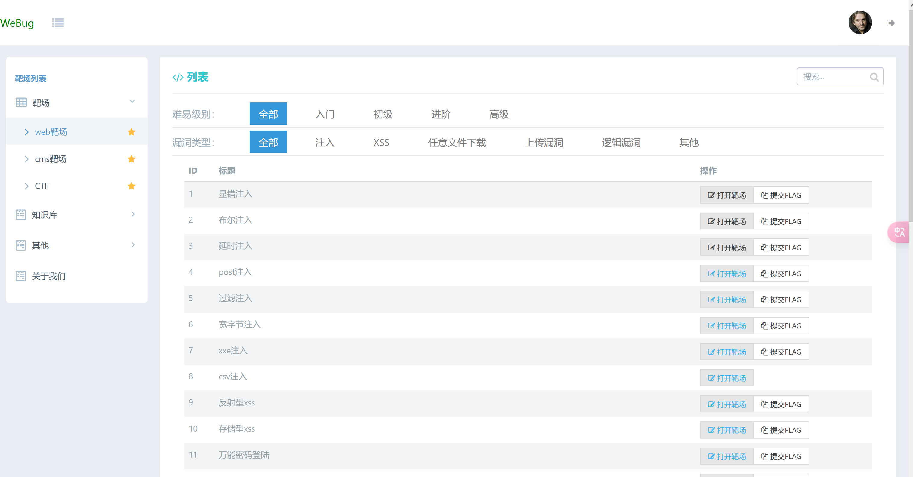

## webug4.0 的部署使用和通过

docker部署
```
docker pull area39/webug
docker run -d -P area39/webug
```

### 通关策略
[WEBUG4.0通关](https://cloud.tencent.com/developer/article/2005900)
[Webug4.0靶场通关](https://xz.aliyun.com/t/12126)




### ****利用dos下的copy实现图片和文字融合，文字在图片中隐藏****

### 给一个图片添加隐藏信息，使得用md打开图片可以看见隐藏信息的方法


```jsx
copy 2.jpg/b+2.txt/a 3.jpg
```

https://blog.csdn.net/u010883226/article/details/80778045

◇优点

　　1. 制作简单，只用 copy 命令就搞定啦；如果隐藏的是压缩文件，提取的过程也很简单。
　　2. 用看图工具看生成的新文件，还是跟原来一样。
　　3. 隐藏的文件，大小不受限制。比如，你可以在一张 100KB 的图片尾部，追加 200KB 的隐藏数据。

◇缺点

　　1. 由于隐藏的文件附加在尾部。当你把这个新的图片文件上传到某些贴图的网站，（假如这个网站对图片格式的校验比较严格）它有可能会发现图片尾部有多余的数据，并且会把这个多余的数据丢弃掉。
　　2. 追加后，图片的文件尺寸变大了。如果你追加的文件太大，容易被发现破绽（比方说，一张 640*480 的 jpeg 图片，大小竟然有好几兆，对于有经验的 IT 技术人员，一下子就会觉得有猫腻）


```import sys

def embed(container_file, data_file, output_file) :
    container = open(container_file, "rb").read()
    data = open(data_file, "rb").read()

    if len(data)+1024 >= len(container) :
        print("Not enough space to save " + data_file)
    else :
        f = open(output_file, "wb")
        f.write(container[ : len(container)-len(data)])
        f.write(data)
        f.close()

if "__main__" == __name__ :
    try :
        if len(sys.argv) == 4 :
            embed(sys.argv[1], sys.argv[2], sys.argv[3])
        else :
            print("Usage:\n%s container data output" % sys.argv[0])
    except Exception as err :
        print(err)
        ```

        
合并图片，合并可执行文件！

copy /b A.jpg + B.zip C.jpg

图片等的隐写，本质上可以通过很多python代码实现


新技术有一个最大风险，往往被忽视，那就是它们没有经过足够的使用，问题都没有暴露出来。

