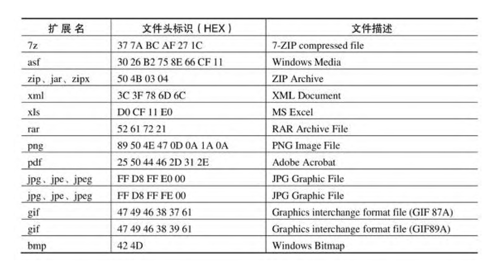

# 利用dos下的copy实现图片和文字融合，文字在图片中隐藏

### 给一个图片添加隐藏信息，使得用md打开图片可以看见隐藏信息的方法


```jsx
copy 2.jpg/b+2.txt/a 3.jpg
```

https://blog.csdn.net/u010883226/article/details/80778045

◇优点

　　1. 制作简单，只用 copy 命令就搞定啦；如果隐藏的是压缩文件，提取的过程也很简单。
　　2. 用看图工具看生成的新文件，还是跟原来一样。
　　3. 隐藏的文件，大小不受限制。比如，你可以在一张 100KB 的图片尾部，追加 200KB 的隐藏数据。

◇缺点

　　1. 由于隐藏的文件附加在尾部。当你把这个新的图片文件上传到某些贴图的网站，（假如这个网站对图片格式的校验比较严格）它有可能会发现图片尾部有多余的数据，并且会把这个多余的数据丢弃掉。
　　2. 追加后，图片的文件尺寸变大了。如果你追加的文件太大，容易被发现破绽（比方说，一张 640*480 的 jpeg 图片，大小竟然有好几兆）


```import sys

def embed(container_file, data_file, output_file) :
    container = open(container_file, "rb").read()
    data = open(data_file, "rb").read()

    if len(data)+1024 >= len(container) :
        print("Not enough space to save " + data_file)
    else :
        f = open(output_file, "wb")
        f.write(container[ : len(container)-len(data)])
        f.write(data)
        f.close()

if "__main__" == __name__ :
    try :
        if len(sys.argv) == 4 :
            embed(sys.argv[1], sys.argv[2], sys.argv[3])
        else :
            print("Usage:\n%s container data output" % sys.argv[0])
    except Exception as err :
        print(err)
```    
合并图片，合并可执行文件！

copy /b A.jpg + B.zip C.jpg

图片等的隐写，本质上可以通过很多python代码实现


### 也可以通过很多隐写的工具，还可以设置密码：比如steghide

具体使用的教程很多，可以搜一搜就知道使用原理！


### 用binwalk之类的工具查看是否有隐藏文件


winhex查看文件的隐藏和头时候对不对，指定的图片格式都是有指定的文件头的

• Windows中的可执行PE文件以“4D 5A”开头。
• BMP文件以“42 4D”开头。
• RAR文件以“52 61 72”开头。
• PDF文件以“25 50 44”开头。



加密命令：java -jar ZipCenOp.jar e xxxx.zip。
此工具会在ZIP文件中搜索所有诸如“50 4B 01 02”（P K . .）
形式的字节，然后更改其后面那一位的值，进行伪加密和解密。


### 从工具包中找出了ZIP密码破解工具Ziperello。
使用方法：支持的破解方法：暴力破解，支持字典破解和模板破解


### 十六进制查看编辑器
winhex,作用：比如图片格式不对，可以编辑正常查看。如果不是在ctf或者图片游戏，通常不会用到！


Photoshop可以辅助查看对应的图层等等


[hash算法解密解决网站](https://hashes.com/en/decrypt/hash)


## 验证文件比如下载的exe，文件判断时候是官方正版的，而没有因为网络等等被替换，攻击之类的，sah256在windows和linux中的验证是否相同的方法


```certutil -hashfile idafree83_linux.run sha256 | findstr ab93d91432f2d4f01622be64ee5cebbc9e5c6bfc92f573a402d9469d2de00a82```
out:
ab93d91432f2d4f01622be64ee5cebbc9e5c6bfc92f573a402d9469d2de00a82

linux 


```sha256 $file | grep $sha256code```
新技术有一个最大风险，往往被忽视，那就是它们没有经过足够的使用，问题都没有暴露出来。

