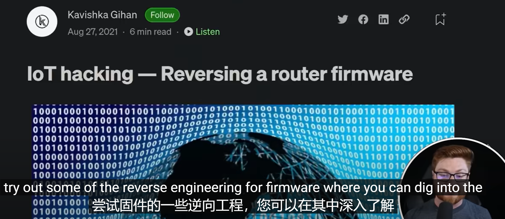
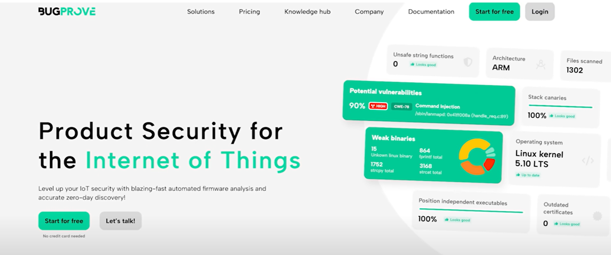
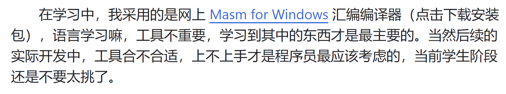
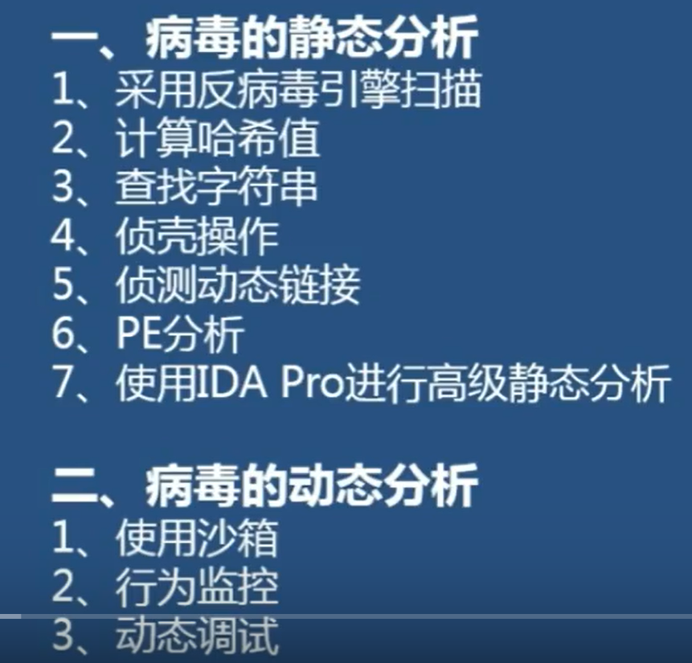

# reverse for go 和汇编语言

https://github.com/reversecore/book

指令码是指计算机中用于表示特定操作的符号或代码。它们通常使用助记符（mnemonics）的形式，比如"ADD"（加法）、"MOV"（移动数据）等。指令码是人类可读的，便于程序员编写和理解。

机器码则是指计算机内部使用的二进制代码，由一系列的0和1组成。计算机硬件能够直接识别和执行机器码。与指令码相比，机器码是计算机能够直接理解和执行的形式，它们是特定硬件体系结构的编码表示。


这些API函数涵盖了各种功能和方面，包括文件操作、网络通信、用户界面、系统设置等等。使用这些API函数，可以方便地进行底层系统编程和与操作系统进行交互。


md

go

github pages
 gitbooks


assembly and programm languages with go java 

注册表，配置信息：


安装目录下的System32\Config目录中
的多个文件构成。操作系统将这些不同的文件集中“虚拟”成整个注
册表供系统自身及应用程序使用。


invest 50%
web3 50%
frontend  1 proj
product see and fix all in the market






熊猫烧香
```
dir /ah 
attrib -s -r -h //消除对应的文件属性：隐藏，系统，只读
setup.exe
autorun.inf

```

proress monitor 监控工具

### 病毒查杀工具编写原理
MD5值，匹配工具库，删除对应的文件
另一种计算md5的值，其次去掉对应的文件的对应属性，
最后删除

### [对病毒工具的逆向分析的完整流程和原理](https://www.bilibili.com/video/BV16W4y1e7i7/?p=5&spm_id_from=pageDriver&vd_source=ad66553c6735d239c199030608317441)




 在学习中，我采用的是网上 Masm for Windows 汇编编译器（点击下载安装包），语言学习嘛，工具不重要，学习到其中的东西才是最主要的。当然后续的实际开发中，工具合不合适，上不上手才是程序员最应该考虑的，当前学生阶段还是不要太挑了。

setup.exe  15.4m


VirusTotal:在线病毒,恶意软件,url扫描器

https://www.virustotal.com/

ThreatTrack:在线病毒,恶意软件,url扫描器

https://www.virustotal.com/

virscan:在线病毒,恶意软件,url扫描器

http://www.virscan.org/

threatexpert:在线病毒,恶意软件,url扫描器

http://www.threatexpert.com/filescan.aspx

malwareviz:在线病毒,恶意软件,url扫描器

https://www.malwareviz.com/

vicheck:在线病毒,恶意软件,url扫描器

https://www.vicheck.ca/

metadefender:在线病毒,恶意软件,url扫描器

https://www.metadefender.com/#!/scan-file


Cherishao/Analysis-Tools: 恶意软件分析套件
https://github.com/Cherishao/Analysis-Tools?tab=readme-ov-file




Peid:查壳工具

http://www.softpedia.com/get/Programming/Packers-Crypters-Protectors/PEiD-updated.shtml
有壳就需要先脱壳，然后再判断语言，在分析，不同语言的汇编，堆栈使用是不一样的！

