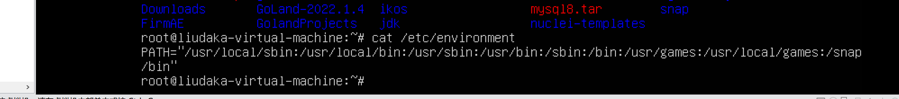

# ethereum

nuclei  -update
nuclei -target example.com  -t http/cves/ -json-export output.json

CVE指的是产品或系统内漏洞的特定示例，CVE就好像是一个字典表，为广泛认同的信息安全漏洞给出一个公共的名称；CWE指的是软件缺陷的类型，是社区开发的常见软件和硬件安全弱点列表，它是一种通用语言，是安全工具的量尺，并且是弱点识别，缓解和预防工作的基准。

CVE是一个已知示例的列表，CWE是一本软件漏洞的参考书。

CWE是通用缺陷枚举，涉及软件安全缺陷的方方面面。基本上可以认为CWE是所有漏洞的原理基础性总结分析；CVE中相当数量的漏洞的成因在CWE中都可以找到相应的条目。

如在代码层、应用层等多个方面的缺陷，从CWE角度看，正是由于CWE的一个或多个缺陷，从而形成了CVE的漏洞

硬性要求
至少2年智能合约开发经验
熟练掌握Solidity或其他智能合约语言
熟悉以太坊、BSC、Polygon等主流区块链平台
熟练使用Git和GitHub
熟练使用Truffle、Hardhat等智能合约开发工具
能够流畅阅读英文技术文档
非硬性要求
对计算机系统安全有一定了解者优先
熟悉云计算平台（AWS/Azure/GCP）
英文沟通能力
Python/NodeJS/Rust开发经验

主要职责：
1.设计、实现和测试区块链协议、智能合约和去中心化应用。
2.与前端和后端工程师合作，为区块链交互开发稳健的API。
3.专注于区块链系统的性能调优、改进、平衡、可用性和自动化。
4.开发技术文档，包括设计文档、代码内注释和面向外部的文档。
5.了解新兴的区块链技术和趋势。
6.与跨职能团队合作，定义区块链技术目标、关键性能指标（KPI）和里程碑。
7.参与代码审查，为团队成长做出贡献。
基本要求：
1.计算机科学、工程或相关技术领域的学士或硕士学位。
2.至少5年软件开发经验，其中至少2年专注于区块链技术。
3.精通至少一个区块链框架，例如超级账本（Hyperledger Fabric）或类似框架。
4.在Java，Solidity，Go等编程语言方面具有强大的编码能力。
5.对区块链架构、如DAG和默克尔树（Merkle Trees）等数据结构，以及加密协议有深入了解。
6.了解公链（例如EOS、Cardano等）和/或联盟链（例如Hyperledger、Corda、Quorum等）的开发和部署。

学习并阅读过主流区块链项目核心模块代码并理解其原理

职位描述
岗位要求
1、2年以上Solidity智能合约开发经验，精通Solidity, Nodejs, Python, Golang中的一种。
2、开发&升级、安全、经济高效大TVL的生产级智能合约。
岗位职责
1、设计、编写Solidity 智能合约。
2、在智能合约上编写全面的测试套件，以确保其功能正确。
3、深入了解虚拟机及其他虚拟机的特征及区别。
4、生产级别智能合约的全栈开发经验。
5、有DEX产品相关经验优先

english

安全：

### evm jvm有什么不一样？

IDO是一种在去中心化交易所(DEX)运行的加密货币代币发行。

Headless Chrome 是 Chrome 浏览器的无界面形态，可以在不打开浏览器的前提下，使用所有 Chrome 支持的特性运行你的程序。相比于现代浏览器，Headless Chrome 更加方便测试 web 应用，获得网站的截图，做爬虫抓取信息等。

evm

truffle

solidity 

code core

两件事情：
block

实战，
入门
小demo

solidity 

