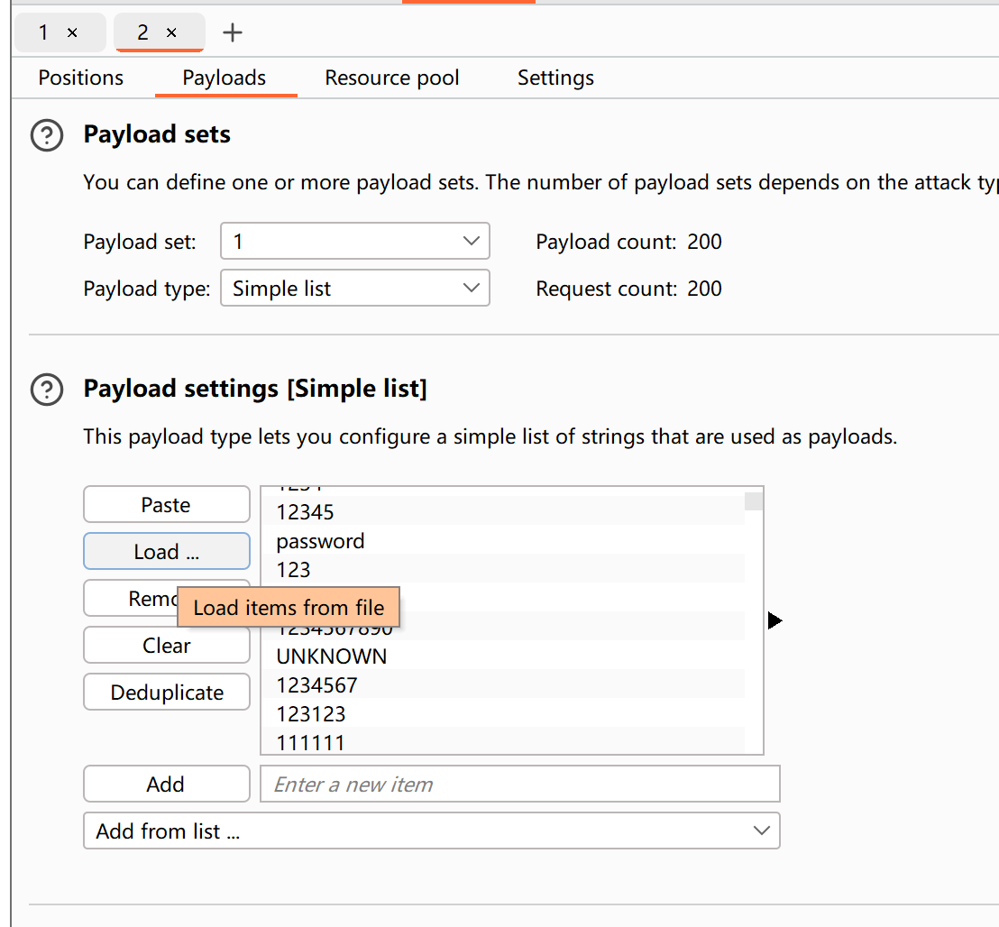

# 个人burppsuite 入门使用
提示：仅限个人使用正规途径，比如打靶，ctf训练等，违规使用违规操作后果自负！
[toc]

## 安装破解专业版
最新版本安装之后自带 jdk环境，所以不需要安装jdk


[破解插件：BurpLoaderKeygen_v1.17.jar](https://github.com/h3110w0r1d-y/BurpLoaderKeygen/releases)

```https://www.123pan.com/s/wkKdjv-nYfiH.html提取码:mk4K```

完整流程图
(1) 用自带的jdk,运行BurpLoaderKeygen_v1.17.jar，放的位置如上图，和exe文件放一起
(2) 修改 licensed to CC  点击run
(3) 运行起来 burpsuite，之后赋值 license,拿到 request,生成response,复制过去就成功了哈，具体操作自己勇敢去尝试根据简单提示


## 使用打靶场景

### 安装DVWA靶场

```
volumes:
  dvwa:


networks:
  dvwa:


services:
  dvwa:
    build: .
    image: ghcr.io/digininja/dvwa:latest
    # Change `always` to `build` to build from local source
    pull_policy: always
    environment:
      - DB_SERVER=db
    depends_on:
      - db
    networks:
      - dvwa
    ports:
      - 4280:80
    restart: unless-stopped

  db:
    image: docker.io/library/mariadb:10
    environment:
      - MYSQL_ROOT_PASSWORD=dvwa
      - MYSQL_DATABASE=dvwa
      - MYSQL_USER=dvwa
      - MYSQL_PASSWORD=p@ssw0rd
    volumes:
      - dvwa:/var/lib/mysql
    networks:
      - dvwa
    restart: unless-stopped

```
初始账号密码：admin password 
第一次进入需要初始化：


### 选择漏洞Vulnerability: Brute Force
基本思路就是，浏览器发送通过burpsuite load密码字典破解！

 1.如何设置通过burpsuite
 使用burp的proxy功能,burp设置的proxy和浏览器使用的代理设置如下，端口一样必须


 2.如何获取密码字典
[常见的弱口令&密码字典下载网站](https://zhuanlan.zhihu.com/p/635466179)

 3.如何爆破:使用burp的intruder

（1）找到链接，send to intruder 


（2）设置爆破点


（3）load下载好的字典



小技巧：如果没有提示点击返回状态码，200一般就是答案，而且状态码一般来说两种！


#### 参考链接

[BurpSuite全平台破解通用-至今可用](https://ccalt.cn/2023/04/04/BurpSuite%E5%85%A8%E5%B9%B3%E5%8F%B0%E7%A0%B4%E8%A7%A3%E9%80%9A%E7%94%A8-%E8%87%B3%E4%BB%8A%E5%8F%AF%E7%94%A8/)

[常见的弱口令&密码字典下载网站](https://zhuanlan.zhihu.com/p/635466179)
[DVWA靶场通关----（1）Brute Force教程](https://www.cnblogs.com/chadlas/p/15707475.html)
[靶场搭建](https://github.com/ffffffff0x/1earn/blob/master/1earn/Security/RedTeam/Web%E5%AE%89%E5%85%A8/%E9%9D%B6%E5%9C%BA/DVWA-WalkThrough.md)
[ctfweb基础题：弱口令爆破](https://www.bilibili.com/video/BV1UM4113742?p=2&vd_source=ad66553c6735d239c199030608317441)
