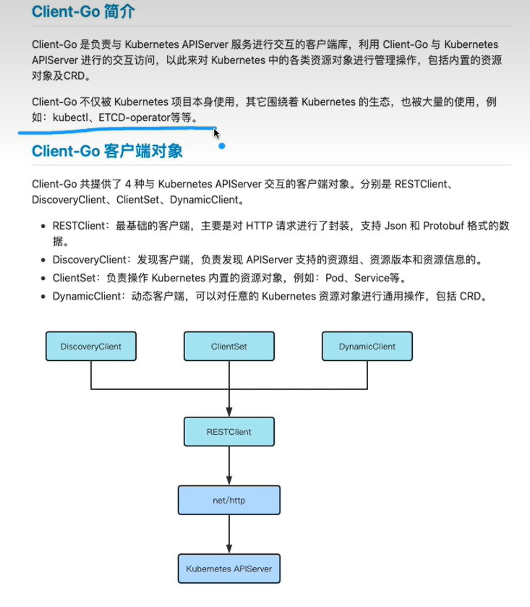

## k8s实践入门

### kubeadm搭建k8s

kubeadm，参考链接
[ubuntu22.04安装kubernetes](https://blog.csdn.net/csdn_tom_168/article/details/126800154?ops_request_misc=&request_id=&biz_id=102&utm_term=ubuntu%E8%AE%BE%E7%BD%AEK8s%E5%BE%97%E5%AE%89%E8%A3%85%E6%BA%90&utm_medium=distribute.pc_search_result.none-task-blog-2~blog~sobaiduweb~default-5-126800154.142^v93^chatsearchT3_2&spm=1018.2226.3001.4450)

- 注意版本,按照这个方法笔者搭建成功了的如果有问题 ```kubeadm reset```重新来一下

- 安装指定版本的 kubelet kubeadm kubectl 
- 
```
sudo apt-get install kubeadm=1.16.10-00 kubelet=1.16.10-00 kubectl=1.16.10-00

安装指定版本的 kubelet kubeadm kubectl 等等

sudo apt install -y kubelet=1.25.14-00 kubeadm=1.25.14-00 kubectl=1.25.14-00
```

- 但是在生产环境中仍然不建议使用Kubeadm安装方式。在实际测试中，二进制安装方式比Kubeadm安装方式更加稳定可靠，并且集群的恢复能力比Kubeadm要高

- kubeadm搭建之后二进制方法搭建报错：
  
```
kubelet.service: Failed at step EXEC spawning /usr/bin/kubelet: No such file or directory
```

但是 kubelet.service 的exec的配置路径明明是 usr/local/bin/kubelet

- kuebadm的配置kubelet.sercvice灭有删除掉，导致问题Kubectl get node没有资源的问题，kubelet启动注入到集群中的启动失败, journalctl -xeu kubelet 报错但是 usr/bin/kubelet但是实际上我们二进制配置的是 kubelet.service 的exec的配置路径,明明是 usr/local/bin/kubelet所以原因是kubeadM的路径下的配置文件修改名字让其不生效,然后重启注入到master主节点的集群中，同时有些会有同意node节点注册的操作。


```
mv /etc/systemd/system/kubelet.service.d/10-kubeadm.conf  /etc/systemd/system/kubelet.service.d/10-kubeadm.confbakfuck
```

#### 需要注意的是，通过kubeadm部署K8S，再通过二进制安装没删除干净会产生的问题


### kubeasz安装 k8s
[一键安装Kubernetes？使用kubeasz带你10分钟装好一个k8s集群，不受国内网络环境影响](https://zhuanlan.zhihu.com/p/562533111)
笔者也是安装成功了的，按照这个步骤这个版本

```
SSH免密登陆
配置从部署节点能够ssh免密登陆所有节点，并且设置python软连接

cd  ~/.ssh

ssh-keygen -t rsa

#$IP为所有节点地址包括自身，按照提示输入yes 和root密码，ip地址为内网ip
ssh-copy-id $IP 

# 为每个节点设置python软链接
ssh $IP ln -s /usr/bin/python3 /usr/bin/python
编排K8S集群
下载安装脚本
wget https://github.com/easzlab/kubeasz/releases/download/3.3.1/ezdown
chmod +x ./ezdown
下载kubeasz代码、二进制、默认容器镜像（更多关于ezdown的参数，运行./ezdown 查看）
# 国内环境
./ezdown -D
# 海外环境
#./ezdown -D -m standard
创建集群配置实例
# 容器化运行kubeasz
./ezdown -S

# 创建新集群 k8s-01
docker exec -it kubeasz ezctl new k8s-01
2021-01-19 10:48:23 DEBUG generate custom cluster files in /etc/kubeasz/clusters/k8s-01
2021-01-19 10:48:23 DEBUG set version of common plugins
2021-01-19 10:48:23 DEBUG cluster k8s-01: files successfully created.
2021-01-19 10:48:23 INFO next steps 1: to config '/etc/kubeasz/clusters/k8s-01/hosts'
2021-01-19 10:48:23 INFO next steps 2: to config '/etc/kubeasz/clusters/k8s-01/config.yml'
修改'/etc/kubeasz/clusters/k8s-01/hosts'
vim /etc/kubeasz/clusters/k8s-01/hosts

# 修改为
# 'etcd' cluster should have odd member(s) (1,3,5,...)
[etcd]
192.168.0.1
192.168.0.2
192.168.0.3

# master node(s)
[kube_master]
192.168.0.1

# work node(s)
[kube_node]
192.168.0.2
192.168.0.3
开始安装
#建议配置命令alias，方便执行
echo "alias dk='docker exec -it kubeasz'" >> /root/.bashrc
source /root/.bashrc

# 一键安装，等价于执行docker exec -it kubeasz ezctl setup k8s-01 all
dk ezctl setup k8s-01 all

# 或者分步安装，具体使用 dk ezctl help setup 查看分步安装帮助信息
# dk ezctl setup k8s-01 01
# dk ezctl setup k8s-01 02
# dk ezctl setup k8s-01 03
# dk ezctl setup k8s-01 04
...
断开SSH连接再重新连接，可以发现安装成功
$ kubectl version         # 验证集群版本     
$ kubectl get node        # 验证节点就绪 (Ready) 状态
$ kubectl get pod -A      # 验证集群pod状态，默认已安装网络插件、coredns、metrics-server等
$ kubectl get svc -A      # 验证集群服务状态


root@hecs:~# kubectl get node
NAME            STATUS                     ROLES    AGE     VERSION
192.168.0.1   Ready,SchedulingDisabled   master   10m     v1.24.2
192.168.0.2   Ready                      node     9m45s   v1.24.2
192.168.0.3   Ready                      node     9m45s   v1.24.2

```


### centos二进制搭建k8s


[K8S-03-画图的方式讲解K8S二进制安装](https://www.bilibili.com/video/BV11V411F7gt/?vd_source=ad66553c6735d239c199030608317441)

贴一下代码：部署参考原文档更直观清晰，贴一下主要是怕某一天没了方便快速查看！
原文档：
http://stu.jxit.net.cn:88/k8s/08-k8s-binary-install.html

```
所有节点安全措施
所有节点关闭安全措施
swapoff -a
sed -ri 's/.*swap.*/#&/' /etc/fstab
systemctl stop firewalld
systemctl disable firewalld
sed -i 's/enforcing/disabled/' /etc/selinux/config
setenforce 0

主节点etcd密钥配置
主节点创建目录
mkdir k8s; cd k8s
mkdir etcd-cert k8s-cert
cd etcd-cert

下载ssl密钥生成器
curl -L http://dl.jxit.net.cn/k8s/cfssl_linux-amd64 -o /usr/local/bin/cfssl
curl -L http://dl.jxit.net.cn/k8s/cfssljson_linux-amd64 -o /usr/local/bin/cfssljson
curl -L http://dl.jxit.net.cn/k8s/cfssl-certinfo_linux-amd64 -o /usr/local/bin/cfssl-certinfo
chmod +x /usr/local/bin/cfssl /usr/local/bin/cfssljson /usr/local/bin/cfssl-certinfo

生成etcd的密钥 sh etcd-cert.sh
cat > ca-config.json <<EOF
{
  "signing": {
    "default": {
      "expiry": "87600h"
    },
    "profiles": {
      "www": {
         "expiry": "87600h",
         "usages": [
            "signing",
            "key encipherment",
            "server auth",
            "client auth"
        ]
      }
    }
  }}
EOF

cat > ca-csr.json <<EOF
{
    "CN": "etcd CA",
    "key": {
        "algo": "rsa",
        "size": 2048
    },
    "names": [
        {
            "C": "CN",
            "L": "Beijing",
            "ST": "Beijing"
        }
    ]}
EOF

cfssl gencert -initca ca-csr.json | cfssljson -bare ca -

#-----------------------

cat > server-csr.json <<EOF
{
    "CN": "etcd",
    "hosts": [
    "10.10.10.11",
    "10.10.10.12",
    "10.10.10.13"
    ],
    "key": {
        "algo": "rsa",
        "size": 2048
    },
    "names": [
        {
            "C": "CN",
            "L": "BeiJing",
            "ST": "BeiJing"
        }
    ]}
EOF

cfssl gencert -ca=ca.pem -ca-key=ca-key.pem -config=ca-config.json -profile=www server-csr.json | cfssljson -bare server

下载ETCD
yum -y install wget
wget http://dl.jxit.net.cn/k8s/etcd-v3.3.15-linux-amd64.tar.gz
tar -zxvf etcd-v3.3.15-linux-amd64.tar.gz
cd etcd-v3.3.15-linux-amd64
mkdir -p /opt/etcd/{ssl,cfg,bin}
mv etcd etcdctl /opt/etcd/bin/
cp /root/k8s/etcd-cert/{ca,server-key,server}.pem /opt/etcd/ssl

让ETCD用上面的密钥启动 
sh ./etcd.sh etcd01 10.10.10.11
#!/bin/bash
# example: ./etcd.sh etcd01 192.168.1.10 etcd02=https://192.168.1.11:2380,etcd03=https://192.168.1.12:2380


ETCD_NAME=$1
ETCD_IP=$2
ETCD_CLUSTER=$3


WORK_DIR=/opt/etcd


cat <<EOF >$WORK_DIR/cfg/etcd
#[Member]
ETCD_NAME="${ETCD_NAME}"
ETCD_DATA_DIR="/var/lib/etcd/default.etcd"
ETCD_LISTEN_PEER_URLS="https://${ETCD_IP}:2380"
ETCD_LISTEN_CLIENT_URLS="https://${ETCD_IP}:2379"


#[Clustering]
ETCD_INITIAL_ADVERTISE_PEER_URLS="https://${ETCD_IP}:2380"
ETCD_ADVERTISE_CLIENT_URLS="https://${ETCD_IP}:2379"
ETCD_INITIAL_CLUSTER="etcd01=https://${ETCD_IP}:2380,${ETCD_CLUSTER}"
ETCD_INITIAL_CLUSTER_TOKEN="etcd-cluster"
ETCD_INITIAL_CLUSTER_STATE="new"
EOF


cat <<EOF >/usr/lib/systemd/system/etcd.service
[Unit]
Description=Etcd Server
After=network.target
After=network-online.target
Wants=network-online.target


[Service]
Type=notify
EnvironmentFile=${WORK_DIR}/cfg/etcd
ExecStart=${WORK_DIR}/bin/etcd \
--name=\${ETCD_NAME} \
--data-dir=\${ETCD_DATA_DIR} \
--listen-peer-urls=\${ETCD_LISTEN_PEER_URLS} \
--listen-client-urls=\${ETCD_LISTEN_CLIENT_URLS},http://127.0.0.1:2379 \
--advertise-client-urls=\${ETCD_ADVERTISE_CLIENT_URLS} \
--initial-advertise-peer-urls=\${ETCD_INITIAL_ADVERTISE_PEER_URLS} \
--initial-cluster=\${ETCD_INITIAL_CLUSTER} \
--initial-cluster-token=\${ETCD_INITIAL_CLUSTER_TOKEN} \
--initial-cluster-state=new \
--cert-file=${WORK_DIR}/ssl/server.pem \
--key-file=${WORK_DIR}/ssl/server-key.pem \
--peer-cert-file=${WORK_DIR}/ssl/server.pem \
--peer-key-file=${WORK_DIR}/ssl/server-key.pem \
--trusted-ca-file=${WORK_DIR}/ssl/ca.pem \
--peer-trusted-ca-file=${WORK_DIR}/ssl/ca.pem
Restart=on-failure
LimitNOFILE=65536


[Install]
WantedBy=multi-user.target
EOF

systemctl daemon-reload
systemctl enable etcd
systemctl restart etcd

检查etcd集群
/opt/etcd/bin/etcdctl \
--ca-file=/opt/etcd/ssl/ca.pem --cert-file=/opt/etcd/ssl/server.pem --key-file=/opt/etcd/ssl/server-key.pem \
--endpoints="https://10.10.10.11:2379" cluster-health

工作节点虚拟网络
在ETCD中设置虚拟网络
/opt/etcd/bin/etcdctl --ca-file=/opt/etcd/ssl/ca.pem --cert-file=/opt/etcd/ssl/server.pem --key-file=/opt/etcd/ssl/server-key.pem --endpoints="https://10.10.10.11:2379" set /coreos.com/network/config '{ "Network": "10.0.0.0/16", "Backend": {"Type": "vxlan"}}'

工作节点安装flannel虚拟网络组件
yum -y install wget
wget http://dl.jxit.net.cn/k8s/flannel-v0.11.0-linux-amd64.tar.gz
tar -zxvf flannel-v0.11.0-linux-amd64.tar.gz
mkdir /opt/kubernetes/{bin,cfg,ssl} -p
mv flanneld mk-docker-opts.sh /opt/kubernetes/bin/

从主节点把访问etcd证书拷过来
scp 10.10.10.11:/opt/etcd/ssl/* /opt/kubernetes/ssl

让flannel按照etcd中配置创建虚拟网络 
sh ./flannel.sh https://10.10.10.11:2379
#!/bin/bash


ETCD_ENDPOINTS=${1:-"http://127.0.0.1:2379"}


cat <<EOF >/opt/kubernetes/cfg/flanneld


FLANNEL_OPTIONS="--etcd-endpoints=${ETCD_ENDPOINTS} \
-etcd-cafile=/opt/kubernetes/ssl/ca.pem \
-etcd-certfile=/opt/kubernetes/ssl/server.pem \
-etcd-keyfile=/opt/kubernetes/ssl/server-key.pem"


EOF


cat <<EOF >/usr/lib/systemd/system/flanneld.service
[Unit]
Description=Flanneld overlay address etcd agent
After=network-online.target network.target
Before=docker.service


[Service]
Type=notify
EnvironmentFile=/opt/kubernetes/cfg/flanneld
ExecStart=/opt/kubernetes/bin/flanneld --ip-masq \$FLANNEL_OPTIONS
ExecStartPost=/opt/kubernetes/bin/mk-docker-opts.sh -k DOCKER_NETWORK_OPTIONS -d /run/flannel/subnet.env
Restart=on-failure


[Install]
WantedBy=multi-user.target


EOF

systemctl daemon-reload
systemctl enable flanneld
systemctl restart flanneld
工作节点Docker对接虚拟网络
所有工作节点安装docker
sudo yum install -y wget yum-utils device-mapper-persistent-data lvm2
sudo yum-config-manager --add-repo http://mirrors.aliyun.com/docker-ce/linux/centos/docker-ce.repo
sudo yum makecache fast
sudo yum -y install docker-ce
curl -sSL http://dl.jxit.net.cn/k8s/set_mirror.sh | sh -s http://hub-mirror.c.163.com
sudo systemctl enable docker

让Docker创建的容器使用虚拟网络通信
cat <<EOF >/usr/lib/systemd/system/docker.service


[Unit]
Description=Docker Application Container Engine
Documentation=https://docs.docker.com
After=network-online.target firewalld.service
Wants=network-online.target


[Service]
Type=notify
EnvironmentFile=/run/flannel/subnet.env
ExecStart=/usr/bin/dockerd \$DOCKER_NETWORK_OPTIONS
ExecReload=/bin/kill -s HUP \$MAINPID
LimitNOFILE=infinity
LimitNPROC=infinity
LimitCORE=infinity
TimeoutStartSec=0
Delegate=yes
KillMode=process
Restart=on-failure
StartLimitBurst=3
StartLimitInterval=60s


[Install]
WantedBy=multi-user.target

EOF

systemctl daemon-reload
systemctl restart docker

查看网络配置
/opt/etcd/bin/etcdctl \
--ca-file=/opt/etcd/ssl/ca.pem --cert-file=/opt/etcd/ssl/server.pem --key-file=/opt/etcd/ssl/server-key.pem \
--endpoints="https://10.10.10.11:2379" ls /coreos.com/network/subnets

主节点APIServer
安装k8s主节点组件
wget http://dl.jxit.net.cn/k8s/kubernetes-server-linux-amd64.tar.gz
tar -zxvf kubernetes-server-linux-amd64.tar.gz
mkdir /opt/kubernetes/{bin,cfg,ssl} -p
cd /root/kubernetes/server/bin/
cp kube-controller-manager kube-apiserver kube-scheduler /opt/kubernetes/bin/
cp kubectl /usr/bin/

生成用于访问APIServer的密钥 
cd /opt/kubernetes/ssl; sh k8s-cert.sh
cat > ca-config.json <<EOF
{
  "signing": {
    "default": {
      "expiry": "87600h"
    },
    "profiles": {
      "kubernetes": {
         "expiry": "87600h",
         "usages": [
            "signing",
            "key encipherment",
            "server auth",
            "client auth"
        ]
      }
    }
  }
}
EOF
cat > ca-csr.json <<EOF
{
    "CN": "kubernetes",
    "key": {
        "algo": "rsa",
        "size": 2048
    },
    "names": [
        {
            "C": "CN",
            "L": "Beijing",
            "ST": "Beijing",
            "O": "k8s",
            "OU": "System"
        }
    ]
}
EOF

cfssl gencert -initca ca-csr.json | cfssljson -bare ca -
#-----------------------
cat > server-csr.json <<EOF
{
    "CN": "kubernetes",
    "hosts": [
      "10.0.0.1",
      "127.0.0.1",
      "10.10.10.11",
      "10.10.10.12",
      "10.10.10.13",
      "kubernetes",
      "kubernetes.default",
      "kubernetes.default.svc",
      "kubernetes.default.svc.cluster",
      "kubernetes.default.svc.cluster.local"
    ],
    "key": {
        "algo": "rsa",
        "size": 2048
    },
    "names": [
        {
            "C": "CN",
            "L": "BeiJing",
            "ST": "BeiJing",
            "O": "k8s",
            "OU": "System"
        }
    ]
}
EOF
cfssl gencert -ca=ca.pem -ca-key=ca-key.pem -config=ca-config.json -profile=kubernetes server-csr.json | cfssljson -bare server

#-----------------------
cat > admin-csr.json <<EOF
{
  "CN": "admin",
  "hosts": [],
  "key": {
    "algo": "rsa",
    "size": 2048
  },
  "names": [
    {
      "C": "CN",
      "L": "BeiJing",
      "ST": "BeiJing",
      "O": "system:masters",
      "OU": "System"
    }
  ]
}
EOF

cfssl gencert -ca=ca.pem -ca-key=ca-key.pem -config=ca-config.json -profile=kubernetes admin-csr.json | cfssljson -bare admin

#-----------------------
cat > kube-proxy-csr.json <<EOF
{
  "CN": "system:kube-proxy",
  "hosts": [],
  "key": {
    "algo": "rsa",
    "size": 2048
  },
  "names": [
    {
      "C": "CN",
      "L": "BeiJing",
      "ST": "BeiJing",
      "O": "k8s",
      "OU": "System"
    }
  ]
}
EOF

cfssl gencert -ca=ca.pem -ca-key=ca-key.pem -config=ca-config.json -profile=kubernetes kube-proxy-csr.json | cfssljson -bare kube-proxy


生成APIServer访问令牌
BOOTSTRAP_TOKEN=$(head -c 16 /dev/urandom | od -An -t x | tr -d ' ')
echo $BOOTSTRAP_TOKEN
cat > token.csv <<EOF
${BOOTSTRAP_TOKEN},kubelet-bootstrap,10001,"system:kubelet-bootstrap"
EOF
mv token.csv /opt/kubernetes/cfg/

按照上面配置将APIServer以服务安装启动 
sh apiserver.sh 10.10.10.11 https://10.10.10.11:2379
#!/bin/bash


MASTER_ADDRESS=$1
ETCD_SERVERS=$2


cat <<EOF >/opt/kubernetes/cfg/kube-apiserver

KUBE_APISERVER_OPTS="--logtostderr=true \\
--v=4 \\
--etcd-servers=${ETCD_SERVERS} \\
--bind-address=${MASTER_ADDRESS} \\
--secure-port=6443 \\
--advertise-address=${MASTER_ADDRESS} \\
--allow-privileged=true \\
--service-cluster-ip-range=10.0.0.0/24 \\
--enable-admission-plugins=NamespaceLifecycle,LimitRanger,ServiceAccount,ResourceQuota,NodeRestriction \\
--authorization-mode=RBAC,Node \\
--kubelet-https=true \\
--enable-bootstrap-token-auth \\
--token-auth-file=/opt/kubernetes/cfg/token.csv \\
--service-node-port-range=30000-50000 \\
--tls-cert-file=/opt/kubernetes/ssl/server.pem \\
--tls-private-key-file=/opt/kubernetes/ssl/server-key.pem \\
--client-ca-file=/opt/kubernetes/ssl/ca.pem \\
--service-account-key-file=/opt/kubernetes/ssl/ca-key.pem \\
--etcd-cafile=/opt/etcd/ssl/ca.pem \\
--etcd-certfile=/opt/etcd/ssl/server.pem \\
--etcd-keyfile=/opt/etcd/ssl/server-key.pem"

EOF

cat <<EOF >/usr/lib/systemd/system/kube-apiserver.service

[Unit]
Description=Kubernetes API Server
Documentation=https://github.com/kubernetes/kubernetes

[Service]
EnvironmentFile=-/opt/kubernetes/cfg/kube-apiserver
ExecStart=/opt/kubernetes/bin/kube-apiserver \$KUBE_APISERVER_OPTS
Restart=on-failure

[Install]
WantedBy=multi-user.target

EOF

systemctl daemon-reload
systemctl enable kube-apiserver
systemctl restart kube-apiserver
主节点controller-manager
配置安装controller-manager 资源维持器
sh controller-manager.sh 127.0.0.1
#!/bin/bash


MASTER_ADDRESS=$1


cat <<EOF >/opt/kubernetes/cfg/kube-controller-manager

KUBE_CONTROLLER_MANAGER_OPTS="--logtostderr=true \\
--v=4 \\
--master=${MASTER_ADDRESS}:8080 \\
--leader-elect=true \\
--address=127.0.0.1 \\
--service-cluster-ip-range=10.0.0.0/24 \\
--cluster-name=kubernetes \\
--cluster-signing-cert-file=/opt/kubernetes/ssl/ca.pem \\
--cluster-signing-key-file=/opt/kubernetes/ssl/ca-key.pem \\
--root-ca-file=/opt/kubernetes/ssl/ca.pem \\
--service-account-private-key-file=/opt/kubernetes/ssl/ca-key.pem \\
--experimental-cluster-signing-duration=87600h0m0s"

EOF

cat <<EOF >/usr/lib/systemd/system/kube-controller-manager.service

[Unit]
Description=Kubernetes Controller Manager
Documentation=https://github.com/kubernetes/kubernetes

[Service]
EnvironmentFile=-/opt/kubernetes/cfg/kube-controller-manager
ExecStart=/opt/kubernetes/bin/kube-controller-manager \$KUBE_CONTROLLER_MANAGER_OPTS
Restart=on-failure

[Install]
WantedBy=multi-user.target

EOF

systemctl daemon-reload
systemctl enable kube-controller-manager
systemctl restart kube-controller-manager
主节点scheduler
安装配置scheduler资源调度 sh scheduler.sh 127.0.0.1
#!/bin/bash


MASTER_ADDRESS=$1


cat <<EOF >/opt/kubernetes/cfg/kube-scheduler

KUBE_SCHEDULER_OPTS="--logtostderr=true \\
--v=4 \\
--master=${MASTER_ADDRESS}:8080 \\
--leader-elect"

EOF

cat <<EOF >/usr/lib/systemd/system/kube-scheduler.service

[Unit]
Description=Kubernetes Scheduler
Documentation=https://github.com/kubernetes/kubernetes

[Service]
EnvironmentFile=-/opt/kubernetes/cfg/kube-scheduler
ExecStart=/opt/kubernetes/bin/kube-scheduler \$KUBE_SCHEDULER_OPTS
Restart=on-failure

[Install]
WantedBy=multi-user.target

EOF

systemctl daemon-reload
systemctl enable kube-scheduler
systemctl restart kube-scheduler

主节点集群授权
主节点创建集群
kubectl create clusterrolebinding kubelet-bootstrap \
--clusterrole=system:node-bootstrapper \
--user=kubelet-bootstrap

生成工作节点用于访问主节点的配置（改token）
sh kubeconfig.sh 10.10.10.11 /opt/kubernetes/ssl/
APISERVER=$1
SSL_DIR=$2
#改成上面的哪个token.csv的值！！！！！！！！！！
BOOTSTRAP_TOKEN=26b34be575911adb969f820daa29feb4 
# Create kubelet bootstrapping kubeconfig
export KUBE_APISERVER="https://$APISERVER:6443"

# Set cluster parameters
kubectl config set-cluster kubernetes \
--certificate-authority=$SSL_DIR/ca.pem \
--embed-certs=true \
--server=${KUBE_APISERVER} \
--kubeconfig=bootstrap.kubeconfig

# Set client authentication parameters
kubectl config set-credentials kubelet-bootstrap \
--token=${BOOTSTRAP_TOKEN} \
--kubeconfig=bootstrap.kubeconfig

# Set context parameters
kubectl config set-context default \
--cluster=kubernetes \
--user=kubelet-bootstrap \
--kubeconfig=bootstrap.kubeconfig

# Set default context
kubectl config use-context default --kubeconfig=bootstrap.kubeconfig
#----------------------
# Create the Kube proxy kubeconfig file
kubectl config set-cluster kubernetes \
--certificate-authority=$SSL_DIR/ca.pem \
--embed-certs=true \
--server=${KUBE_APISERVER} \
--kubeconfig=kube-proxy.kubeconfig

kubectl config set-credentials kube-proxy \
--client-certificate=$SSL_DIR/kube-proxy.pem \
--client-key=$SSL_DIR/kube-proxy-key.pem \
--embed-certs=true \
--kubeconfig=kube-proxy.kubeconfig

kubectl config set-context default \
--cluster=kubernetes \
--user=kube-proxy \
--kubeconfig=kube-proxy.kubeconfig

kubectl config use-context default --kubeconfig=kube-proxy.kubeconfig

将工作节点访问主的配置拷过去
scp /root/bootstrap.kubeconfig  /root/kube-proxy.kubeconfig 10.10.10.12:/opt/kubernetes/cfg/
scp /root/bootstrap.kubeconfig  /root/kube-proxy.kubeconfig 10.10.10.13:/opt/kubernetes/cfg/
scp /root/kubernetes/server/bin/kubelet /root/kubernetes/server/bin/kube-proxy 10.10.10.12:/opt/kubernetes/bin/
scp /root/kubernetes/server/bin/kubelet /root/kubernetes/server/bin/kube-proxy 10.10.10.13:/opt/kubernetes/bin/

工作节点kubelet代理
两个工作节点配置kubelet代理 （注意authentication:那块的空格）
sh kubelet.sh 10.10.10.12
#!/bin/bash


NODE_ADDRESS=$1
DNS_SERVER_IP=${2:-"10.0.0.2"}


cat <<EOF >/opt/kubernetes/cfg/kubelet

KUBELET_OPTS="--logtostderr=true \\
--v=4 \\
--hostname-override=${NODE_ADDRESS} \\
--kubeconfig=/opt/kubernetes/cfg/kubelet.kubeconfig \\
--bootstrap-kubeconfig=/opt/kubernetes/cfg/bootstrap.kubeconfig \\
--config=/opt/kubernetes/cfg/kubelet.config \\
--cert-dir=/opt/kubernetes/ssl \\
--pod-infra-container-image=docker.io/kubernetes/pause:latest"

EOF

cat <<EOF >/opt/kubernetes/cfg/kubelet.config

kind: KubeletConfiguration
apiVersion: kubelet.config.k8s.io/v1beta1
address: ${NODE_ADDRESS}
port: 10250
readOnlyPort: 10255
cgroupDriver: cgroupfs
clusterDNS:
- ${DNS_SERVER_IP}
clusterDomain: cluster.local.
failSwapOn: false
authentication:
  anonymous:
    enabled: true

EOF

cat <<EOF >/usr/lib/systemd/system/kubelet.service

[Unit]
Description=Kubernetes Kubelet
After=docker.service
Requires=docker.service

[Service]
EnvironmentFile=/opt/kubernetes/cfg/kubelet
ExecStart=/opt/kubernetes/bin/kubelet \$KUBELET_OPTS
Restart=on-failure
KillMode=process

[Install]
WantedBy=multi-user.target

EOF

systemctl daemon-reload
systemctl enable kubelet
systemctl restart kubelet

工作节点kube-proxy网络代理
两个工作节点配置kube-proxy网络代理 sh kube-proxy.sh 10.10.10.12
#!/bin/bash


NODE_ADDRESS=$1


cat <<EOF >/opt/kubernetes/cfg/kube-proxy

KUBE_PROXY_OPTS="--logtostderr=true \\
--v=4 \\
--hostname-override=${NODE_ADDRESS} \\
--cluster-cidr=10.0.0.0/24 \\
--proxy-mode=ipvs \\
--kubeconfig=/opt/kubernetes/cfg/kube-proxy.kubeconfig"

EOF

cat <<EOF >/usr/lib/systemd/system/kube-proxy.service

[Unit]
Description=Kubernetes Proxy
After=network.target

[Service]
EnvironmentFile=-/opt/kubernetes/cfg/kube-proxy
ExecStart=/opt/kubernetes/bin/kube-proxy \$KUBE_PROXY_OPTS
Restart=on-failure

[Install]
WantedBy=multi-user.target

EOF

systemctl daemon-reload
systemctl enable kube-proxy
systemctl restart kube-proxy

主节点授权
主节点接受工作节点加入（注意替换节点ID）
kubectl get csr
# 后面的节点ID替换为上面命令的输出
kubectl certificate approve node-csr-NK3x
# 查看工作节点状态
kubectl get node
# 添加认证用户用于进入容器和查看日志
kubectl create clusterrolebinding cluster-system-anonymous --clusterrole=cluster-admin --user=system:anonymous

配置coredns让容器间可以通过名字访问，查看状态（需要等一段时间，保证Running状态）
kubectl apply -f http://dl.jxit.net.cn/k8s/coredns.yaml
kubectl get all -n kube-system

查看工作节点状态，部署测试
kubectl create deployment nginx --image=evild/alpine-nginx
kubectl expose deployment nginx --port=80 --type=NodePort
kubectl create deployment apache --image=evild/alpine-nginx
kubectl expose deployment apache --port=80 --type=NodePort

```


### ubuntu二进制搭建环境
[一键部署k8s-1.23.12(docker运行时)（二进制方式）（一主多从）（ubuntu22.04版）文档](https://www.yuque.com/linuxkaifa/k8s-binary/vfo4al)
防止语雀崩溃，在这儿再粘一下

####  ubuntu22.04配置静态ip跟dns
```

cat > /etc/netplan/00-installer-config.yaml << 'EOF'
network:
    ethernets:
        ens33:
            dhcp4: no
            dhcp6: no
            addresses:
                - 192.168.1.201/24
            routes:
                - to: default
                  via: 192.168.1.2
            nameservers:
                addresses:
                    - 8.8.8.8
    version: 2
    renderer: networkd
EOF

netplan apply

sed -i 's/#DNS=/DNS=223.5.5.5/g' /etc/systemd/resolved.conf

sed -i 's/#DNSStubListener=yes/DNSStubListener=no/g' /etc/systemd/resolved.conf

ln -sf /run/systemd/resolve/resolv.conf /etc/resolv.conf

systemctl restart systemd-resolved

cat /etc/resolv.conf
```
#### 配置可相互访问
```
hostnamectl set-hostname master && su -
hostnamectl set-hostname node1 && su -
hostnamectl set-hostname node2 && su -

cat > /etc/hosts << 'EOF'
127.0.0.1 localhost

# The following lines are desirable for IPv6 capable hosts
::1     ip6-localhost ip6-loopback
fe00::0 ip6-localnet
ff00::0 ip6-mcastprefix
ff02::1 ip6-allnodes
ff02::2 ip6-allrouters

192.168.1.201 master
192.168.1.202 node1
192.168.1.203 node2
EOF


ssh-keygen

for i in master node{1..2}; do echo ">>> $i";ssh-copy-id $i;done
```
#### 提前下载二进制包

```
# 下载到/root目录下

# 下载k8s-1.23.12二进制文件
wget https://dl.k8s.io/v1.23.12/kubernetes-server-linux-amd64.tar.gz

# 下载etcd二进制文件
wget https://github.com/etcd-io/etcd/releases/download/v3.5.1/etcd-v3.5.1-linux-amd64.tar.gz

# 下载docker-20.10.18二进制文件
wget https://mirrors.tuna.tsinghua.edu.cn/docker-ce/linux/static/stable/x86_64/docker-20.10.18.tgz --no-check-certificate

# 下载生成证书工具二进制文件
wget http://pkg.cfssl.org/R1.2/cfssl_linux-amd64 -O /usr/local/bin/cfssl

wget http://pkg.cfssl.org/R1.2/cfssljson_linux-amd64 -O /usr/local/bin/cfssljson

wget http://pkg.cfssl.org/R1.2/cfssl-certinfo_linux-amd64 -O /usr/local/bin/cfssl-certinfo

```


#### 脚本内容
```
cat > k8s-1.23.12_install.sh << 'eof'
# 变量
# 脚本所有ip已经用变量，部署时只需要改成自己的ip即可
for i in master node{1..2}; do
	echo -e "\e[32;5m>>> $i\e[0m";
	ssh root@$i "cat >> ~/.bashrc << 'EOF'
master_ip=192.168.1.201
node1_ip=192.168.1.202
node2_ip=192.168.1.203
KUBE_APISERVER="https://192.168.1.201:6443"
EOF";
done

source ~/.bashrc

master_ip=192.168.1.201
node1_ip=192.168.1.202
node2_ip=192.168.1.203
KUBE_APISERVER="https://192.168.1.201:6443"

# 环境准备

# 1、关闭防火墙
echo -e "\e[32;5m[=====♫ ♬ ♪ ♩ ♭ ♪ の 关闭防火墙 の ♪ ♭ ♩ ♪ ♬ ♫=====]\e[0m"

for i in master node{1..2}; do echo -e "\e[32;5m>>> $i\e[0m";ssh root@$i "ufw disable"; done

# 2、关闭swap
echo -e "\e[32;5m[=====♫ ♬ ♪ ♩ ♭ ♪ の 关闭 swap の ♪ ♭ ♩ ♪ ♬ ♫=====]\e[0m"

for i in master node{1..2}; do echo -e "\e[32;5m>>> $i\e[0m";ssh root@$i "swapoff -a"; done

for i in master node{1..2}; do echo -e "\e[32;5m>>> $i\e[0m";ssh root@$i "sed -i 's/.*swap.*/#&/g' /etc/fstab"; done 

# 3、加载IPVS模块
echo -e "\e[32;5m[=====♫ ♬ ♪ ♩ ♭ ♪ の 加载IPVS模块 の ♪ ♭ ♩ ♪ ♬ ♫=====]\e[0m"

for i in master node{1..2}; do echo -e "\e[32;5m>>> $i\e[0m";ssh root@$i "apt-get update && apt install ipset ipvsadm socat jq -y"; done 


cat > /etc/modules-load.d/ipvs.conf << EOF
modprobe -- ip_vs
modprobe -- ip_vs_rr
modprobe -- ip_vs_wrr
modprobe -- ip_vs_sh
modprobe -- nf_conntrack
EOF

for i in master node{1..2}; do
	echo -e "\e[32;5m>>> $i\e[0m";
	scp /etc/modules-load.d/ipvs.conf root@$i:/etc/modules-load.d;
done

for i in master node{1..2}; do
	echo -e "\e[32;5m>>> $i\e[0m";
	ssh root@$i "bash -x /etc/modules-load.d/ipvs.conf";
done

cat <<EOF | sudo tee /etc/modules-load.d/containerd.conf
overlay
br_netfilter
EOF

for i in master node{1..2}; do
	echo -e "\e[32;5m>>> $i\e[0m";
	ssh root@$i "modprobe overlay && modprobe br_netfilter";
done

cat <<EOF | sudo tee /etc/sysctl.d/99-kubernetes-cri.conf
net.bridge.bridge-nf-call-iptables  = 1
net.ipv4.ip_forward                 = 1
net.bridge.bridge-nf-call-ip6tables = 1
EOF

for i in master node{1..2}; do
	echo -e "\e[32;5m>>> $i\e[0m";
	scp /etc/sysctl.d/99-kubernetes-cri.conf root@$i:/etc/sysctl.d;
done

for i in master node{1..2}; do
	echo -e "\e[32;5m>>> $i\e[0m";
	ssh root@$i sysctl --system;
done
	
# 设置资源配置文件
cat >> /etc/security/limits.conf <<EOF
* soft nofile 65536
* hard nofile 65536
* soft nproc 65536
* hard nproc 65536
* soft  memlock  unlimited
* hard memlock  unlimited
EOF

for i in master node{1..2}; do echo ">>> $i";scp /etc/security/limits.conf root@$i:/etc/security/;done

# 创建目录
for i in master node{1..2}; do echo ">>> $i";ssh root@$i "mkdir -p /etc/{kubernetes,kubernetes/ssl}";done

for i in master node{1..2}; do echo ">>> $i";ssh root@$i "mkdir -p /etc/{etcd,etcd/ssl}";done

for i in master node{1..2}; do echo ">>> $i";ssh root@$i "mkdir -p /opt/{etcd,kubernetes}";done

for i in master node{1..2}; do echo ">>> $i";ssh root@$i "mkdir -p /var/log/{etcd,kubernetes}";done

# k8s包
# 二进制文件已提前下载好
# wget https://dl.k8s.io/v1.19.10/kubernetes-server-linux-amd64.tar.gz

tar -xf kubernetes-server-linux-amd64.tar.gz

cd kubernetes/server/bin/

for i in master node{1..2}; do echo ">>> $i";scp kube-apiserver kube-controller-manager kube-scheduler kubectl kubeadm root@$i:/usr/local/bin/;done

for i in master node{1..2}; do echo ">>> $i";scp kubelet kube-proxy root@$i:/usr/local/bin/;done

# 3、一键安装docker（二进制方式）
# 二进制文件已提前下载好
# cd && wget https://mirrors.tuna.tsinghua.edu.cn/docker-ce/linux/static/stable/x86_64/docker-20.10.18.tgz --no-check-certificate

cd && tar xf docker-20.10.18.tgz

for i in master node{1..2}; do echo ">>> $i";scp  /root/docker/* root@$i:/usr/bin;done

cat > /usr/lib/systemd/system/docker.service << 'EOF'
Description=Docker Application Container Engine
Documentation=https://docs.docker.com
After=network-online.target firewalld.service
Wants=network-online.target

[Service]
Type=notify
ExecStart=/usr/bin/dockerd
ExecReload=/bin/kill -s HUP $MAINPID
LimitNOFILE=infinity
LimitNPROC=infinity
TimeoutStartSec=0
Delegate=yes
KillMode=process
Restart=on-failure
StartLimitBurst=3
StartLimitInterval=60s

[Install]
WantedBy=multi-user.target
EOF

for i in node{1..2}; do echo ">>> $i";scp  /usr/lib/systemd/system/docker.service root@$i:/usr/lib/systemd/system;done

for i in master node{1..2}; do
	echo -e "\e[32;5m>>> $i\e[0m";
	ssh root@$i "systemctl enable docker --now";
done

cat > /etc/docker/daemon.json <<EOF
{
"exec-opts": ["native.cgroupdriver=systemd"],
"log-driver": "json-file",
"log-opts": {
  "max-size": "100m"
  },
  "storage-driver": "overlay2",
  "storage-opts": [
    "overlay2.override_kernel_check=true"
    ]
}
EOF

for i in master node{1..2}; do echo ">>> $i";scp "/etc/docker/daemon.json" root@$i:/etc/docker;done

for i in master node{1..2}; do echo ">>> $i";ssh root@$i "systemctl daemon-reload && systemctl restart docker";done

# 一键部署etcd集群脚本

# 下载和分发
# 二进制文件已提前下载好
# wget http://pkg.cfssl.org/R1.2/cfssl_linux-amd64 -O /usr/local/bin/cfssl

# wget http://pkg.cfssl.org/R1.2/cfssljson_linux-amd64 -O /usr/local/bin/cfssljson

# wget http://pkg.cfssl.org/R1.2/cfssl-certinfo_linux-amd64 -O /usr/local/bin/cfssl-certinfo

# chmod +x /usr/local/bin/cfssl*

cd && mv cfssl* /usr/local/bin
chmod +x /usr/local/bin/cfssl*

# 创建根证书(CA）
cat > /etc/kubernetes/ssl/ca-config.json << EOF
{
  "signing": {
    "default": {
      "expiry": "876000h"
    },
    "profiles": {
      "kubernetes": {
        "usages": [
            "signing",
            "key encipherment",
            "server auth",
            "client auth"
        ],
        "expiry": "876000h"
      }
    }
  }
}
EOF

cat > /etc/kubernetes/ssl/ca-csr.json << EOF
{
  "CN": "kubernetes",
  "key": {
    "algo": "rsa",
    "size": 2048
  },
  "names": [
    {
      "C": "CN",
      "ST": "BeiJing",
      "L": "BeiJing",
      "O": "k8s",
      "OU": "CN"
    }
  ],
  "ca": {
    "expiry": "876000h"
 }
}
EOF

# 生成CA证书和秘钥
cd /etc/kubernetes/ssl

cfssl gencert -initca ca-csr.json | cfssljson -bare ca

# 分发CA证书到所有节点
for i in master node{1..2}; do echo ">>> $i";scp ca*.pem ca-config.json root@$i:/etc/kubernetes/ssl;done

# 下载和分发etcd二进制文件
# 二进制文件已提前下载好
# cd && wget https://github.com/etcd-io/etcd/releases/download/v3.5.1/etcd-v3.5.1-linux-amd64.tar.gz

cd && tar -xf etcd-v3.5.1-linux-amd64.tar.gz

for i in master node{1..2}; do echo ">>> $i";scp etcd-v3.5.1-linux-amd64/{etcd,etcdctl} root@$i:/usr/local/bin/;done

# 创建etcd证书和私钥
cat > /etc/etcd/ssl/etcd-csr.json << EOF
{
    "CN": "etcd",
    "hosts": [
    "127.0.0.1",
    "$master_ip",
    "$node1_ip",
    "$node2_ip"
    ],
    "key": {
        "algo": "rsa",
        "size": 2048
    },
    "names": [
        {
            "C": "CN",
            "ST": "BeiJing",
            "L": "BeiJing",
            "O": "k8s",
            "OU": "CN"
        }
    ]
}
EOF

cd /etc/etcd/ssl

cfssl gencert \
-ca=/etc/kubernetes/ssl/ca.pem \
-ca-key=/etc/kubernetes/ssl/ca-key.pem \
-config=/etc/kubernetes/ssl/ca-config.json \
-profile=kubernetes etcd-csr.json | cfssljson -bare etcd

# 分发证书
for i in master node{1..2}; do echo ">>> $i";scp etcd*.pem root@$i:/etc/etcd/ssl;done

# 添加etcd主配置文件
cat > /etc/etcd/etcd.conf << EOF
#[Member]
ETCD_NAME="etcd-1"
ETCD_DATA_DIR="/var/lib/etcd/default.etcd"
ETCD_LISTEN_PEER_URLS="https://\$master_ip:2380"
ETCD_LISTEN_CLIENT_URLS="https://\$master_ip:2379"

#[Clustering]
ETCD_INITIAL_ADVERTISE_PEER_URLS="https://\$master_ip:2380"
ETCD_ADVERTISE_CLIENT_URLS="https://\$master_ip:2379"
ETCD_INITIAL_CLUSTER="etcd-1=https://$master_ip:2380,etcd-2=https://$node1_ip:2380,etcd-3=https://$node2_ip:2380"
ETCD_INITIAL_CLUSTER_TOKEN="etcd-cluster"
ETCD_INITIAL_CLUSTER_STATE="new"
EOF

# 分发配置文件
for i in master node{1..2}; do echo ">>> $i";scp /etc/etcd/etcd.conf root@$i:/etc/etcd;done

# 修改节点1-3的etcd.conf配置文件中的节点名称
# etcd-1
for i in master; do echo ">>> $i";ssh root@$i "sed -i 's#PEER_URLS=\"https:\/\/\$master_ip:2380\"#PEER_URLS=\"https:\/\/$master_ip:2380\"#g' /etc/etcd/etcd.conf";done

for i in master; do echo ">>> $i";ssh root@$i "sed -i 's#CLIENT_URLS=\"https:\/\/\$master_ip:2379\"#CLIENT_URLS=\"https:\/\/$master_ip:2379\"#g' /etc/etcd/etcd.conf";done

# etcd-2
for i in node1; do echo ">>> $i";ssh root@$i "sed -ri 's#ETCD_NAME=\"etcd-1\"#ETCD_NAME=\"etcd-2\"#' /etc/etcd/etcd.conf";done

for i in node1; do echo ">>> $i";ssh root@$i "sed -i 's#PEER_URLS=\"https:\/\/\$master_ip:2380\"#PEER_URLS=\"https:\/\/$node1_ip:2380\"#g' /etc/etcd/etcd.conf";done

for i in node1; do echo ">>> $i";ssh root@$i "sed -i 's#CLIENT_URLS=\"https:\/\/\$master_ip:2379\"#CLIENT_URLS=\"https:\/\/$node1_ip:2379\"#g' /etc/etcd/etcd.conf";done
# etcd-3
for i in node2; do echo ">>> $i";ssh root@$i "sed -ri 's#ETCD_NAME=\"etcd-1\"#ETCD_NAME=\"etcd-3\"#' /etc/etcd/etcd.conf";done

for i in node2; do echo ">>> $i";ssh root@$i "sed -i 's#PEER_URLS=\"https:\/\/\$master_ip:2380\"#PEER_URLS=\"https:\/\/$node2_ip:2380\"#g' /etc/etcd/etcd.conf";done

for i in node2; do echo ">>> $i";ssh root@$i "sed -i 's#CLIENT_URLS=\"https:\/\/\$master_ip:2379\"#CLIENT_URLS=\"https:\/\/$node2_ip:2379\"#g' /etc/etcd/etcd.conf";done

# 配置etcd为systemctl管理
cat > /usr/lib/systemd/system/etcd.service << EOF
[Unit]
Description=Etcd Server
After=network.target
After=network-online.target
Wants=network-online.target
Documentation=https://github.com/coreos

[Service]
Type=notify
EnvironmentFile=/etc/etcd/etcd.conf
WorkingDirectory=/opt/etcd
ExecStart=/usr/local/bin/etcd \\
  --cert-file=/etc/etcd/ssl/etcd.pem \\
  --key-file=/etc/etcd/ssl/etcd-key.pem \\
  --trusted-ca-file=/etc/kubernetes/ssl/ca.pem \\
  --peer-cert-file=/etc/etcd/ssl/etcd.pem \\
  --peer-key-file=/etc/etcd/ssl/etcd-key.pem \\
  --peer-trusted-ca-file=/etc/kubernetes/ssl/ca.pem \\
  --peer-client-cert-auth \\
  --client-cert-auth \\
  --enable-v2
Restart=on-failure
RestartSec=5
LimitNOFILE=65536

[Install]
WantedBy=multi-user.target
EOF

# 分发
for i in master node{1..2}; do echo ">>> $i";scp /usr/lib/systemd/system/etcd.service root@$i:/usr/lib/systemd/system;done

# 启动ETCD
for i in master node{1..2}; do echo ">>> $i";ssh root@$i "mkdir -p /var/lib/etcd/default.etcd" ;done

for i in master node{1..2}; do echo ">>> $i";ssh root@$i "systemctl daemon-reload" ;done

echo -e "\e[32;5m[=====♫ ♬ ♪ ♩ ♭ ♪ の 正在启动etcd集群，时间可能比较久，请耐心等待の ♪ ♭ ♩ ♪ ♬ ♫=====]\e[0m"
for i in master node{1..2}; do echo ">>> $i";ssh root@$i "systemctl start etcd" ;done

# 5、一键部署kube-apiserver组件
cat > /etc/kubernetes/token.csv << EOF
$(head -c 16 /dev/urandom | od -An -t x | tr -d ' '),kubelet-bootstrap,10001,"system:kubelet-bootstrap"
EOF

for i in node{1..2}; do echo ">>> $i";scp /etc/kubernetes/token.csv root@$i:/etc/kubernetes;done

cat > /etc/kubernetes/ssl/kube-apiserver-csr.json << EOF
{
"CN": "kubernetes",
  "hosts": [
    "127.0.0.1",
    "$master_ip",
    "$node1_ip",
    "$node2_ip",
    "10.96.0.1",
    "kubernetes",
    "kubernetes.default",
    "kubernetes.default.svc",
    "kubernetes.default.svc.cluster",
    "kubernetes.default.svc.cluster.local"
  ],
  "key": {
    "algo": "rsa",
    "size": 2048
  },
  "names": [
    {
      "C": "CN",
      "ST": "Beijing",
      "L": "Beijing",
      "O": "kubemsb",
      "OU": "CN"
    }
  ]
}
EOF

cd /etc/kubernetes/ssl/

cfssl gencert \
-ca=/etc/kubernetes/ssl/ca.pem \
-ca-key=/etc/kubernetes/ssl/ca-key.pem \
-config=/etc/kubernetes/ssl/ca-config.json \
-profile=kubernetes kube-apiserver-csr.json | cfssljson -bare kube-apiserver

for i in node{1..2}; do echo ">>> $i"; scp /etc/kubernetes/ssl/kube-apiserver*pem root@$i:/etc/kubernetes/ssl/;done

# systemd管理apiserver
cat > /etc/systemd/system/kube-apiserver.service << 'EOF'
[Unit]
Description=Kubernetes API Server
Documentation=https://github.com/kubernetes/kubernetes
After=etcd.service
Wants=etcd.service

[Service]
EnvironmentFile=-/etc/kubernetes/kube-apiserver.conf
ExecStart=/usr/local/bin/kube-apiserver $KUBE_APISERVER_OPTS
Restart=on-failure
RestartSec=5
Type=notify
LimitNOFILE=65536

[Install]
WantedBy=multi-user.target
EOF

# kube-apiserver配置文件
cat > /etc/kubernetes/kube-apiserver.conf << EOF
KUBE_APISERVER_OPTS="--enable-admission-plugins=NamespaceLifecycle,NodeRestriction,LimitRanger,ServiceAccount,DefaultStorageClass,ResourceQuota \\
  --anonymous-auth=false \\
  --bind-address=0.0.0.0 \\
  --secure-port=6443 \\
  --advertise-address=k8s_master_ip \\
  --insecure-port=0 \\
  --authorization-mode=Node,RBAC \\
  --runtime-config=api/all=true \\
  --enable-bootstrap-token-auth \\
  --service-cluster-ip-range=10.96.0.0/16 \\
  --token-auth-file=/etc/kubernetes/token.csv \\
  --service-node-port-range=30000-32767 \\
  --tls-cert-file=/etc/kubernetes/ssl/kube-apiserver.pem  \\
  --tls-private-key-file=/etc/kubernetes/ssl/kube-apiserver-key.pem \\
  --client-ca-file=/etc/kubernetes/ssl/ca.pem \\
  --kubelet-client-certificate=/etc/kubernetes/ssl/kube-apiserver.pem \\
  --kubelet-client-key=/etc/kubernetes/ssl/kube-apiserver-key.pem \\
  --service-account-key-file=/etc/kubernetes/ssl/ca-key.pem \\
  --service-account-signing-key-file=/etc/kubernetes/ssl/ca-key.pem  \\
  --service-account-issuer=api \\
  --etcd-cafile=/etc/kubernetes/ssl/ca.pem \\
  --etcd-certfile=/etc/etcd/ssl/etcd.pem \\
  --etcd-keyfile=/etc/etcd/ssl/etcd-key.pem \\
  --etcd-servers=https://$master_ip:2379,https://$node1_ip:2379,https://$node2_ip:2379 \\
  --enable-swagger-ui=true \\
  --allow-privileged=true \\
  --apiserver-count=3 \\
  --audit-log-maxage=30 \\
  --audit-log-maxbackup=3 \\
  --audit-log-maxsize=100 \\
  --audit-log-path=/var/log/kube-apiserver-audit.log \\
  --event-ttl=1h \\
  --alsologtostderr=true \\
  --logtostderr=false \\
  --log-dir=/var/log/kubernetes \\
  --v=4"
EOF


for i in node{1..2}; do echo ">>> $i"; scp /etc/systemd/system/kube-apiserver.service root@$i:/etc/systemd/system/kube-apiserver.service;done

for i in node{1..2}; do echo ">>> $i"; scp /etc/kubernetes/kube-apiserver.conf root@$i:/etc/kubernetes;done

# 1
for i in master; do echo ">>> $i";ssh root@$i "sed -ri 's#k8s_master_ip#$master_ip#' /etc/kubernetes/kube-apiserver.conf";done

# 2
for i in node1; do echo ">>> $i";ssh root@$i "sed -ri 's#k8s_master_ip#$node1_ip#' /etc/kubernetes/kube-apiserver.conf";done
# 3
for i in node2; do echo ">>> $i";ssh root@$i "sed -ri 's#k8s_master_ip#$node2_ip#' /etc/kubernetes/kube-apiserver.conf";done

# 启动服务
for i in master node{1..2}; do echo ">>> $i";ssh root@$i "mkdir -p /opt/kubernetes/kube-apiserver && systemctl daemon-reload && systemctl enable kube-apiserver --now";done

# 6、一键部署kube-controller-manager
cat > /etc/kubernetes/ssl/kube-controller-manager-csr.json << EOF
{
    "CN": "system:kube-controller-manager",
    "key": {
        "algo": "rsa",
        "size": 2048
    },
    "hosts": [
      "127.0.0.1",
      "$master_ip",
      "$node1_ip",
      "$node2_ip"
    ],
    "names": [
      {
        "C": "CN",
        "ST": "Beijing",
        "L": "Beijing",
        "O": "system:kube-controller-manager",
        "OU": "system"
      }
    ]
}
EOF

cd /etc/kubernetes/ssl

cfssl gencert \
-ca=/etc/kubernetes/ssl/ca.pem \
-ca-key=/etc/kubernetes/ssl/ca-key.pem \
-config=/etc/kubernetes/ssl/ca-config.json \
-profile=kubernetes kube-controller-manager-csr.json | cfssljson -bare kube-controller-manager

for i in node{1..2}; do echo ">>> $i";scp kube-controller-manager*.pem root@$i:/etc/kubernetes/ssl;done

# 创建和分发 kubeconfig 文件
cd /etc/kubernetes/ssl
source /root/.bashrc


#1.设置集群参数
kubectl config set-cluster kubernetes \
--certificate-authority=/etc/kubernetes/ssl/ca.pem \
--embed-certs=true \
--server=${KUBE_APISERVER} \
--kubeconfig=kube-controller-manager.kubeconfig

#2.设置客户端认证参数
kubectl config set-credentials system:kube-controller-manager \
--client-certificate=kube-controller-manager.pem \
--client-key=kube-controller-manager-key.pem \
--embed-certs=true \
--kubeconfig=kube-controller-manager.kubeconfig

#设置上下文参数
kubectl config set-context system:kube-controller-manager \
--cluster=kubernetes \
--user=system:kube-controller-manager \
--kubeconfig=kube-controller-manager.kubeconfig

#设置默认上下文
kubectl config use-context system:kube-controller-manager \
--kubeconfig=kube-controller-manager.kubeconfig

for i in master node{1..2}; do echo ">>> $i";scp kube-controller-manager.kubeconfig root@$i:/etc/kubernetes/;done

# systemd管理controller-manager
cat > /usr/lib/systemd/system/kube-controller-manager.service << 'EOF'
[Unit]
Description=Kubernetes Controller Manager
Documentation=https://github.com/kubernetes/kubernetes

[Service]
EnvironmentFile=-/etc/kubernetes/kube-controller-manager.conf
ExecStart=/usr/local/bin/kube-controller-manager $KUBE_CONTROLLER_MANAGER_OPTS
Restart=on-failure
RestartSec=5

[Install]
WantedBy=multi-user.target
EOF

# 配置文件
cat > /etc/kubernetes/kube-controller-manager.conf << 'EOF'
KUBE_CONTROLLER_MANAGER_OPTS="--secure-port=10257 \
  --bind-address=127.0.0.1 \
  --kubeconfig=/etc/kubernetes/kube-controller-manager.kubeconfig \
  --service-cluster-ip-range=10.96.0.0/16 \
  --cluster-name=kubernetes \
  --cluster-signing-cert-file=/etc/kubernetes/ssl/ca.pem \
  --cluster-signing-key-file=/etc/kubernetes/ssl/ca-key.pem \
  --allocate-node-cidrs=true \
  --cluster-cidr=10.244.0.0/16 \
  --experimental-cluster-signing-duration=87600h \
  --root-ca-file=/etc/kubernetes/ssl/ca.pem \
  --service-account-private-key-file=/etc/kubernetes/ssl/ca-key.pem \
  --leader-elect=true \
  --feature-gates=RotateKubeletServerCertificate=true \
  --controllers=*,bootstrapsigner,tokencleaner \
  --horizontal-pod-autoscaler-sync-period=10s \
  --tls-cert-file=/etc/kubernetes/ssl/kube-controller-manager.pem \
  --tls-private-key-file=/etc/kubernetes/ssl/kube-controller-manager-key.pem \
  --use-service-account-credentials=true \
  --alsologtostderr=true \
  --logtostderr=false \
  --log-dir=/var/log/kubernetes \
  --v=2"
EOF

for i in node{1..2}; do echo ">>> $i"; scp /usr/lib/systemd/system/kube-controller-manager.service root@$i://usr/lib/systemd/system;done

for i in node{1..2}; do echo ">>> $i"; scp /etc/kubernetes/kube-controller-manager.conf root@$i:/etc/kubernetes;done

# 启动kube-controller-manager服务
for i in master node{1..2}; do echo ">>> $i";ssh root@$i "mkdir -p /opt/kubernetes/kube-controller-manager && systemctl daemon-reload && systemctl start kube-controller-manager && systemctl enable kube-controller-manager";done

# 7、一键kube-scheduler
cat > /etc/kubernetes/ssl/kube-scheduler-csr.json <<EOF
{
    "CN": "system:kube-scheduler",
    "hosts": [
      "127.0.0.1",
      "$master_ip",
      "$node1_ip",
      "$node2_ip"
    ],
    "key": {
        "algo": "rsa",
        "size": 2048
    },
    "names": [
      {
        "C": "CN",
        "ST": "Beijing",
        "L": "Beijing",
        "O": "system:kube-scheduler",
        "OU": "system"
      }
    ]
}
EOF

cd /etc/kubernetes/ssl

cfssl gencert \
-ca=/etc/kubernetes/ssl/ca.pem \
-ca-key=/etc/kubernetes/ssl/ca-key.pem \
-config=/etc/kubernetes/ssl/ca-config.json \
-profile=kubernetes kube-scheduler-csr.json | cfssljson -bare kube-scheduler

for i in node{1..2}; do echo ">>> $i";scp kube-scheduler*pem root@$i:/etc/kubernetes/ssl;done

# "设置集群参数"
 kubectl config set-cluster kubernetes \
--certificate-authority=/etc/kubernetes/ssl/ca.pem \
--embed-certs=true \
--server=${KUBE_APISERVER} \
--kubeconfig=kube-scheduler.kubeconfig

# "设置客户端认证参数"
 kubectl config set-credentials system:kube-scheduler \
--client-certificate=kube-scheduler.pem \
--client-key=kube-scheduler-key.pem \
--embed-certs=true \
--kubeconfig=kube-scheduler.kubeconfig

# "设置上下文参数"
 kubectl config set-context system:kube-scheduler \
--cluster=kubernetes \
--user=system:kube-scheduler \
--kubeconfig=kube-scheduler.kubeconfig

# "设置默认上下文"
 kubectl config use-context system:kube-scheduler --kubeconfig=kube-scheduler.kubeconfig
 
# 分发 kubeconfig 到所有 master 节点
for i in master node{1..2}; do echo ">>> $i";scp kube-scheduler.kubeconfig root@$i:/etc/kubernetes/;done

# systemd管理scheduler
cat > /usr/lib/systemd/system/kube-scheduler.service << 'EOF'
[Unit]
Description=Kubernetes Scheduler
Documentation=https://github.com/kubernetes/kubernetes

[Service]
EnvironmentFile=-/etc/kubernetes/kube-scheduler.conf
ExecStart=/usr/local/bin/kube-scheduler $KUBE_SCHEDULER_OPTS
Restart=on-failure
RestartSec=5

[Install]
WantedBy=multi-user.target
EOF

cat > /etc/kubernetes/kube-scheduler.conf << 'EOF'
KUBE_SCHEDULER_OPTS="--address=127.0.0.1 \
--kubeconfig=/etc/kubernetes/kube-scheduler.kubeconfig \
--leader-elect=true \
--alsologtostderr=true \
--logtostderr=false \
--log-dir=/var/log/kubernetes \
--v=2"
EOF

for i in node{1..2}; do echo ">>> $i";scp /usr/lib/systemd/system/kube-scheduler.service root@$i:/usr/lib/systemd/system;done

for i in node{1..2}; do echo ">>> $i";scp /etc/kubernetes/kube-scheduler.conf root@$i:/etc/kubernetes;done

# 启动kube-scheduler服务
for i in master node{1..2}; do echo ">>> $i";ssh root@$i "mkdir -p /opt/kubernetes/kube-scheduler && mkdir -p /var/log/kubernetes/kube-schedul && systemctl daemon-reload && systemctl start kube-scheduler && systemctl enable kube-scheduler";done

# kubectl
cat > /etc/kubernetes/ssl/admin-csr.json << EOF
{
  "CN": "admin",
  "hosts": [],
  "key": {
    "algo": "rsa",
    "size": 2048
  },
  "names": [
    {
      "C": "CN",
      "ST": "Beijing",
      "L": "Beijing",
      "O": "system:masters",             
      "OU": "system"
    }
  ]
}
EOF

cd /etc/kubernetes/ssl/

cfssl gencert \
-ca=/etc/kubernetes/ssl/ca.pem \
-ca-key=/etc/kubernetes/ssl/ca-key.pem \
-config=/etc/kubernetes/ssl/ca-config.json \
-profile=kubernetes admin-csr.json | cfssljson -bare admin

# 创建~/.kube/config文件
# 1.设置集群参数
kubectl config set-cluster kubernetes \
--certificate-authority=/etc/kubernetes/ssl/ca.pem \
--embed-certs=true \
--server=${KUBE_APISERVER} \
--kubeconfig=/root/.kube/config

# 2.设置客户端认证参数
kubectl config set-credentials admin \
--client-certificate=/etc/kubernetes/ssl/admin.pem \
--client-key=/etc/kubernetes/ssl/admin-key.pem \
--embed-certs=true \
--kubeconfig=/root/.kube/config

# 3.设置上下文参数
kubectl config set-context kubernetes \
--cluster=kubernetes \
--user=admin \
--kubeconfig=/root/.kube/config

# 4.设置默认上下文
kubectl config use-context kubernetes \
--kubeconfig=/root/.kube/config

# 分发
for i in node{1..2}; do echo ">>> $i";ssh root@$i "mkdir -p ~/.kube" && scp /root/.kube/config root@$i:~/.kube/config;done


kubectl create clusterrolebinding kube-apiserver:kubelet-apis --clusterrole=system:kubelet-api-admin --user kubernetes --kubeconfig=/root/.kube/config

# 8、一键部署kubelet
# token 载入环境变量
BOOTSTRAP_TOKEN=$(awk -F "," '{print $1}' /etc/kubernetes/token.csv)

# 2.设置集群参数
kubectl config set-cluster kubernetes \
--certificate-authority=/etc/kubernetes/ssl/ca.pem \
--embed-certs=true \
--server=${KUBE_APISERVER} \
--kubeconfig=/etc/kubernetes/kubelet-bootstrap.kubeconfig

# 3.设置客户端认证参数
kubectl config set-credentials kubelet-bootstrap \
--token=${BOOTSTRAP_TOKEN} \
--kubeconfig=/etc/kubernetes/kubelet-bootstrap.kubeconfig

# 4.设置上下文参数
kubectl config set-context default \
--cluster=kubernetes \
--user=kubelet-bootstrap \
--kubeconfig=/etc/kubernetes/kubelet-bootstrap.kubeconfig

# 5.设置默认上下文
kubectl config use-context default --kubeconfig=/etc/kubernetes/kubelet-bootstrap.kubeconfig

kubectl create clusterrolebinding cluster-system-anonymous --clusterrole=cluster-admin --user=kubelet-bootstrap

kubectl create clusterrolebinding kubelet-bootstrap --clusterrole=system:node-bootstrapper --user=kubelet-bootstrap --user=/etc/kubernetes/kubelet-bootstrap.kubeconfig


# 分发
for i in node{1..2}; do echo ">>> $i";scp /etc/kubernetes/kubelet-bootstrap.kubeconfig root@$i:/etc/kubernetes/;done

cat > /etc/kubernetes/kubelet.json <<EOF
{
  "kind": "KubeletConfiguration",
  "apiVersion": "kubelet.config.k8s.io/v1beta1",
  "authentication": {
    "x509": {
      "clientCAFile": "/etc/kubernetes/ssl/ca.pem"
    },
    "webhook": {
      "enabled": true,
      "cacheTTL": "2m0s"
    },
    "anonymous": {
      "enabled": false
    }
  },
  "authorization": {
    "mode": "Webhook",
    "webhook": {
      "cacheAuthorizedTTL": "5m0s",
      "cacheUnauthorizedTTL": "30s"
    }
  },
  "address": "0.0.0.0",
  "port": 10250,
  "readOnlyPort": 10255,
  "cgroupDriver": "systemd",
  "hairpinMode": "promiscuous-bridge",
  "serializeImagePulls": false,
  "clusterDomain": "cluster.local.",
  "clusterDNS": ["10.96.0.10"]
}
EOF

for i in node{1..2}; do echo ">>> $i";scp /etc/kubernetes/kubelet.json root@$i:/etc/kubernetes/;done

cat > /usr/lib/systemd/system/kubelet.service <<'EOF'
[Unit]
Description=Kubernetes Kubelet
Documentation=https://github.com/kubernetes/kubernetes
After=docker.service
Requires=docker.service

[Service]
WorkingDirectory=/var/lib/kubelet
ExecStart=/usr/local/bin/kubelet \
  --bootstrap-kubeconfig=/etc/kubernetes/kubelet-bootstrap.kubeconfig \
  --cert-dir=/etc/kubernetes/ssl \
  --kubeconfig=/etc/kubernetes/kubelet.kubeconfig \
  --config=/etc/kubernetes/kubelet.json \
  --cni-bin-dir=/opt/cni/bin \
  --cni-conf-dir=/etc/cni/net.d \
  --network-plugin=cni \
  --rotate-certificates \
  --pod-infra-container-image=registry.aliyuncs.com/google_containers/pause:3.6 \
  --root-dir=/etc/cni/net.d \
  --alsologtostderr=true \
  --logtostderr=false \
  --log-dir=/var/log/kubernetes \
  --v=2
Restart=on-failure
RestartSec=5

[Install]
WantedBy=multi-user.target
EOF

for i in node{1..2}; do echo ">>> $i";scp /usr/lib/systemd/system/kubelet.service root@$i:/usr/lib/systemd/system;done


for i in master node{1..2}; do echo ">>> $i";ssh root@$i docker pull registry.aliyuncs.com/google_containers/pause:3.6;done

for i in master node{1..2}; do echo ">>> $i";ssh root@$i "mkdir -p /var/log/kubernetes && mkdir /var/lib/kubelet && systemctl daemon-reload && systemctl start kubelet && systemctl enable kubelet";done

# 9、一键部署kube-proxy
cat > /etc/kubernetes/ssl/kube-proxy-csr.json <<EOF
{
  "CN": "system:kube-proxy",
  "key": {
    "algo": "rsa",
    "size": 2048
  },
  "names": [
    {
      "C": "CN",
      "ST": "Beijing",
      "L": "Beijing",
      "O": "kubemsb",
      "OU": "CN"
    }
  ]
}
EOF

cd /etc/kubernetes/ssl

cfssl gencert -ca=/etc/kubernetes/ssl/ca.pem \
-ca-key=/etc/kubernetes/ssl/ca-key.pem \
-config=/etc/kubernetes/ssl/ca-config.json \
-profile=kubernetes kube-proxy-csr.json | cfssljson -bare kube-proxy

for i in node{1..2}; do echo ">>> $i";scp kube-proxy*pem root@$i:/etc/kubernetes/ssl;done

# 设置集群参数
kubectl config set-cluster kubernetes \
--certificate-authority=/etc/kubernetes/ssl/ca.pem \
--embed-certs=true \
--server=${KUBE_APISERVER} \
--kubeconfig=/etc/kubernetes/kube-proxy.kubeconfig

# 设置客户端认证参数
kubectl config set-credentials kube-proxy \
--client-certificate=/etc/kubernetes/ssl/kube-proxy.pem \
--client-key=/etc/kubernetes/ssl/kube-proxy-key.pem \
--embed-certs=true \
--kubeconfig=/etc/kubernetes/kube-proxy.kubeconfig

# 设置上下文参数
kubectl config set-context default \
--cluster=kubernetes \
--user=kube-proxy \
--kubeconfig=/etc/kubernetes/kube-proxy.kubeconfig

# 设置默认上下文
kubectl config use-context default --kubeconfig=/etc/kubernetes/kube-proxy.kubeconfig

for i in node{1..2}; do echo ">>> $i";scp /etc/kubernetes/kube-proxy.kubeconfig root@$i:/etc/kubernetes;done

cat > /etc/kubernetes/kube-proxy-config.yaml <<EOF
apiVersion: kubeproxy.config.k8s.io/v1alpha1
bindAddress: 0.0.0.0
clientConnection:
  kubeconfig: /etc/kubernetes/kube-proxy.kubeconfig
clusterCIDR: 10.244.0.0/16
healthzBindAddress: 127.0.0.1:10256
kind: KubeProxyConfiguration
metricsBindAddress: 127.0.0.1:10249
mode: "ipvs"
EOF

for i in node{1..2}; do echo ">>> $i";scp /etc/kubernetes/kube-proxy-config.yaml root@$i:/etc/kubernetes;done

cat > /usr/lib/systemd/system/kube-proxy.service << EOF
[Unit]
Description=Kubernetes Kube-Proxy Server
Documentation=https://github.com/kubernetes/kubernetes
After=network.target

[Service]
WorkingDirectory=/var/lib/kube-proxy
ExecStart=/usr/local/bin/kube-proxy \\
  --config=/etc/kubernetes/kube-proxy-config.yaml \\
  --alsologtostderr=true \\
  --logtostderr=false \\
  --log-dir=/var/log/kubernetes \\
  --v=2

Restart=on-failure
RestartSec=5
LimitNOFILE=65536

[Install]
WantedBy=multi-user.target
EOF

for i in node{1..2}; do echo ">>> $i";scp /usr/lib/systemd/system/kube-proxy.service root@$i:/usr/lib/systemd/system;done

for i in master node{1..2}; do echo ">>> $i";ssh root@$i "mkdir -p /var/lib/kube-proxy && systemctl daemon-reload && systemctl start kube-proxy";done
eof
```

## k8s部署应用
验证k8s环境 kubectl等组件全都运行稳定

#### tomcat-deployment.yaml
```
apiVersion: apps/v1
kind: Deployment
metadata:
  # 部署名字
  name: tomcat-deployment
spec:
  replicas: 2
  # 用来查找关联的 Pod，所有标签都匹配才行
  selector:
    matchLabels:
      app: tomcat
  # 定义 Pod 相关数据
  template:
    metadata:
      labels:
        app: tomcat
    spec:
      # 定义容器，可以多个
      containers:
      - name: tomcat # 容器名字
        image: tomcat:9.0

```

#### tomcat-service.yaml
```
apiVersion: v1
kind: Service
metadata:
  name: tomcat-service
spec:
  selector:
    app: tomcat
  # 默认 ClusterIP 集群内可访问，NodePort 节点可访问，LoadBalancer 负载均衡模式（需要负载均衡器才可用）
  type: NodePort
  ports:
    - port: 8080        # 本 Service 的端口
      targetPort: 8080  # 容器端口
      nodePort: 31005   # 节点端口，范围固定 30000 ~ 32767


```

- 运行命令

```kubectl apply -f tomcat-deployment.yaml tomcat-service.yaml```


- 参考入门
[Kubernetes (K8S) 3 小时快速上手 + 实践，无废话纯干货](https://www.bilibili.com/video/BV1Tg411P7EB/?spm_id_from=333.337.search-card.all.click&vd_source=ad66553c6735d239c199030608317441)


## client-go交互
[项目代码](https://github.com/geeeekegeeeeke/micro-k8s-client.git)

[官网提供的examples](https://github.com/kubernetes/client-go/tree/master/examples)

[Client-Go 实战之 Client-Go 调用封装](https://www.bilibili.com/video/BV1se4y1R7mS/?spm_id_from=333.788&vd_source=ad66553c6735d239c199030608317441)




- 简单来说，就是利用kubeconfig保存的私钥文件,链接k8s api得到启动和管理资源的作用。
```
apiVersion: v1
clusters:
- cluster:
    certificate-authority-data: LS0tLS1CRUdJTiBDRVJUSUZJQ0FURS0tLS0tCk1JSURCVENDQWUyZ0F3SUJBZ0lJS0R1cU5VMU5mQW93RFFZSktvWklodmNOQVFFTEJRQXdGVEVUTUJFR0ExVUUKQXhNS2EzVmlaWEp1WlhSbGN6QWVGdzB5TXpFd01USXdNakE1TkRsYUZ3MHpNekV3TURrd01qRTBORGxhTUJVeApFekFSQmdOVkJBTVRDbXQxWW1WeWJtVjBaWE13Z2dFaU1BMEdDU3FHU0liM0RRRUJBUVVBQTRJQkR3QXdnZ0VLCkFvSUJBUURDN0M1VWlKeFFBVmdIR1IwVTEraUZoR1JiWGpOSkRpSkg4ZVBPTWtPZlBLQlkyekF2cFRmNTAvWWgKRGQ3NnlkUzBXT0trUytwK0FoOEdxaWc4a1pYZUJlb1NJcDhFS2J2Kzc5Qyt2aTFCSU1GUzFoZGV6MWRZVzhQcAp6RURwVTR0MEV4Y3FNd0xmOVJscm9CWCt6c1YxUFNneEloOEYvK0tXSU4yQ0NrbzAwTHRTYVNGZXNQNXRwUnE5CjJVRSs0Q3BrMjVCeTE2eldMdXdtODFSOVpYWFowVDFqeW9rWncxMGU3UkUxSWlidVpGVm04QWtHUXFRaWJDQ1cKcnArVTFrclZzVnhwT01IYkZ0eUNpU3RUZ3FpdnZTMUNhOE55c0J0T1ZweE16dTlnODI1OWJBNXRuNWxNV09Obgo3SVVtNHc3SUZUQUgxQ1NGZDhsY05WaTh6d3NiQWdNQkFBR2pXVEJYTUE0R0ExVWREd0VCL3dRRUF3SUNwREFQCkJnTlZIUk1CQWY4RUJUQURBUUgvTUIwR0ExVWREZ1FXQkJUQnhKL2VBWFRpZmY4Zmh4dFNWK2x6aXBNMzZ6QVYKQmdOVkhSRUVEakFNZ2dwcmRXSmxjbTVsZEdWek1BMEdDU3FHU0liM0RRRUJDd1VBQTRJQkFRQU95ZFFCUGhWcApuc3FRZ1FDYnZhYkJMalF0K1FFYXpyMEw4SmhYZWd1MUZOZWJSTlVZeW1UQmtTU1RNTGV3TXptcFlJN240UDAzClFlenhuYmpuWGZhVW45dy80d0hKRk1Ud1FVbTdMblZkVXNNNEcxTXRLM2NYbHpSdXphSXlwai90YXdpWjVCYk4KdmM0RnVBditFK01xVzBPeXlLYVlveVRrYVhlQ0Y5Ylh5ZzYwcU1ha0tpMjB0c0ZNVjFQRGVDWnhkK3MzN2V5QQo5dmFpRG9GeHc0WnFXM1pHaTZ0Vlp5bGJmZGVITlZGaU01bk9zVzdleVpXSHdQYVNXRFI5c2tUUlZCU21YNERHCisrd0hLd3VFUllIakVsYjREdDZ6dUxmUFZzWmd0dFpKRVhEaDJHd3A2SHJ3eXhLZyt6ckEyWHpJZkplK1RqZTEKWjF6Q2hUVCtUVjBvCi0tLS0tRU5EIENFUlRJRklDQVRFLS0tLS0K
    server: https://192.168.1.59:6443
  name: kubernetes
contexts:
- context:
    cluster: kubernetes
    user: kubernetes-admin
  name: kubernetes-admin@kubernetes
current-context: kubernetes-admin@kubernetes
kind: Config
preferences: {}
users:
- name: kubernetes-admin
  user:
    client-certificate-data: LS0tLS1CRUdJTiBDRVJUSUZJQ0FURS0tLS0tCk1JSURJVENDQWdtZ0F3SUJBZ0lJYmJ1bmlYY3NJNFl3RFFZSktvWklodmNOQVFFTEJRQXdGVEVUTUJFR0ExVUUKQXhNS2EzVmlaWEp1WlhSbGN6QWVGdzB5TXpFd01USXdNakE1TkRsYUZ3MHlOREV3TVRFd01qRTBOVEZhTURReApGekFWQmdOVkJBb1REbk41YzNSbGJUcHRZWE4wWlhKek1Sa3dGd1lEVlFRREV4QnJkV0psY201bGRHVnpMV0ZrCmJXbHVNSUlCSWpBTkJna3Foa2lHOXcwQkFRRUZBQU9DQVE4QU1JSUJDZ0tDQVFFQXQ0em1YRm9tWk1rZjA3THQKM2RyZTVLQ1h1bENYRVBiTitmNHNoK2gwUzNyYk9jdktoWGR6Ukd2cDBZSklLMGxtSXJRRkYySzhmNzVwZERWWgp0ZFhXQUdZU3kzbE4zVmpiUnc5UVZ0ejQ5eUxiRVFXcFBPN0NzR2M3Qm9QRElDNndhNEtEUE9oR0lsZ0pmMFdJCmNicEN3OUxoTVBYVlJXbUoxbFByTGJSY3lrYWRscWhJS2JQU00zY1Q2WEdzaWs1NlpEQkx5TUZNU1VIZ3A4b0QKZkpVUFdLYzNRT2dKcmxRR0cwbDZxTGdSY2RaeVNOSGlJbmVhV1pzeW5qd0VvNlJLK1lJNGVqUVc5WU5ZNWRleApTZmlRMWVwY3YyWEdHSWZ0RzJKNjIvL2dLVDdocGtBMmkrRzVPZlZRTGNnUXVldVNHWXZUcXJQalNHRmppbmxmCm9XUUtxd0lEQVFBQm8xWXdWREFPQmdOVkhROEJBZjhFQkFNQ0JhQXdFd1lEVlIwbEJBd3dDZ1lJS3dZQkJRVUgKQXdJd0RBWURWUjBUQVFIL0JBSXdBREFmQmdOVkhTTUVHREFXZ0JUQnhKL2VBWFRpZmY4Zmh4dFNWK2x6aXBNMwo2ekFOQmdrcWhraUc5dzBCQVFzRkFBT0NBUUVBc3FtamVXbmw1bkdmaDUvYkk5NU1DTFhQa21DRkZJN29GeFYrCkVSeFlwSHZMdm5WbWQ0SWt0cEROcDR2ZndFTjBweFhjdS8rWEk4U2NpWFBqdmtwM0JhV05DTEJ0dFdCSHlYSkMKQ1BZcjcxakc5R2tGL2oxbEk5emRRV3lyc0Zyd2YxMFBOUHluSUZhQ003RGY0aXJNb2NZZWpobG9lanI4NFlzdApuZzVyQmpKNW5LRHF5VS9SSk04R2JSc0lSWjVENm1uaFpGRldBT1h6RW9rNFF2dXpOL2FYYTNlRUhFdG9VMUhECndJbDg1UjhkM281K0U4MXlPSitrYktwQ2Jyd2hTK2E5TTgxWHZvcm82UnMyUUcranZhSVVBdUxYN2xxMXI2OUoKUm1DOHRhbndka3Rsa0VQK014bUxlMy9wdytSTFQ1QTlLN29SRVRicDh5RWc0d1dDV2c9PQotLS0tLUVORCBDRVJUSUZJQ0FURS0tLS0tCg==
    client-key-data: LS0tLS1CRUdJTiBSU0EgUFJJVkFURSBLRVktLS0tLQpNSUlFb2dJQkFBS0NBUUVBdDR6bVhGb21aTWtmMDdMdDNkcmU1S0NYdWxDWEVQYk4rZjRzaCtoMFMzcmJPY3ZLCmhYZHpSR3ZwMFlKSUswbG1JclFGRjJLOGY3NXBkRFZadGRYV0FHWVN5M2xOM1ZqYlJ3OVFWdHo0OXlMYkVRV3AKUE83Q3NHYzdCb1BESUM2d2E0S0RQT2hHSWxnSmYwV0ljYnBDdzlMaE1QWFZSV21KMWxQckxiUmN5a2FkbHFoSQpLYlBTTTNjVDZYR3NpazU2WkRCTHlNRk1TVUhncDhvRGZKVVBXS2MzUU9nSnJsUUdHMGw2cUxnUmNkWnlTTkhpCkluZWFXWnN5bmp3RW82UksrWUk0ZWpRVzlZTlk1ZGV4U2ZpUTFlcGN2MlhHR0lmdEcySjYyLy9nS1Q3aHBrQTIKaStHNU9mVlFMY2dRdWV1U0dZdlRxclBqU0dGamlubGZvV1FLcXdJREFRQUJBb0lCQURoT09MeEx5MHRQaHp2aAp2NlkyNWZrc2FsNzFLZUpDVTUxRW8xUnRzbjhWQ1BzSjBPNXdYaU8zRnRyMkpEMWpIcm0yajNsRkNKNEhRMElxCnU0SlVQbm1RMW1Na3F3WWpvK0NBaWh5YlhLUXpSUkJMdEViRTEyUlZ4bjJSSGVKWmNEVUtyRWVhMlNqZjZNbnEKQXBrZ2tpcVFIaFJ1MVNXZDRuS2srNWZocERWSVB6MktNNGE4TmRzZTBXVGxydEtJQ053eTFRdkNzNSsrWXF4UQpmd0tuUC9OR2JpM3BVRzhkU0VJUkV2Q1R1aG83UTdTU051Q29wdTR2RjYweFIwei9TaytwUTRYVEtMS3Z4WjJpCk9iUUxjU0lWUzNPb2IyWW1weHQvdFg0TDJXRW9NUFFkTnh2R2FXc0pUVnFLMG05cSt2Vy95aW44TnR2Q3lhc2wKMHRSaU9nRUNnWUVBMitocnFwWEgzOHE0bkVGVGtHYUt0bnBoYkxhWkZxRWJCZHo4em1lN0k5M2dNdzVZangrNgpMRHdLWExHYjBpWE5VNlM4dWlZdzRoNkQ0NkJWTHJZQUk5SElldWxxMWdna24wMEV3aUVnTkI4SUdoSkQ1d0dFCnFGekd1NWN5QWVKUWc3YVlXaHM2bS9MOGtVdGlhcWtXZWFDY0gvZmhTVWdVV0xsSlgyclYyU0VDZ1lFQTFhemsKNUVPTW84WVplMkRzQzFRUTFvQnRYWnlhRzhBcTVoQy9BVXFQSFNqL0JzcDBteVpxc1hBVzBJWFkrbytCM0x1awpJMTFkVncrNE1HQkwxWERlT2xIMHlPS0F2YVRWR0NwbUN4Z1NxdnQyYVVYall0Ti9ZYVg0aWREQndNWFhhMVFGCmNGZlQrUmhIeXNFVlQ4RExsMlM3STFOa0Q4TjJvMWZkMFRrSnJrc0NnWUFJT2tYczkvV21kZHM2WFdkVys3OHMKM0o5UWhmUnNXRksrZ1dvai90V05uZnVKYlh2NnZ1RWtUb3JFdFJCemFGNnFSbnVaSzF5ZzJTdHVGTTJiRmN3agppdkhKUjNwcno1b3ZLNTZGOU45VGsrV2x0QkUrVDF3N1FGMWZIMlVMbFFBV0xYcTl4RThKRHFwTWRWbVZUQVkvClByY1lxeG1PdUZlcWlpUW9vY0ttZ1FLQmdIM081Wm9NdDdMNkFham1RVFRPVTNlb2VEeEU1MnZ0Y3BTeFNYVCsKTEZOei91eEZxZkJyNXlnQUlqNjJnREhPNnh4SEV2YUxrMWllZGNsdCtWaDdzeXpOY240UTl0SXlTaEdIYlR1YworZWpZVkRqWm9HOWdyY0NWMDBkNXRZckdNZmNNcW9NaUF6bkg5UVZKT0Q0VCt3dHhrTW5VNExaelZOZ0o5UjJxCklxd1BBb0dBTURtcjMxbzZLK09hRWdlN3pId0pNL3MvZCt4NFZtYkdsQTR3TEd4djFaUEc5RUxJR3FpT3lPeHYKUDhRbkJqVHc0SmpKOFFTaUJsOUpxZmFOREhwVWhKb1UvTFo4M0xpY1NDb091ME96cGdjQTVWTVhIQ2lGUWRpZgpjckZ6V0lKT2ZqMjR6K3ErSGRXQWtPelhDdUp6dGlOaHZDRG04amUxUzQ2MHY3bkNEZ2c9Ci0tLS0tRU5EIFJTQSBQUklWQVRFIEtFWS0tLS0tCg==
```

- 这个连接过程也可以使用postman来实现
[Postman加载kubernetes-CA认证文件并访问https-api]9https://blog.csdn.net/qq_38695182/article/details/93776591

 k8s集群证书位置 ： /etc/kubernetes/pki 位置的 crt 和key结尾的文件
- ca.pem 对应 API-CA证书
- client.pem 对应 API-Client证书
- client.key.pem 对应 API-Client证书密钥
 
 
###  client-go通过docker-compose格式文件转化为yaml文件进行部署


- 原命令：


```
docker run --rm -it --mount type=bind,source=/root/ikos,target=/root/ikos 192.168.1.85/library/ikos:test4 bash ikos-run /root/ikos/client_ftp.out.pp.bc
```


- 目标命令：deployment.yml 

```
apiVersion: apps/v1
kind: Deployment
metadata:
  annotations:
    kompose.cmd: kompose convert -f docker-compose.yml
    kompose.version: 1.31.2 (a92241f79)
  creationTimestamp: null
  labels:
    io.kompose.service: ikos
  name: ikos
spec:
  replicas: 1
  selector:
    matchLabels:
      io.kompose.service: ikos
  strategy:
    type: Recreate
  template:
    metadata:
      annotations:
        kompose.cmd: kompose convert -f docker-compose.yml
        kompose.version: 1.31.2 (a92241f79)
      creationTimestamp: null
      labels:
        io.kompose.network/ikos-default: "true"
        io.kompose.service: ikos
    spec:
      imagePullSecrets:    #  如过使用harbor仓库得镜像，需要设置从secret处拉取镜像  查看 kubectl get secret
      - name: habor
      containers:
        - args:
            - bash
            - ikos-run
            - /root/ikos/client_ftp.out.pp.bc
          image: 192.168.1.85/library/ikos:test4
          name: ikos
          resources: {}
          stdin: true
          tty: true
          volumeMounts:
            - mountPath: /root/ikos
              name: ikos-claim0
      restartPolicy: Always
      volumes:
        - name: ikos-claim0
          persistentVolumeClaim:
            claimName: ikos-claim0
status: {}
```


- pvc
```

apiVersion: v1
kind: PersistentVolumeClaim
metadata:
  creationTimestamp: null
  labels:
    io.kompose.service: ikos-claim0
  name: ikos-claim0
spec:
  accessModes:
    - ReadWriteOnce
  resources:
    requests:
      storage: 5Gi
status: {}
```


- pv
```
apiVersion: v1
kind: PersistentVolume
metadata:
  name: pv2
spec:
  capacity:
    storage: 5Gi
  accessModes:
    - ReadWriteOnce
  persistentVolumeReclaimPolicy: Retain
  storageClassName: standard
  hostPath:
    path: /root/ikos

```


- 一致的运行命令：
Kubectl apply -f xxx.yml
Kubectl get -f xxx.yml
Kubectl delete -f xxx.yml

过程：

docker run转成docker-compose 通过composerize网站：
https://www.composerize.com/

- docker-compose.yml

```
version: '3.3'
services:
    ikos:
        stdin_open: true
        tty: true
        volumes:
            -
                type: bind
                source: /root/ikos
                target: /root/ikos
        image: '192.168.1.85/library/ikos:test4'
        command: 'bash ikos-run /root/ikos/client_ftp.out.pp.bc'
```

docker-compose转k8s的yaml 通过kompose命令 kompose网站：
https://kompose.io/

安装命令：
# Linux
curl -L https://github.com/kubernetes/kompose/releases/download/v1.31.2/kompose-linux-amd64 -o kompose

# Linux ARM64
curl -L https://github.com/kubernetes/kompose/releases/download/v1.31.2/kompose-linux-arm64 -o kompose

# macOS
curl -L https://github.com/kubernetes/kompose/releases/download/v1.31.2/kompose-darwin-amd64 -o kompose

# macOS ARM64
curl -L https://github.com/kubernetes/kompose/releases/download/v1.31.2/kompose-darwin-arm64 -o kompose

```
chmod +x kompose
sudo mv ./kompose /usr/local/bin/kompose

kompose convert -f docker-compose.yml

```


## 周围产品之rainbond
注意：接入k8s集群的选项再三个点按钮出的菜单，和裸机接入不一样，这一点之前找了好久！
流程就是输入 kubeconfig文件就可以了，会在k8s中安全一堆组件
安装和启动的基本原理如下：

#### 基本解读： by 团队中的 pengxj

- 如何做的初始化
调用的接口
http://192.168.1.120:7070/console/proxy/enterprise-server/api/v1/enterprises/626f839bd938169d6ff5cdd5abc815a6/init-cluster
2.
[GET]
http://192.168.1.120:7070/console/proxy/enterprise-server/api/v1/enterprises/626f839bd938169d6ff5cdd5abc815a6/kclusters/1203d3c288344c7782de1ab944856a62/rainbond-components?providerName=custom

获取pod安装状态

- 涉及到的模块
- ui(发起初始化请求，间隔发送查询组件状态) 
- cloud-adaptor(接口，完成CRD和CRD对象创建，返回初始化结果信息)
- rainbond-operator(由kubebuilder辅助生成的CRD定义和将各个CRD的worker在Kubernetes中启动)
cloud-adaptor源码

```
//handler
func (e *ClusterHandler) CreateInitRainbondTask(ctx *gin.Context) {
  eid := ctx.Param("eid")
  var req v1.InitRainbondRegionReq
  if err := ctx.ShouldBindJSON(&req); err != nil {
    logrus.Errorf("bind init rainbond body failure %s", err.Error())
    ginutil.JSON(ctx, nil, bcode.BadRequest)
    return
  }
  task, err := e.cluster.InitRainbondRegion(ctx.Request.Context(), eid, req)
  if err != nil {
    ginutil.JSON(ctx, task, err)
    return
  }
  ginutil.JSON(ctx, task, nil)
}
从handler来到InitRainbondRegion
func (c *ClusterUsecase) InitRainbondRegion(ctx context.Context, eid string, req v1.InitRainbondRegionReq) (*model.InitRainbondTask, error) {
  oldTask, err := c.InitRainbondTaskRepo.GetTaskByClusterID(eid, req.Provider, req.ClusterID)
  if err != nil && !errors.Is(err, bcode.ErrInitRainbondTaskNotFound) {
    return nil, err
  }
  if oldTask != nil && !req.Retry {
    return oldTask, bcode.ErrorLastTaskNotComplete
  }

  if err := c.isAlreadyInstalled(ctx, eid, req.ClusterID, req.Provider); err != nil {
    return nil, err
  }

  var accessKey *model.CloudAccessKey
  if req.Provider != "rke" && req.Provider != "custom" {
    accessKey, err = c.CloudAccessKeyRepo.GetByProviderAndEnterprise(req.Provider, eid)
    if err != nil {
      return nil, bcode.ErrorNotFoundAccessKey
    }
  }
  newTask := &model.InitRainbondTask{
    TaskID:       uuidutil.NewUUID(),
    Provider:     req.Provider,
    EnterpriseID: eid,
    ClusterID:    req.ClusterID,
  }

  if err := c.InitRainbondTaskRepo.Create(newTask); err != nil {
    logrus.Errorf("create init rainbond task failure %s", err.Error())
    return nil, bcode.ServerErr
  }
  initTask := types.InitRainbondConfigMessage{
    EnterpriseID: eid,
    TaskID:       newTask.TaskID,
    InitRainbondConfig: &types.InitRainbondConfig{
      EnterpriseID: eid,
      ClusterID:    newTask.ClusterID,
      Provider:     newTask.Provider,
    }}
  if accessKey != nil {
    initTask.InitRainbondConfig.AccessKey = accessKey.AccessKey
    initTask.InitRainbondConfig.SecretKey = accessKey.SecretKey
  }
  if err := c.TaskProducer.SendInitRainbondRegionTask(initTask); err != nil {
    logrus.Errorf("send init rainbond region task failure %s", err.Error())
  } else {
    if err := c.InitRainbondTaskRepo.UpdateStatus(eid, newTask.TaskID, "start"); err != nil {
      logrus.Errorf("update task status failure %s", err.Error())
    }
  }
  logrus.Infof("send init rainbond region task %s to queue", newTask.TaskID)
  return newTask, nil
}
```


1. 首先是看之前是有已经有相同的初始化任务和判断是否已经安装过了
2. 然后就是完成把这个初始化任务记录到数据库
3. 接着就是传给TaskProducer去初始化
4. 比较重要的是

``` 
if err := c.TaskProducer.SendInitRainbondRegionTask(initTask); err != nil {
//SendInitRainbondRegionTask

func (m *taskProducer) SendInitRainbondRegionTask(config types.InitRainbondConfigMessage) error {
  return m.sendTask(constants.CloudInit, config)
}

//sendTask
func (m *taskProducer) sendTask(topicName string, taskConfig interface{}) error {
  body, err := json.Marshal(taskConfig)
  if err != nil {
    return err
  }
  return m.taskProducer.Publish(topicName, body)
}

//publish
func (w *Producer) Publish(topic string, body []byte) error {
  return w.sendCommand(Publish(topic, body))
}

//sendCommand
func (w *Producer) sendCommand(cmd *Command) error {
  doneChan := make(chan *ProducerTransaction)
  err := w.sendCommandAsync(cmd, doneChan, nil)
  if err != nil {
    close(doneChan)
    return err
  }
  t := <-doneChan
  return t.Error
}

//sendCommandAsync
func (w *Producer) sendCommandAsync(cmd *Command, doneChan chan *ProducerTransaction,
  args []interface{}) error {
  // keep track of how many outstanding producers we're dealing with
  // in order to later ensure that we clean them all up...
  atomic.AddInt32(&w.concurrentProducers, 1)
  defer atomic.AddInt32(&w.concurrentProducers, -1)

  if atomic.LoadInt32(&w.state) != StateConnected {
    err := w.connect()
    if err != nil {
      return err
    }
  }

  t := &ProducerTransaction{
    cmd:      cmd,
    doneChan: doneChan,
    Args:     args,
  }

  select {
  case w.transactionChan <- t:
  case <-w.exitChan:
    return ErrStopped
  }

  return nil
}

```
- producer细节（可不看，不影响）
主要完成一个**的连接，然后创建一个事务，用select阻塞，等连接创建好后再发射

```
//connect
func (w *Producer) connect() error {
  w.guard.Lock()
  defer w.guard.Unlock()

  if atomic.LoadInt32(&w.stopFlag) == 1 {
    return ErrStopped
  }

  switch state := atomic.LoadInt32(&w.state); state {
  case StateInit:
  case StateConnected:
    return nil
  default:
    return ErrNotConnected
  }

  w.log(LogLevelInfo, "(%s) connecting to nsqd", w.addr)

  logger, logLvl := w.getLogger()

  w.conn = NewConn(w.addr, &w.config, &producerConnDelegate{w})
  w.conn.SetLogger(logger, logLvl, fmt.Sprintf("%3d (%%s)", w.id))

  _, err := w.conn.Connect()
  if err != nil {
    w.conn.Close()
    w.log(LogLevelError, "(%s) error connecting to nsqd - %s", w.addr, err)
    return err
  }
  atomic.StoreInt32(&w.state, StateConnected)
  w.closeChan = make(chan int)
  w.wg.Add(1)
  go w.router()

  return nil
}
完成连接，然后来到router
//router

func (w *Producer) router() {
  for {
    select {
    case t := <-w.transactionChan:
      w.transactions = append(w.transactions, t)
      err := w.conn.WriteCommand(t.cmd)
      if err != nil {
        w.log(LogLevelError, "(%s) sending command - %s", w.conn.String(), err)
        w.close()
      }
    case data := <-w.responseChan:
      w.popTransaction(FrameTypeResponse, data)
    case data := <-w.errorChan:
      w.popTransaction(FrameTypeError, data)
    case <-w.closeChan:
      goto exit
    case <-w.exitChan:
      goto exit
    }
  }

exit:
  w.transactionCleanup()
  w.wg.Done()
  w.log(LogLevelInfo, "exiting router")
}

```

//在这里发送err := w.conn.WriteCommand(t.cmd)
consumer
这个cloud-adaptor采用了producer,consumer的模型
真正的创建任务在consumer那来做
主要在HandleMsg这里

```

func (h *cloudInitTaskHandler) HandleMsg(ctx context.Context, initConfig types.InitRainbondConfigMessage) error {
  if _, exist := h.handledTask[initConfig.TaskID]; exist {
    logrus.Infof("task %s is running or complete,ignore", initConfig.TaskID)
    return nil
  }
  initTask, err := CreateTask(InitRainbondClusterTask, initConfig.InitRainbondConfig)
  if err != nil {
    logrus.Errorf("create task failure %s", err.Error())
    h.eventHandler.HandleEvent(initConfig.GetEvent(&apiv1.Message{
      StepType: "CreateTask",
      Message:  err.Error(),
      Status:   "failure",
    }))
    return nil
  }
  // Asynchronous execution to prevent message consumption from taking too long.
  // Idempotent consumption of messages is not currently supported
  go h.run(ctx, initTask, initConfig)
  h.handledTask[initConfig.TaskID] = "running"
  return nil
}

```


也就是根据传入的参数是否合法，合法后创建一个initTask
然后 go h.run

```
func (h *cloudInitTaskHandler) run(ctx context.Context, initTask Task, initConfig types.InitRainbondConfigMessage) {
  defer func() {
    h.handledTask[initConfig.TaskID] = "complete"
  }()
  defer func() {
    if err := recover(); err != nil {
      debug.PrintStack()
    }
  }()
  closeChan := make(chan struct{})
  go func() {
    defer close(closeChan)
    for message := range initTask.GetChan() {
      if message.StepType == "Close" {
        return
      }
      h.eventHandler.HandleEvent(initConfig.GetEvent(&message))
    }
  }()
  initTask.Run(ctx)
  //waiting message handle complete
  <-closeChan
  logrus.Infof("init rainbond region task %s handle success", initConfig.TaskID)
}

```


来到真正的run，也就是在task/init_rainbond_cluster.go 中InitRainbondCluster的Run方法，方法很长，分一段一段看
安装流程
控制器(adaptor)初始化

```
// create adaptor
  adaptor, err := factory.GetCloudFactory().GetRainbondClusterAdaptor(c.config.Provider, c.config.AccessKey, c.config.SecretKey)
  if err != nil {
    c.rollback("Init", fmt.Sprintf("create cloud adaptor failure %s", err.Error()), "failure")
    return
  }
```

检查集群状态
这部分代码应该不用怎么改所以先不看
获取gateway和ChaosNode 结点

```
if len(gatewayNodes) == 0 {
    if len(nodes) < 2 {
      gatewayNodes = []*rainbondv1alpha1.K8sNode{
        getK8sNode(nodes[0]),
      }
    } else {
      gatewayNodes = []*rainbondv1alpha1.K8sNode{
        getK8sNode(nodes[0]),
        getK8sNode(nodes[1]),
      }
    }
  }
  if len(chaosNodes) == 0 {
    if len(nodes) < 2 {
      chaosNodes = []*rainbondv1alpha1.K8sNode{
        getK8sNode(nodes[0]),
      }
    } else {
      chaosNodes = []*rainbondv1alpha1.K8sNode{
        getK8sNode(nodes[0]),
        getK8sNode(nodes[1]),
      }
    }
  }
  
 ```
很简单，也就是如果结点数大于2，那就会使用第一个结点和第二个结点来做为两者的节点
获取初始化config
//由上面创建的控制器来获取config

```
initConfig := adaptor.GetRainbondInitConfig(c.config.EnterpriseID, cluster, gatewayNodes, chaosNodes, c.rollback)

//在internal/adaptor/custom/custom.go中
//GetRainbondInitConfig
func (c *customAdaptor) GetRainbondInitConfig(eid string, cluster *v1alpha1.Cluster, gateway, chaos []*rainbondv1alpha1.K8sNode, rollback func(step, message, status string)) *v1alpha1.RainbondInitConfig {
  return &v1alpha1.RainbondInitConfig{
    EnableHA: func() bool {
      if cluster.Size > 3 {
        return true
      }
      return false
    }(),
    ClusterID:    cluster.ClusterID,
    GatewayNodes: gateway,
    ChaosNodes:   chaos,
    EIPs: func() (re []string) {
      if len(cluster.EIP) > 0 {
        return cluster.EIP
      }
      for _, n := range gateway {
        if n.ExternalIP != "" {
          re = append(re, n.ExternalIP)
        }
      }
      if len(re) == 0 {
        for _, n := range gateway {
          if n.InternalIP != "" {
            re = append(re, n.InternalIP)
          }
        }
      }
      return
    }(),
  }
}
```


集群控制器（operator）创建并启动
主要是完成两部分内容
1. 使用helm install安装CRD资源
2. 为CRD资源创建资源对象
//创建
```
rri := operator.NewRainbondRegionInit(kubeConfig, repo.NewRainbondClusterConfigRepo(datastore.GetGDB()))

//真正开始初始化集群
if err := rri.InitRainbondRegion(initConfig); err != nil {
    c.rollback("InitRainbondRegionOperator", err.Error(), "failure")
    return
}
InitRainbondRegion内容有点多，还是一点点来
1.
//先将kubeconfig保存到一个本地临时文件中
clusterID := initConfig.ClusterID
  kubeconfigFileName := "/tmp/" + clusterID + ".kubeconfig"
  if err := r.kubeconfig.Save(kubeconfigFileName); err != nil {
    return fmt.Errorf("warite kubeconfig file failure %s", err.Error())
  }
  defer func() {
    os.Remove(kubeconfigFileName)
  }()
2.创建namespace
//创建一个clinet-go的客户端，然后创建namespace
// create namespace
  client, runtimeClient, err := r.kubeconfig.GetKubeClient()
  if err != nil {
    return fmt.Errorf("create kube client failure %s", err.Error())
  }
  cn := &v1.Namespace{}
  cn.Name = r.namespace
  if err := func() error {
*    ctx, cancel := context.WithTimeout(context.Background(), time.Second*10)
    defer cancel()
    _, err = client.CoreV1().Namespaces().Create(ctx, cn, metav1.CreateOptions{})
    if err != nil && !k8sErrors.IsAlreadyExists(err) {
      return fmt.Errorf("create namespace failure %s", err.Error())
    }
    return nil
  }(); err != nil {
    return err
  }
3.执行helm install，安装 rainbond-operator
defaultArgs := []string{
    helmPath, "install", "rainbond-operator", chartPath, "-n", r.namespace,
    "--kubeconfig", kubeconfigFileName,
    "--set", "operator.image.name=" + fmt.Sprintf("%s/rainbond-operator", version.InstallImageRepo),
    "--set", "operator.image.tag=" + version.OperatorVersion}

```    

4.helm 二进制文件和chart 模版文件来自哪里？
从rainbond-console的部署Dockerfile中可看到
[Image]
//helm 是现拉的

```wget https://goodrain-pkg.oss-cn-shanghai.aliyuncs.com/pkg/helm```

//chart文件来自于cloud-adaptor/chart文件夹中
并且对于HELM_PATH和CHART_PATH，初始化时会做这样的操作
[Image]
也就是说到这里，总结就是启动了rainbond-operator和各个crd
由rainbond-operator去完成后面的那些初始化任务

5.创建相应的CRD资源(当然也包括了各个组件)

```
// create custom resource
  if err := r.createRainbondCR(client, runtimeClient, initConfig); err != nil {
    return fmt.Errorf("create rainbond CR failure %s", err.Error())
  }
  return nil```


这个createRainbondCR函数有点长，
首先就像官网中说的
[Image]
第一步是创建cluster资源对象
第二步是函数最后的，
return operator.Install(cluster)
也就是到了创建各个组件了，详细代码如下


func (o *Operator) Install(cluster rainbondv1alpha1.RainbondCluster) error {
  ctx, cancel := context.WithTimeout(context.Background(), time.Second*20)
  defer cancel()
  if err := o.RuntimeClient.Create(ctx, cluster); err != nil {
    if !errors.IsAlreadyExists(err) {
      return fmt.Errorf("create rainbond cluster failure %s", err.Error())
    }
    var old rainbondv1alpha1.RainbondCluster
    if err := o.RuntimeClient.Get(ctx, types.NamespacedName{Name: cluster.Name, Namespace: cluster.Namespace}, &old); err != nil {
      return fmt.Errorf("get rainbond cluster failure %s", err.Error())
    }

    // Keep the image configuration
    if cluster.Spec.ImageHub == nil && old.Spec.ImageHub != nil {
      cluster.Spec.ImageHub = old.Spec.ImageHub
    }

    // Keep the database configuration
    if cluster.Spec.RegionDatabase == nil && old.Spec.RegionDatabase != nil {
      cluster.Spec.RegionDatabase = old.Spec.RegionDatabase
    }
    if cluster.Spec.UIDatabase == nil && old.Spec.UIDatabase != nil {
      cluster.Spec.UIDatabase = old.Spec.UIDatabase
    }
    old.Spec = cluster.Spec
    if err := o.RuntimeClient.Update(ctx, &old); err != nil {
      return fmt.Errorf("update rainbond cluster failure %s", err.Error())
    }
    *cluster = old
  }
  if err := o.createRainbondVolumes(cluster); err != nil {
    return fmt.Errorf("create rainbond volume failure %s", err.Error())
  }
  if err := o.createRainbondPackage(); err != nil {
    return fmt.Errorf("create rainbond volume failure %s", err.Error())
  }
  if err := o.createComponents(cluster); err != nil {
    return err
  }
  return nil
}
```

也就是创建cluster、volume、package、components
先看components

```
func (o *Operator) createComponents(cluster v1alpha1.RainbondCluster) error {
  claims := o.genComponentClaims(cluster)
  for _, claim := range claims {
    // update image repository for priority components
    claim.imageRepository = cluster.Spec.RainbondImageRepository
    data := parseComponentClaim(claim)
    // init component
    data.Namespace = o.Namespace

     err := retryutil.Retry(time.Second*2, 3, func() (bool, error) {
      if err := o.createResourceIfNotExists(data); err != nil {
        return false, err
      }
      return true, nil
    })
    if err != nil {
      return fmt.Errorf("create rainbond component %s failure %s", data.GetName(), err.Error())
    }
  }
  return nil
}
```


- 显然如果我们要替换成我们自己的组件，那就是要修改上面的Claim
比如可以在这里修改名字和镜像仓库地址
按component举例，如果只想改变组件依赖的镜像，那就只需修改右边的镜像名字和上边的仓库就行了。
如果想把在K8s中看到的组件名字一起改了，那就得需要下面几步

1. 修改上边左边的名字，比如rbd-chaos
2. 接着是到另一个服务rainbond-operator，到controllers/handler/chaos.go中把这个地方给改成相同的
3. 还有在同一个文件中的下面


## 周围产品之kubesphere
todo 没有使用过

来自于尚硅谷的K8s组件的交互图


## 周围产品之其他
rancher
k3s

OpenShift
#### Openstack

-难点在于可以和K8S相互包含的运行，既可以再K8S中运行openstack，也可以在openstack中运行K8S

简易部署：

[devstack部署](https://blog.csdn.net/woaikeji/article/details/123772104?spm=1001.2101.3001.6650.8&utm_medium=distribute.pc_relevant.none-task-blog-2%7Edefault%7EBlogCommendFromBaidu%7ERate-8-123772104-blog-128811106.235%5Ev38%5Epc_relevant_sort&depth_1-utm_source=distribute.pc_relevant.none-task-blog-2%7Edefault%7EBlogCommendFromBaidu%7ERate-8-123772104-blog-128811106.235%5Ev38%5Epc_relevant_sort&utm_relevant_index=16)

- 架构
  


