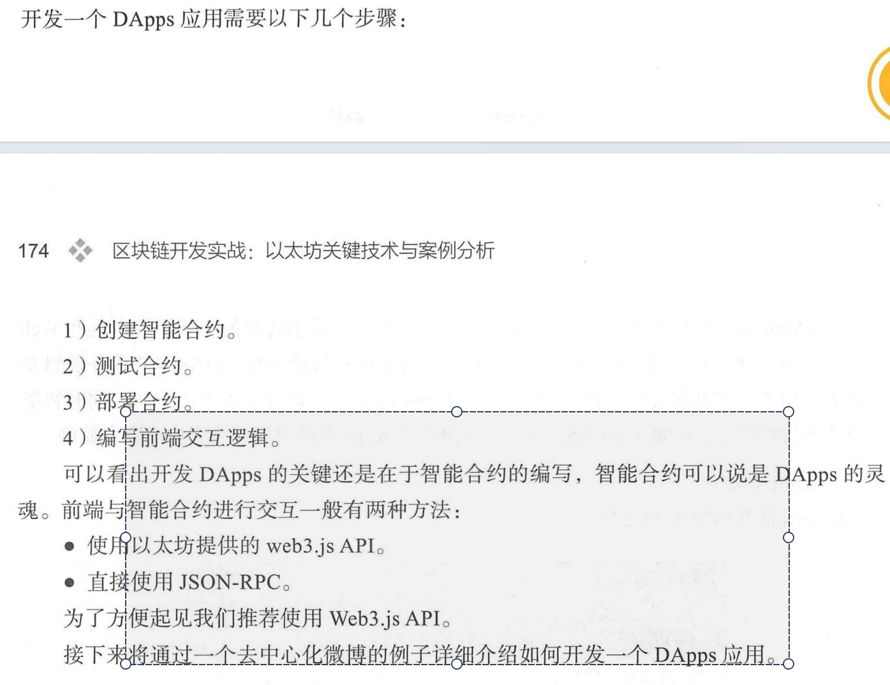
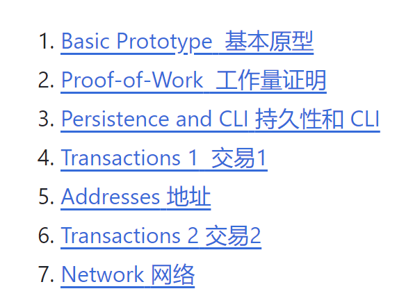
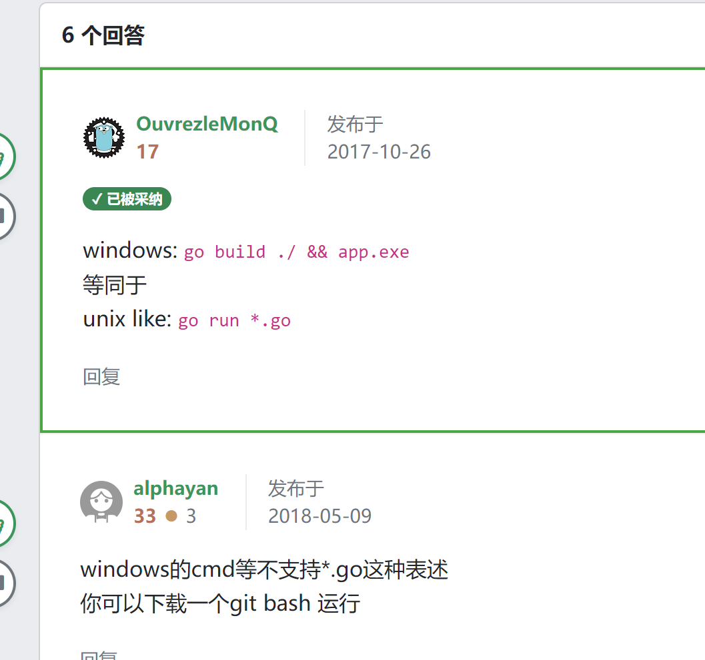
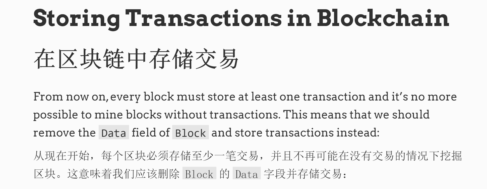

# blockchain

[电压社区](https://eleduck.com/)
[蚁穴](https://antcave.club/)


## 书籍
[master ethereum](https://github.com/ethereumbook/ethereumbook/blob/develop/01what-is.asciidoc)


## 代码
[简单到难的开源代码](https://zhuanlan.zhihu.com/p/91114121)


## 博客
[以太坊系列之一: 以太坊RLP用法-以太坊源码学习](https://www.cnblogs.com/baizx/p/6928622.html)


## 用代码演示基本的安全，转账，挖矿，共识等的认识


### 如何同步代码理解？


https://github.com/ventali/awesome-zk


### 如何打包进区块和我们真实的交易的区别？先打包，后交易的问题！

Explain why a blockchain needs tokens to operate.
解释为什么区块链需要代币才能运行。

整个交易理解经济上和代码上？


#### 区块没有可以记录交易数据？怎么办，一直在挖矿，但是没人交易会发生什么？

即使在没有交易发生的特定时间段内，区块链网络仍然能够继续运行，并在有交易发生时进行记录和处理。

查询币：比特币的查询涉及到查看比特币的所有权和交易历史记录。比特币的所有权是通过使用密码学中的公钥和私钥来管理的。每个比特币地址（通常由公钥生成）与一个或多个比特币的所有权相关联。在区块链上，交易被记录和存储，并且可以根据交易的输入和输出来追踪比特币的流动。通过区块浏览器等工具，用户可以使用比特币地址查询其余额和交易历史记录。


#### 作为奖励的比特币总数是如何通过代码设计的？

比特币的总供应量和奖励数量是通过比特币协议中的代码设计确定的。以下是关于比特币奖励和总供应量如何通过代码设计的一些关键点：

初始奖励：比特币协议规定了初始的区块奖励数量。在比特币网络启动时，初始奖励被设置为50个比特币。这个数量在比特币核心代码中以常量的形式定义。

减半机制：比特币协议中设定了每经过210,000个区块（大约4年）后，区块奖励会减半一次。这个减半机制是通过代码设计实现的。具体来说，通过在比特币核心代码中定义一个减半周期（halving interval）和计算减半次数的方式，来确定当前区块奖励的数量。

总供应量上限：比特币协议规定了比特币的总供应量上限。根据协议设计，比特币的总供应量将永远不会超过2100万个比特币。这个上限通过在比特币核心代码中设置一个常量来实现。

奖励计算：在每个区块中，矿工挖矿成功后会获得区块奖励和交易费用。区块奖励的数量是通过代码计算得出的，通常是根据当前的减半次数和初始奖励来确定。交易费用是由交易发起者支付的，并在每个交易中指定。


## 以下是几个基于Go语言实现的比特币项目的推荐：


1. **btcd**: btcd是一个全节点实现，它提供了一个完整的比特币节点和钱包的实现。它是用Go语言编写的，具有高度的可定制性和可扩展性。项目地址：https://github.com/btcsuite/btcd

2. **btcwallet**: btcwallet是一个比特币钱包的实现，它提供了安全的存储和管理比特币私钥的功能，以及与比特币网络的交互。它是基于btcd的代码库，并且可以与btcd一起使用。项目地址：https://github.com/btcsuite/btcwallet

3. **gocoin**: gocoin是一个功能丰富的比特币库和命令行工具集，它提供了一系列的功能，包括比特币交易的创建和签名、地址生成、区块链浏览、钱包管理等。项目地址：https://github.com/piotrnar/gocoin

4. **kaspad**: kaspad是一个高性能的比特币全节点实现，它是采用Go语言编写的，具有高度的并发性和可扩展性。它旨在提供一种可扩展的比特币区块链解决方案。项目地址：https://github.com/kaspanet/kaspad

这些项目提供了基于Go语言的比特币实现和工具集，可以用于开发自己的比特币应用程序、节点或钱包。它们是开源的，你可以在GitHub上找到它们的源代码，并根据你的需求进行定制和使用。


# 代码理解比特币所有的知识点解释


# 代码理解以太坊所有的知识点解释
[go语言golang实现区块链blockchain源代码](https://zhuanlan.zhihu.com/p/91114121)

https://in.indeed.com/career-advice/interviewing/blockchain-interview-questions

https://intellipaat.com/blog/interview-question/blockchain-interview-questions/

### Geth是dAPP吗？Geth是go-ethereum么？

Geth（Go Ethereum）不是DApp（去中心化应用程序），而是以太坊网络的一种客户端实现。它是由Go语言编写的，是以太坊的官方客户端之一。

Geth是一种软件，它允许用户连接到以太坊网络，并与网络上的其他节点进行通信。作为以太坊客户端，Geth提供了一组命令行工具和API，使用户可以管理以太坊账户、部署和执行智能合约、查询区块链数据等。

虽然Geth本身不是DApp，但它是开发和运行DApp所必需的基础设施之一。开发者可以使用Geth客户端与以太坊网络进行交互，部署和调试智能合约，以及与其他DApp进行通信。Geth提供了与以太坊网络的连接和交互接口，为构建和运行DApp提供了底层支持。


### Geth是go-ethereum的简称么？
是的，Geth是go-ethereum的简称。"Geth"是指以太坊的官方Go语言实现的客户端，全称为"go-ethereum"。它是以太坊开发团队使用Go语言编写的一种客户端实现，用于连接到以太坊网络并与其他节点进行通信。Geth客户端提供了一组命令行工具和API，使用户能够与以太坊网络进行交互、管理账户、部署和执行智能合约，以及查询区块链数据等操作。所以，Geth是指go-ethereum客户端。


### 现在运行的以太坊节点是go-ethereum么？

以太坊网络上运行的节点可以使用不同的客户端实现，其中go-ethereum（Geth）是最流行和广泛采用的一个。然而，以太坊网络是去中心化的，因此存在多个不同的客户端实现。

除了Geth之外，还有其他以太坊客户端，例如Parity Ethereum（由Parity Technologies开发）、OpenEthereum（前身是Parity Ethereum的旧版本）、Nethermind、Besu等。这些客户端实现都提供与以太坊网络的连接和交互功能，但它们可能在特性、性能、安全性等方面有所不同。

因此，虽然以太坊网络上运行的节点中很大一部分是使用go-ethereum（Geth）作为客户端的，但也有其他客户端实现在网络中运行。网络中的节点可以选择使用他们认为最适合自己需求的客户端。

[go_connect](https://www.youtube.com/watch?v=-7uChuO_VzM)

[go_deploy](https://github.com/what-the-func/golang-ethereum-deploy-contract/tree/master)


[用Go来做以太坊开发](https://goethereumbook.org/zh/)

[go-ethereum-code-analysis](https://github.com/ZtesoftCS/go-ethereum-code-analysis)


[以太坊在效率前沿的实施](https://github.com/ledgerwatch/erigon)

blog:https://consensys.io/blog

[ethereum guide](https://ethereum.org/zh/developers/docs)


尽管代码中尝试在空区块中写入交易，但矿工仍然有权选择是否将该交易包含在他们的挖矿区块中。因此，不能保证交易一定会被包含在空区块中。
go代码实现是可以操作空区块的

[go code explain](https://github.com/ZtesoftCS/go-ethereum-code-analysis/blob/master/a%E9%BB%84%E7%9A%AE%E4%B9%A6%E9%87%8C%E9%9D%A2%E5%87%BA%E7%8E%B0%E7%9A%84%E6%89%80%E6%9C%89%E7%9A%84%E7%AC%A6%E5%8F%B7%E7%B4%A2%E5%BC%95.md)


[Starting with version 1.18, Go has added support for generics, also known as type parameters.从 1.18 版本开始，Go 添加了对泛型（也称为类型参数）的支持](https://gobyexample.com/generics)


# eth 白皮书 黄皮书  源码解读，官网
[eth go code explain](https://github.com/ZtesoftCS/go-ethereum-code-analysis/blob/master/a%E9%BB%84%E7%9A%AE%E4%B9%A6%E9%87%8C%E9%9D%A2%E5%87%BA%E7%8E%B0%E7%9A%84%E6%89%80%E6%9C%89%E7%9A%84%E7%AC%A6%E5%8F%B7%E7%B4%A2%E5%BC%95.md)


https://github.com/inoutcode/ethereum_book

https://github.com/yuange1024/ethereum_yellowpaper


## [evm learn](https://www.zaryabs.com/evm-learning-resources/)


go泛型


```
package main

import "fmt"

func MapKeys[K comparable, V any](m map[K]V) []K {
    r := make([]K, 0, len(m))
    for k := range m {
        r = append(r, k)
    }
    return r
}

type List[T any] struct {
    head, tail *element[T]
}

type element[T any] struct {
    next *element[T]
    val  T
}

func (lst *List[T]) Push(v T) {
    if lst.tail == nil {
        lst.head = &element[T]{val: v}
        lst.tail = lst.head
    } else {
        lst.tail.next = &element[T]{val: v}
        lst.tail = lst.tail.next
    }
}

func (lst *List[T]) GetAll() []T {
    var elems []T
    for e := lst.head; e != nil; e = e.next {
        elems = append(elems, e.val)
    }
    return elems
}

func main() {
    var m = map[int]string{1: "2", 2: "4", 4: "8"}

    fmt.Println("keys:", MapKeys(m))

    _ = MapKeys[int, string](m)

    lst := List[int]{}
    lst.Push(10)
    lst.Push(13)
    lst.Push(23)
    fmt.Println("list:", lst.GetAll())
}
```

函数名 MapKeys[K comparable, V any] 中的 [K comparable, V any] 部分实际上是函数的类型参数（type parameters）声明。在 Go 语言中，类型参数用于实现泛型编程，允许在函数或数据结构中使用通用的类型。

在这个函数的情况下，[K comparable, V any] 表示函数 MapKeys 具有两个类型参数，分别是 K 和 V。其中，K 的约束条件是 comparable，表示 K 必须是可比较的类型。而 V 没有特定的约束条件，可以是任意类型。

[firmadyne 详解](https://kms.app/archives/314/)

https://tyeyeah.github.io/2020/12/13/2020-12-13-Firmadyne-and-FirmAE/

https://cypherpunks-core.github.io/ethereumbook/01what-is.html


https://github.com/liyansong2018/firmware-analysis-plus


加速下载和访问： GitHub 通过全球分布式的内容分发网络（CDN）来提供 objects.githubusercontent.com 上的对象，以加快下载速度并提高访问性能。这使得从 GitHub 仓库获取对象更加高效和可靠。

### 区块链开发实战 Hyperledger Fabric关键技术与案例分析


### 区块链开发实战：以太坊关键技术与案例分析 (吴寿鹤，冯翔，刘涛，周广益) (z-lib.org)

code
```

{
  "config": {
    "chainId": 10,
    "homesteadBlock": 0,
    "eip150Block": 0,
    "eip150Hash": "0x0000000000000000000000000000000000000000000000000000000000000000",
    "eip155Block": 0,
    "eip158Block": 0,
    "byzantiumBlock": 0,
    "constantinopleBlock": 0,
    "petersburgBlock": 0,
    "istanbulBlock": 0,
    "ethash": {}
  },
  "nonce": "0x0",
  "timestamp": "0x5e4a53b2",
  "extraData": "0x0000000000000000000000000000000000000000000000000000000000000000",
  "gasLimit": "0x47b760",
  "difficulty": "0x80000",
  "mixHash": "0x0000000000000000000000000000000000000000000000000000000000000000",
  "coinbase": "0x0000000000000000000000000000000000000000",
  "alloc": {
    "0000000000000000000000000000000000000088": {
      "balance": "0x200000000000000000000000000000000000000000000000000000000000000"
    }
  },
  "number": "0x0",
  "gasUsed": "0x0",
  "parentHash": "0x0000000000000000000000000000000000000000000000000000000000000000"
}

```

```
./geth --datadir db/  --rpc  --rpcaddr=0.0.0.0 --rpcport 8545 --rpccorsdomain "*" --rpcapi "eth,net,web3,personal,admin,shh,txpool,debug,miner" --noddiscover --maxpeers 30 --networkid 10 --port 30303 --mine --minerthreads 1 --therbase "0000000000000000000000000000000000000088"  console

```
./geth --datadir db --networkid 10 --http --http.corsdomain="*" --http.port 8545 --http.api db,web3,eth,debug,personal,net,miner,admin --allow-insecure-unlock --rpc.allow-unprotected-txs  --port 30303  --dev --dev.period 1  console 2>>geth.log 

 ./geth --datadir db --networkid 10  --http.addr=0.0.0.0  --http --http.corsdomain="*" --http.port 8545  --rpc.enabledeprecatedpersonal --http.api db,web3,eth,debug,personal,net,miner,admin --allow-insecure-unlock --rpc.allow-unprotected-txs  --port 30303  --miner.etherbase  "0000000000000000000000000000000000000088"  console


 ./geth --datadir db attach rpc:./db/geth.ipc


http://shuzang.top/2019/geth-console-command/

https://noxx.substack.com/p/evm-deep-dives-the-path-to-shadowy

```
balance = web3.fromWei(eth.getBalance(eth.accounts[0]),"ether")

 eth.blockNumber 

```


## 实现一个blockchain  应用一个blockchain
go 使用statedb的基本方法和原理？


是否是合约创建交易,evm statedb都是在创建合约，而不是其他的东西！

### dapp，大家的应用场景是什么？



####  JSON-RPC  WEB3JS.API  那么go代码链接属于什么模式
其实就是不同语言的实现而已
通常需要前端，所以web3 js。显得就跟合适，不然难道还要再要一个后端来做交互么？
如果有这样的项目，是什么？看几十个项目运行几十个项目，做一些笔记，当然会是一个idea!好的！
JSON-RP 本质上是这个go lib ethcleint类似


### truffle 

https://learnblockchain.cn/docs/truffle/quickstart.html


```client, err := ethclient.Dial("https://cloudflare-eth.com")```

## 需要什么样的人，困境是什么


娓娓道来：
https://medium.com/@deliriusz/dissecting-evm-using-go-ethereum-eth-client-implementation-part-i-transaction-execution-flow-960a1533e994
https://github.com/Billy1900/Ethereum-tutorial-EN  以太坊源码分析，英文版

[go-ethereum-code-analysis](https://github.com/ZtesoftCS/go-ethereum-code-analysis)中文版


https://www.mslinn.com/blog/2018/06/13/evm-source-walkthrough.html

https://cypherpunks-core.github.io/ethereumbook/02intro.html

[一行命令配置Github国内镜像源](git config --global url."hub.fastgit.xyz/".insteadOf github.com/)


```
docker p ull ethereum/client-go pi


docker run -d --name ethereum-node - v /Us ers/alice/ethereum : /root \ 
p 8545 : 8545 p 30303 30303 \ 
ethereum/ c l i e n t-go - -fast cache=512
```

要使交易被处理，必须要挖矿 这里我们启动挖矿，然后等待挖到一个区块之后就停
止挖矿：
必须一直挖矿的显示映射是什么？

### 


### 节点和区块的代码交互逻辑，理解上是存在问题上的

https://github.com/Jeiwan/blockchain_go



https://jeiwan.net/连接是没问题的。

区块链网络是去中心化的，这意味着没有服务器来做事，也没有客户端使用服务器来获取或处理数据。区块链网络中存在节点，每个节点都是网络的正式成员。节点就是一切：它既是客户端又是服务器。记住这一点非常重要，因为它与通常的 Web 应用程序非常不同。

当内存池中有足够的交易时，矿工开始挖掘新的区块。

### 比特币挖到了区块，但是却没有交易数据怎么办？


#### goland 同一个包中函数互相调用报错 undefined

goland run时，如果run的包名是非main包，系统会自动编译引用同一个包的相关文件。但是如果编译的包名是main包，系统不会自动编译引用的同一包的相关文件，此时会报错：xxx变量undefined；xxx函数undefined。解决方案有两种：
方案一：cd到对应的文件夹，使用命令go run *.go，运行当前文件夹下的所有go文件。
方案二: 在goland设置编译配置： cnfiguration -> run kind -> Directoty即可。






https://mindmajix.com/blockchain-interview-questions


开发工具

[ethereum-developer-tools-list](https://github.com/ConsenSys/ethereum-developer-tools-list)


memory
cpu
node


https://github.com/ventali/awesome-zk

https://github.com/protofire/blockchain-learning-path

https://github.com/crytic/awesome-ethereum-security?tab=readme-ov-file


[Awesome Blockchain 很棒的区块链](https://github.com/yjjnls/awesome-blockchain?tab=readme-ov-file)


https://www.lynalden.com/

如何把gitea安装到别的盘
本质上是如何把怎么把docker安装到别的盘
文件配置 ROOT = D:/go-project/gitea_main/data/gitea-repositories
但是如果我们linxu下是没有这个选项的，说明什么，说明只有挂在和扩展系统盘的说法，挂载的文件路径是没有变化的！


看价值心法书籍：
说的是，函数，算法和最小化的闭环等一些简单的事情，但是我确实很受启发

做什么事情，像本领域优秀的人学习，仅此而已！

本质上，购入到不同的平台，并没有那么大的风险。不知道我是怎么想的，很执拗貌似！

自学

贫穷限制了你的想象力：

