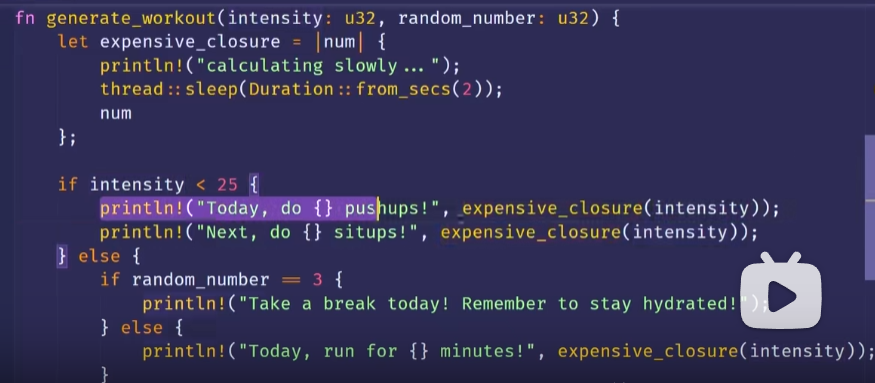

## rust by example  
https://foresightnews.pro/article/detail/10089

https://rust-cli.github.io/book/tutorial/index.html

https://rustmagazine.org/

[包含了使用rust来写一个os的项目的博客](https://zh.practice.rs/elegant-code-base.html)

通过有挑战性的示例、练习题、实践项目来提升 Rust 水平，建立从入门学习到上手实战的直通桥梁
[Rust语言圣经github](https://github.com/sunface/rust-course)

# rust
 sudo code --no-sandbox --user-data-dir ~

[rust-by-example](https://doc.rust-lang.org/rust-by-example/)

[rust权威指南](https://doc.rust-lang.org/stable/book/title-page.html)
中结合视频，学会了什么？
1. assert 和 asserteq的参数不一样，参数不止1，2个，注释，这样在报错可以自定义输出的内容
2. 作用域不仅在rust，go java也是有的，只不过rust用到了极致，从而没有垃圾收集器，所以变为了fight for compiler
3. switch  let的区别，一个是所有都需要举例否则 _println，另一个是选择性的筛选而已！
4. 分布在堆栈的区别，从而使一种精通一门语言的感觉，基础，应用和编码的分析。
5. 语言的行业内的圈子的一种很熟悉的感觉！
6. 代码刻意练习的精通和缺乏！
7. 并在取值为None（对于Option）或Err（对于Result）时，触发一个panic，并提供自定义的错误信息
8. 一个新东西，新领域，权威指南的重要性
9. 


总结：

#[actix_rt::test]用于标记异步测试函数，确保在actix-rt的运行时环境中执行。
#[cfg(test)]用于条件编译，标记测试相关的代码，只在运行测试时编译和执行。

 Rust 和 WebAssembly使用的人场景是什么，比如我们可能会更喜欢用js

let mut s:u32 =32
let mut count = 0u32;
const THREE_HOURS_IN_SECONDS: u32 = 60 * 60 * 3;

Rust 是一种静态类型语言，这意味着它必须在编译时知道所有变量的类型
Option<T>有两个变体：Some(T)，表示具有值的情况，和None，表示没有值的情况。 expect() panic()

#### package


crate


crate的功能


mod


使用路径的移动方法，是一起移动还是相对移动，决定了你是否可以使用相对路径和绝对路径！

private pub


父模块无法访问子模块
子模块可以访问父模块的信息！
定义在同一模块中，可以引用 


```
mod front_of_house { //父模块无法访问子模块
    pub mod hosting {
        fn add_to_waitlist() {}
    }
}

pub fn eat_at_restaurant() {
    // Absolute path
    crate::front_of_house::hosting::add_to_waitlist();

    // Relative path
    front_of_house::hosting::add_to_waitlist();
}
```

super相当于“..”
是从模块里面到了模块外面


对于函数引入到其父模块，不然分不清，是本地定义的，还是哪儿来的

struct enum指定完整的路径


pub use 重新导出
查看隐藏文件夹会看到：package-cache 
config，下的清华源 cargo


访问堆为什么慢，因为多了指针跳转这个环节，这个环节和我们的缓存有关系

### 所有权


为什么会有string类型的存在，用户的输入相对于字符串字面值的不可变，无法提供复杂的场景！


论只是追求知识的多，而不是很在意精通，就好比是知道国内外多数书籍的书名，仅此而已。让对于浩瀚的书籍，这是没有作用的！！


废弃对应的字符串达到失效，当我们在复制的时候~

clone,复制堆数据


基本类型，深度浅度copy没有区别


copy drop注意区别！
函数自动调用drop函数


移动
s2


引用和借用的意义
就是获取使用，但不获取对应的所有权。
书籍内容的构造基本原理，所以就可以说，掌握了基本的代码问题！然后可以写一些代码！！


### 闭包
使用场景：当我们都需要执行一个函数，但是其实else后面是不需要执行的时候。这时候闭包就解决了如果是普通函数就都会执行的尴尬！




查看可以直接看到顶层的结构，而不是深层次的类型！


分析 https://github.com/rust-boom/rust-boom?tab=readme-ov-file有意思的项目，写成文档，这是一个工程师的能力！


### HTTP/2（全称为HTTP/2.0）是HTTP协议的下一代版本，与HTTP/1.1相比有一些重要的区别。以下是HTTP/2和HTTP/1.1之间的主要区别：

1. **多路复用（Multiplexing）**：HTTP/2引入了多路复用的特性，允许多个请求和响应同时在同一个连接上进行。在HTTP/1.1中，每个请求都需要建立一个单独的连接，导致连接开销和延迟增加，而HTTP/2通过在一个连接上同时发送多个请求和响应，提高了性能和效率。

2. **二进制分帧（Binary Framing）**：HTTP/2将HTTP报文分割为更小的二进制帧（frames），并采用二进制格式进行传输。这种二进制格式的设计使得协议的解析和处理更高效，并且容易进行错误检测和修复。

3. **头部压缩（Header Compression）**：HTTP/2使用了HPACK算法对请求和响应的头部进行压缩。在HTTP/1.1中，每个请求和响应都需要重复发送相同的头部字段，浪费了带宽和增加了延迟。通过头部压缩，HTTP/2减少了重复的头部字段的传输，降低了带宽使用和延迟。

4. **服务器推送（Server Push）**：HTTP/2支持服务器主动推送资源给客户端。服务器可以在一个请求的响应中预先推送其他请求所需要的资源，避免了客户端发送额外的请求来获取这些资源，提高了性能和加载速度。

5. **流量控制（Flow Control）**：HTTP/2引入了流量控制机制，允许接收方控制请求的速率，避免了过度的请求导致的拥塞和性能下降。

总的来说，HTTP/2相对于HTTP/1.1在性能、效率和安全性方面都有所提升。它通过多路复用、二进制分帧、头部压缩、服务器推送和流量控制等特性，使得网页加载更快，提高了用户体验。然而，需要注意的是，HTTP/2仍然保持与HTTP/1.1兼容，因此在应用层

http://learn.lianglianglee.com/%E4%B8%93%E6%A0%8F/%E9%99%88%E5%A4%A9%20%C2%B7%20Rust%20%E7%BC%96%E7%A8%8B%E7%AC%AC%E4%B8%80%E8%AF%BE/43%20%E7%94%9F%E4%BA%A7%E7%8E%AF%E5%A2%83%EF%BC%9A%E7%9C%9F%E5%AE%9E%E4%B8%96%E7%95%8C%E4%B8%8B%E7%9A%84%E4%B8%80%E4%B8%AARust%E9%A1%B9%E7%9B%AE%E5%8C%85%E5%90%AB%E5%93%AA%E4%BA%9B%E8%A6%81%E7%B4%A0%EF%BC%9F.md


为了编写操作系统内核，我们需要不依赖于任何操作系统功能的代码。这意味着我们不能使用线程、文件、堆内存、网络、随机数、标准输出或任何其他需要操作系统抽象或特定硬件的功能。这是有道理的，因为我们正在尝试编写自己的操作系统和驱动程序。


[bottlerocket](https://github.com/bottlerocket-os/bottlerocket/blob/develop/QUICKSTART-VMWARE.md)


实践者和信息收集者：code and 收集适合自己的规划得东西


，C ABI 是定义了编程语言和操作系统之间的接口规范，它确保了不同编译器和链接器生成的二进制代码之间的兼容性，使得它们可以正确地进行函数调用和数据传递。

[LLVM](https://llvm.org/docs/LangRef.html)


# rust for os dever

https://rcore-os.cn/rCore-Tutorial-Book-v3/

目前MoeOS要做的工作很多，我也会在学习和工作之余继续完善MoeOS

https://rustmagazine.github.io/rust_magazine_2021/chapter_12/lets-make-os.html


~/.cargo/config
```
[source.crates-io]
replace-with = 'tuna'

[source.tuna]
registry = "https://mirrors.tuna.tsinghua.edu.cn/git/crates.io-index.git"
```

```

rustup target add riscv64gc-unknown-none-elf
cargo install cargo-binutils
rustup component add llvm-tools-preview
rustup component add rust-src

```

然而，通过在整数字面量后面添加类型后缀，您可以显式地指定它的类型。在这种情况下，后缀 _u8 表示将整数字面量解释为 u8 类型。


[rust impl git](https://github.com/MrBeanCpp/mit)

git文件压缩
全量commit备份快照，空间换时间


gitlet


rust中String::from("someusername123"),和普通字符串的区别？

在 Rust 中，String::from("someusername123") 是通过 String 类型的一个方法 from 创建的字符串。与普通字符串相比，使用 String 类型有以下区别：

动态分配：String 类型是一个动态分配的字符串，它在堆上分配内存来存储字符串数据。这意味着它可以根据需要动态地增长或缩小，具有灵活性。

可变性：String 类型是可变的，可以进行修改、附加和删除操作。您可以改变 String 对象的内容，而不需要创建一个全新的字符串对象。

所有权：String 类型拥有字符串的所有权。这意味着当 String 对象超出其作用域时，它将负责释放内存。这是通过 Rust 的所有权系统来实现的，以确保内存管理的安全性和性能。

UTF-8 编码：String 类型中的字符串以 UTF-8 编码存储。这使得处理多语言、特殊字符和 Unicode 字符串更为方便。


Rust 确实包含打印调试信息的功能，但我们必须明确选择使该功能可用于我们的结构。为此，我们在结构定义之前添加外部属性 #[derive(Debug)]


https://app.codecrafters.io/tracks/rust


blockchain 需要精通
dapp应用场景和玩玩需要精通！


反而是那些学习不算好，就知道瞎倒腾的人，成了最大的赢家。

最后，知识比较丰富，学历比较高的人发现，替代我们的不是人工智能，而是那些比自己学历低，且喜欢拥抱变化的那群人。

