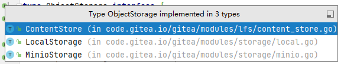

### 现有使用的场景：

- 代码仓库：开发者和其他
 issue  pr  repo 分支模型  **组织权限控制不太符合**
 

- 代码hooks,钩子函数回调-devops回调，触发
code

- 版本发布：版本间代码差异提交入库，三方接口代码树结构查看，接口查询
tag

- 代码统计和简单分析 
code cloc
代码行数，文件数，注释数，空行数等等

- 代码库本身的权限管理，组织管理，代码分支管理！

### 常见的实现和约束：

.  先有个人，再有组织，企业，高校
. 个人空间不可以重复如:https://github.com/liuyuchao/demo.git 的空间是liuyuchao
. 空间名字英文
. 仓库http地址分三级（ip+user+repo）：https://github.com/liuyuchao/demo.git

现在不支持自定义个人命名空间git的地址，默认名字拼音作为空间组成 比如 https://github.com/docker/libcompose.git、git clone https://gitee.com/daka1004/godemo.git

### 问题：多租户备份、权限使用
 1. 不同部门相同的用户名会存在问题
 - 从onroad同步和登录的时候。
 - git push 等基本所有的操作的时候

2. 同步修改租户为onroad逻辑：二院，所，部门这种逻辑组织来使用数据库和代码文件保存会很复杂
 - 不是常规设计的使用方法包括git地址协议（不止三级），代码保存（/data/repo/{user,org}）
 - 代码仓库转让到其他的成员，成员之间的权限问题难以控制，
 - 代码按照组织层级保存在目录上或者存储应用上，比如 minio，导致备份复杂

3. 代码和数据库各组织部门备份
 - 数据库没有做到不同命名空间进行区分：如果要做没有java动态的数据源库，minio空间动态切换等
 - 代码存放./data/gitea-repo，类似文件分部门备份现有代码设计无法做到。
  (现在支持 /repo（ local  minio  lfs）所有代码备份，涉及到恢复问题（.git结构和实际代码不同）
 - 

4. 组织的使用需求场景还需要更清晰

 - 权限控制需求 
 - 数据备份 

共性问题：
-  备份指定用户或者组织的数据（数据库/代码），代码本质（hash object。同步用户用户名字维护如liuyuchao_1273

-  go实现的多数据源动态切换！如果是minio，bucket空间切换

### 改进方法

1. 使用 https://github/eryuan/706/sanbu/test.git代替https://github/liuyuchao/demo.git

 - 问题1：所有的代码逻辑接口都需要改变，.git的结构 git协议修改 如push pull的问题refs data

 - 问题2：所有用户数据都通过onroad接口调用，或者租户相关表导入同步过来

2. 和gitee,github类似只有企业和个人的解决方案,保存用户的所有信息，部门，身份证等，liuyuchao_1221（身份证后四位）当作git工作空间，（电话号）的登录名，进行区分，

  - 问题1：可能接受的企业单位粒度，以及粒度对应下的个人，就是gitee的企业组织的方法：706，还是三部这个粒度当作一个企业，或者一个团队为 git仓库
   （可能的方法，保存用户的所有信息，部门，身份证等，liuyuchao_1221（身份证后四位）的登录名，进行区分）
   （而且建立仓库的是否，是需要进入对应的组织再建立仓库，而且我可能是个人使用的场景，）

 - 问题2：
同步过来先有机构，再有个人--谁建立机构?root管理员的分配?部门的问题,
-- 后期没有登录，注册接口,同步数据如何保证第二个同名
--  同步数据如何保证第二个同名liuyuchao_7831类似数据 
-- 基础用户数据都是来自onroad,备份必要性
-- 代码仓库自身的数据库备份部分，没有不同命名空间的区分，有空间区分，使用逻辑很复杂，但是只有备份的时候才起作用
--用户进行操作需要反复访问onroad,确定租户，或者gitea数据库冗余很多没有用的数据，
-- 无法单独使用，无法独立使用
-- 不同步如何保证同onroad数据一致性

结论：
保证单主机多服务隔离使用空间部署-各部门独立使用代码库和空间
代码仓库权限外界访问隔离
支持minio使用
key管理模块，push代码权限验证支持
同步用户重名解决方法？？？涉及到onroad跳转，身份证验证问题

