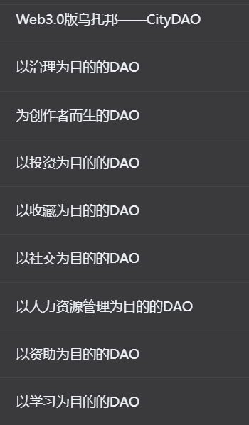

# [Rust in Blockchain ](https://rustinblockchain.org/)

https://rustmagazine.github.io/

https://blocksec.com/blog/podcast-how-block-sec-intercepted-15-m-of-web3-exploits-in-real-time-1

https://www.notion.so/0-6a318776241f4e71960118bf294f8c11

https://github.com/a16z/magi

[开发者新手指南：一文汇总 Web3 开发工具](https://mp.weixin.qq.com/s?__biz=Mzg3ODcwOTA1Mw==&mid=2247490634&idx=1&sn=70d6e433812673a7659b1728f8c28b11&scene=21#wechat_redirect)

[开发者新手指南：Web3 技术堆栈 & 平均薪资盘点](
https://mp.weixin.qq.com/s?__biz=Mzg3ODcwOTA1Mw==&mid=2247490069&idx=1&sn=09674d9847c20f2de5649d2ea15c0162&scene=21#wechat_redirect)

制约Web3.0发展的瓶颈？答案显而易见，就是优质的应用

参考文献：

Web3 Walkthrough — Part 2 — Becoming a Web3 Developer | HackerNoon

https://hackernoon.com/web3-walkthrough-part-2-becoming-a-web3-developer?source=rss

Web3 Technology Stack

https://web3-technology-stack.readthedocs.io/en/latest/#about

A simple guide to the Web3 stack

https://blog.coinbase.com/a-simple-guide-to-the-web3-stack-785240e557f0

A Developer’s Guide to the Web3 Stack

https://alchemy.com/blog/web3-stack

Hire Web3 Developers: Salary, Skills and More

https://www.revelo.com/blog/hire-web3-developers

Solidity developer jobs: which Web3 companies are hiring? - Articles

https://metaschool.so/articles/web3-companies-hiring-solidity-developer-jobs/?utm_source=twitterblogpost&utm_medium=organic&utm_campaign=dailypost

https://dashboard.alchemy.com/

https://www.notion.so/TinTinLand-Community-3f0b56879c57411f9a04dd82ba541e6a?pvs=4

rust dapp
设计的基本app的好玩的地方
tintinland

# rust开发dapp项目的解读1..=n

https://www.notion.so/TinTinLand-Community-3f0b56879c57411f9a04dd82ba541e6a

https://github.com/hanakannzashi/near-contract-course-basics.git

