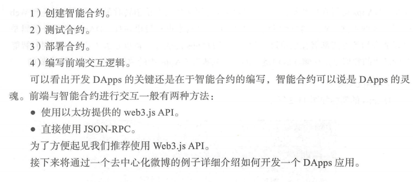
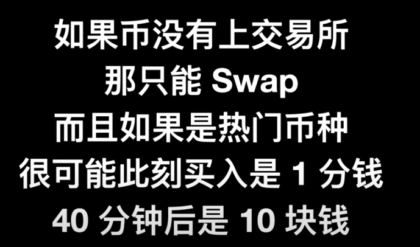
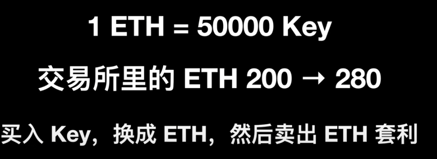
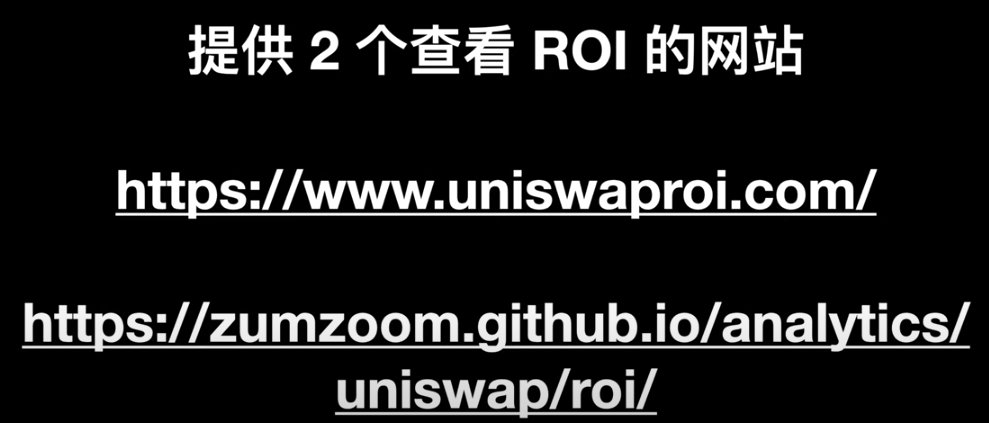
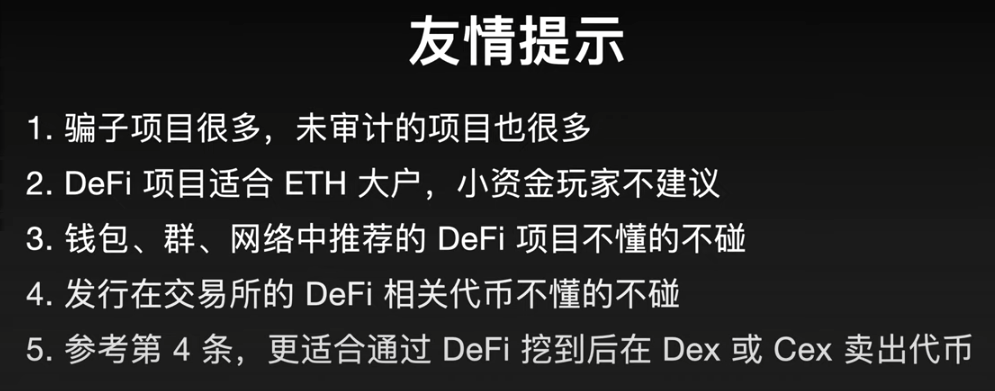
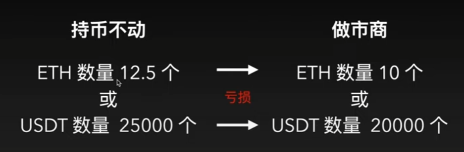
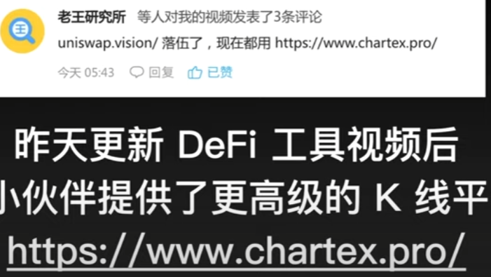
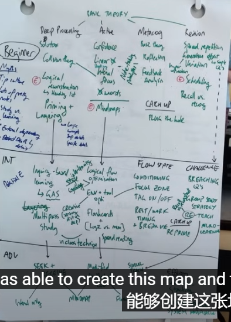
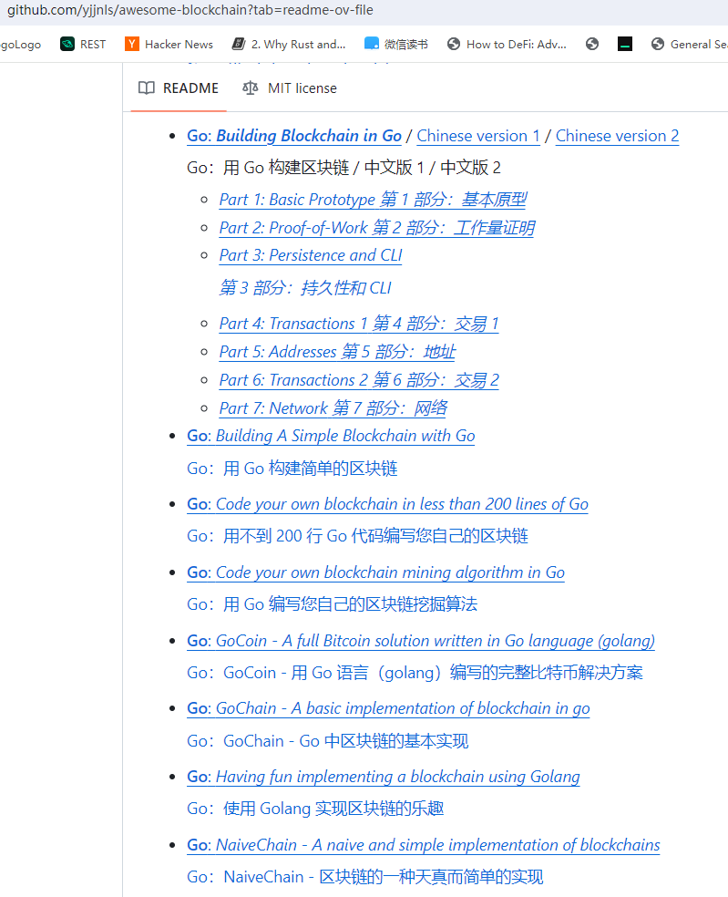

# [Rust in Blockchain ](https://rustinblockchain.org/)

https://rustmagazine.github.io/

https://blocksec.com/blog/podcast-how-block-sec-intercepted-15-m-of-web3-exploits-in-real-time-1

https://www.notion.so/0-6a318776241f4e71960118bf294f8c11

https://github.com/a16z/magi

[开发者新手指南：一文汇总 Web3 开发工具](https://mp.weixin.qq.com/s?__biz=Mzg3ODcwOTA1Mw==&mid=2247490634&idx=1&sn=70d6e433812673a7659b1728f8c28b11&scene=21#wechat_redirect)

[开发者新手指南：Web3 技术堆栈 & 平均薪资盘点](
https://mp.weixin.qq.com/s?__biz=Mzg3ODcwOTA1Mw==&mid=2247490069&idx=1&sn=09674d9847c20f2de5649d2ea15c0162&scene=21#wechat_redirect)

制约Web3.0发展的瓶颈？答案显而易见，就是优质的应用

参考文献：

Web3 Walkthrough — Part 2 — Becoming a Web3 Developer | HackerNoon

https://hackernoon.com/web3-walkthrough-part-2-becoming-a-web3-developer?source=rss

Web3 Technology Stack

https://web3-technology-stack.readthedocs.io/en/latest/#about

A simple guide to the Web3 stack

https://blog.coinbase.com/a-simple-guide-to-the-web3-stack-785240e557f0

A Developer’s Guide to the Web3 Stack

https://alchemy.com/blog/web3-stack

Hire Web3 Developers: Salary, Skills and More

https://www.revelo.com/blog/hire-web3-developers

Solidity developer jobs: which Web3 companies are hiring? - Articles

https://metaschool.so/articles/web3-companies-hiring-solidity-developer-jobs/?utm_source=twitterblogpost&utm_medium=organic&utm_campaign=dailypost

https://dashboard.alchemy.com/

https://www.notion.so/TinTinLand-Community-3f0b56879c57411f9a04dd82ba541e6a?pvs=4

rust dapp
设计的基本app的好玩的地方
tintinland

# rust开发dapp项目的解读1..=n  solana

https://www.notion.so/TinTinLand-Community-3f0b56879c57411f9a04dd82ba541e6a

https://github.com/hanakannzashi/near-contract-course-basics.git

https://blog.chain.link/how-to-build-and-deploy-a-solana-smart-contract-zh/

# awesome-solana dev

https://github.com/StockpileLabs/awesome-solana-oss

https://www.notion.so/Solana-9712501f28b948de906392032653b42c?pvs=4

https://www.theblockbeats.info/news/29170

----------------------------------------------------------

# 玩法web3 code
https://0xmacro.notion.site/Session-Notes-a08f34aefdc14a6cb3f1b66f4a88f034

问题在于不同语言可以实现的web3项目的的玩法逻辑和交互，之后采用代码进行实现！

想要看的是实际的项目如何设计，如何交互eth等问题，怎么部署怎么完善！

敦促人们了解金钱如何运作、投资并创造被动收入流

**项目具体实现 todo**
### 基本实现：
how to defi？还差时间用money的实现和实践，才有自己的代码发言权，包括代码安全性！

等等：好像合约部署，很简单一个步骤，就可以在自己的对应的钱包可以查看东西，说明这个过程本身是很简单的，至于部署的合约是怎么在eth链上，发挥作用的，这是一个问题

不久之后，类似网络浏览器的图形界面（例如 Mist）被创建来扩展客户端，并且客户端功能被内置到使用经过时间考验的 HTML/CSS/JS 堆栈构建的网站中。然而，为了支持最多样化、最复杂的 dapp，开发人员需要通过 API 以编程方式访问客户端功能。这将客户端技术开放为可重用、可组合的单元，全球开发人员社区可以以创造性的方式应用它们。

To support this, Geth ships official Go packages that can be embedded into third party desktop and server applications. There is also a mobile API that can be used to embed Geth into mobile applications.
为了支持这一点，Geth 提供了可以嵌入到第三方桌面和服务器应用程序中的官方 Go 软件包。还有一个移动 API，可用于将 Geth 嵌入到移动应用程序中。

**可以理解为 geth既可以当作客户端又可以当作服务端，从代码层面来讲！本机部署之后就这样使用，但是如果是访问的主网那就是一个完整的额客户端**

https://geth.ethereum.org/docs/developers/dapp-developer/native

 ethclient 包提供了一个实现完整以太坊 JSON-RPC API 的客户端，而 gethclient 提供了特定于 Geth 的 API。

 [使用Web3.js与以太坊交互](https://blog.csdn.net/2301_78240244/article/details/130757423)
则是使用js的实现，前端语言进行以太坊的交互和合约的调用

### 设计奇技淫巧

### rust语言实现的demo和区别？
rust编写合约，在near区块链 nearcore也是rust开发的 https://github.com/near/nearcore
[near区块链](https://near.org/)

本质上就是这些，包括发币多少一共，然后看defi，不同链之间的模型和测试案例，以及开源代码。
#### 从零开始实现一个defi借贷？
包括链，以及设计的模型和以太坊交互的实现。

如果用户提供的抵押品价值高于借贷的价值，则用户可以借入特定资产
那为什么需要借贷？
- 杠杆交易：用户可能希望使用借入的资金进行杠杆交易。通过借入更多的资产，用户可以放大他们的投资回报。例如，如果用户预期某个资产的价格将上涨，他们可以借入该资产来增加他们的头寸，以便在价格上涨时获得更大的利润。

- 投资多样化：用户可能希望将借入的资金用于投资组合的多样化。即使他们已经有一定数量的某种资产，他们可能希望借入其他资产来分散风险或追求更多的机会。

- 灵活性：借贷资产可以为用户提供更大的灵活性。他们可以使用借入的资金来满足紧急资金需求、抓住突发机会或满足其他资金需求。

#### 假设你有一些加密数字资产，比如以太坊。你不希望卖掉以太，但是需要一笔流动性现金，用来消费或者投资更多的数字资产。

你将1500美元的以太锁入智能合约 (Collateralized Debt Position, 抵押债仓) 之中，作为担保物。
根据该担保物的风险参数 (2/3的折扣)，可生成1000个 Dai，即1000 美元 。
用 Dai 换成美元或投资其他的资产。
当需要取回担保物(以太)时，偿还 1000 个Dai 和极低的利息(以MKR支付, 目前年化 0.5%)，拿回以太并保留获取的收益(来自以太的上涨或用Dai投资的收益)。
Dai: 如何稳定？

当一个区块链已经开发完成，之后基础的功能（比如合约的部署和执行）是没有变化的，那么之后的更新迭代是在做什么事情？
安全性和漏洞修复：区块链项目需要不断关注和修复可能存在的安全漏洞，以保护用户的资产和数据安全。发现和修复潜在的漏洞是一个持续不断的过程，因为黑客和恶意攻击者始终在寻找新的漏洞。因此，项目团队会持续进行安全审计、漏洞修复和更新操作，以确保系统的安全性。

性能和可扩展性改进：随着时间的推移，区块链网络和用户数量可能会增加，这可能对性能和可扩展性提出挑战。因此，项目团队会致力于改进区块链的性能、吞吐量和交易确认时间，以应对不断增长的用户需求。

新功能和增强功能：尽管基础功能没有变化，但项目团队可能会不断推出新的功能和增强功能，以提供更多的价值和吸引更多的用户。这些新功能可能包括新的合约模板、新的智能合约功能、新的代币标准、新的链间互操作性协议等等。

社区驱动的改进：区块链项目通常具有活跃的社区，其中包括开发者、用户和持币人。团队会积极倾听社区的反馈和建议，并根据社区需求进行改进。这可能包括增加更多的治理功能、改进用户体验、增加社区参与机制等等。

https://www.solanazh.com/

dapp的具体实现和具体项目：

rust sway
https://github.com/FuelLabs/sway?tab=readme-ov-file

主动做市商和自动做市商的解读

#### 什么是 AMM？

简单来说，AMM 模式就如同一台自动售货机，对于一个交易对来说，AMM 同时销售交易对两边的代币，作为买方和卖方的对手方;流动性提供者（Liquidity Provider，简称 LP）按照规则为这台自动售货机提供一种或同时提供两种代币让售货机销售。交易者投入一种代币，根据自动售货机的规则以及当前两种代币的比例能够确定能够兑换出的另一种代币数量，从而完成交易。

交易完成后，由于售货机内部的代币比例发生变动，自动生成了新的价格。交易只能按照现价交易，因此很多基于 AMM 的 DEX 称为 Swap。

AMM 应用在区块链场景仅五年时间，从最早的 x*y = k 模型，涌现出数十种不同的模型，本文将从**流动性需求，资金效率，价格影响**等角度切入，对市场上公开的 AMM 模型做机制研究，其中包括已经被应用、被市场检验的产品，也包括最新提出的改进方案，希望能为相关业务的开发者提供一些启发。

在Uniswap V1中，用户可以在以太坊区块链上创建和交易各种ERC-20代币。然而，Uniswap V1的初始设计限制了**交易对**的配置，每个交易对都需要以ETH作为其中一个资产。这意味着用户只能通过ETH来交易其他代币，而无法直接在Uniswap V1中进行两个非ETH代币之间的交易。

其中 x 和 y 分别表示“自动售货机”中两种代币的“库存”，k 为流动性参数，在每次交易过程中库存发生改变而 k 保持不变，每次流动性的添加和移除过程中 k 对应增加或减少；Uniswap V2 中 x 和 y 可以是任意的 ERC20 标准代币。代币在资金池中库存比例即为当前兑换价格，流动性提供也根据当前比例等比例提供。

在DeFi中，**滑点**（Slippage）是指在进行交易时，实际成交价格与预期价格之间的差异或偏移。更低的滑点意味着交易能够以更接近预期价格的价格成交，而较高的滑点则表示交易可能以较远离预期价格的价格成交

滑点容忍度（Slippage Tolerance）来控制滑点的程度

uniswap进行defi交易：
不用去交易所，直接就在自己的这个区间
通过coinmarketcap，进入到uniswap网站，通过钱包进行交易即可 metamask

### DEFI怎么赚钱和区别？

区别就是没有订单簿，不像交易所你提了一个交易价格就挂在上面了！
实时计算，差价给了做市商
如果没有我们想要兑换的币，就可以把合约地址，添加进去，在以太坊上，因为本质上，就是合约地址产生这些币！分发等等！

参考：
林冠宏的两本书:
区块链DApp开发：基于以太坊和比特币公 by_林冠宏
区块链以太坊DApp开发实战 by_林冠宏 
精通以太坊
区块链实战：以太坊关键技术和实战分析
区块链开发实战：hyperlerdger fabric
building ethereum dapps

钱包onekey的特点相比于metamask，更多功能，还可以同时创建bitcoiN

----------------------------------------------------------
1分钱到10块钱
如果添加的币不可以买卖，就是没有流动性。

在以太坊中，共识客户端（Consensus Client）和执行客户端（Execution Client）是两个不同的概念。

1. 共识客户端：共识客户端是以太坊网络中参与共识算法的一部分，负责验证和执行区块链上的交易，并维护区块链的一致性。共识客户端实现了以太坊的共识算法，如Proof of Work（工作量证明）或Proof of Stake（权益证明）。它们通过与其他节点进行交互，共同达成一致并确认区块链上的交易和状态。以太坊中常见的共识客户端包括Geth和Parity。

2. 执行客户端：执行客户端是以太坊网络中的一个节点实现，它负责执行智能合约的代码。执行客户端接收共识客户端传递的交易和区块，并执行其中包含的智能合约代码。执行客户端根据智能合约的逻辑，更新区块链上的状态，并将结果传递给共识客户端进行验证和共识。以太坊中的执行客户端包括Geth和Parity，它们既可以是共识客户端也可以是执行客户端。

如果您想加入以太坊网络作为一个节点，通常需要同时运行共识客户端和执行客户端。共识客户端负责验证区块链的共识规则，并参与共识算法，而执行客户端负责执行智能合约的代码并更新区块链状态。这样，您可以与其他节点进行交互，并参与验证和执行区块链上的交易和合约。

需要注意的是，以太坊网络的节点可以选择不同的客户端实现，例如Geth、Parity、Nethermind等。您可以选择其中一个执行客户端来加入以太坊网络，但为了完整参与以太坊的共识和智能合约执行，最好同时运行共识客户端和执行客户端。

提供流动会挣钱，也会亏钱，亏钱意味着
eth交易所快速上涨，但是uniswap却没有同步交易所的数据，会导致问题

查看roi的网站：

通过以太坊地址查询ROI
https://www.uniswaproi.com/
ROI 查询
https://zumzoom.github.io/analytics/u...
Defi锁仓量查询
http://defipulse.com/

**2023亏钱的教训：**
不懂大环境，美元加息，全球熊-和批判性思维，不同观点，信息源被污染有关系，甚至直到以后11月份会涨价，但是还是没买任何币
没有做事规则：交易的计划和结束的退出机制，本质是执行失败和思考没有区分，输在了认知，运气等等，都不是一个人气馁的理由，长远看，是有好处的
不懂原理，专业投机之类的知识，没有做到先胜而后战
没有安全常识，被钓鱼网站和其他出现的安全问题
没有隐私保护和加密信息隐私的常识，私钥等等

# 白皮书阅读defi blockchain and so on 

# defi挣钱的可能性和现象的一种操作！maybe就像下象棋和布局一样！
[uniswap 实操](https://www.youtube.com/watch?v=ZGeVtZEpuT4)
理论就是注入的流动性的比例

[compound](https://www.youtube.com/watch?v=g46ySx1bWB8)

可以进行治理投票，可以退出
门槛高，需要eth比较多，少量基本是没什么用的！

风险：清算，利率，gas,套利在快速eth变化中
引入：预言机可以解决问题，方法具体

[curve 实操]()
[curve fi](https://www.youtube.com/watch?v=FD9_LYlFQAg)

[zkrollup](https://github.com/matter-labs/zksync-era)

### 如何创建dao

https://cryptomarketpool.com/how-to-create-a-dao/

https://hashnode.com/

### web3 postman
https://web.getlaika.app/

### 公链项目
https://vfat.tools/

### 铭文的作用？

[awesome-blockchain-rust](https://github.com/rust-in-blockchain/awesome-blockchain-rust)

https://101blockchains.com/top-blockchains-using-rust-programming-language/

[upgrade eth](https://eth2book.info/latest/)
https://leastauthority.com/community-matters/moonmath-manual/

[foundry book](https://book.getfoundry.sh/)

[Damn Vulnerable DeFi](https://www.damnvulnerabledefi.xyz/)

[zk road](https://plum-lightning-36c.notion.site/Road-to-ZK-2e85993b316b4c7c831bcdc866005e1b)

whiteboard
https://zkhack.dev/whiteboard/

# 闭环  

## solana闭环

## 合约闭环，对比不同合约代码的区别

[defi map](https://github.com/OffcierCia/DeFi-Developer-Road-Map/blob/main/translations/README_cn.md)

切片允许您引用集合中连续的元素序列，而不是整个集合。切片是一种引用，因此它没有所有权

## foundry book 闭环

https://www.fintechfestival.sg/zh/why-attend

