# HOW TO NFT

https://mirror.xyz/bi8bo-yep.eth/0TVFqKFTj70gxoh5TIgcalLviwZ8kwsnUfMogVhNp1o

每张宝可梦交易卡都是独一无二的，没有两张卡是可以互换的，因为它们可能有不同的动作、稀有度和物理条件。

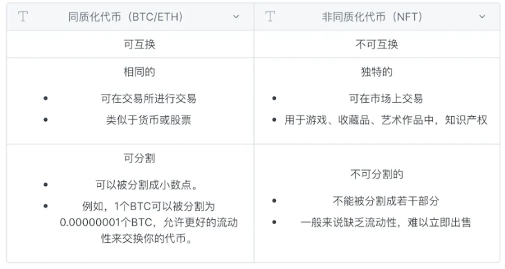

真实性
NFTs正在颠覆中介机构

NFT和defi都额可以自己铸造，但是那么做得不能做到得东西是什么？

艺术家和创作者现在可以直接以NFT的形式创作艺术作品，并直接从他们粉丝那里获得收入，没有任何中间商。无需考虑来自分销商和出版商的费用，艺术家现在可以根据用户愿意支付的费用，来赚取属于他们的公平份额。

错误得价格，或者代币购买对应得nft,从而轻而易举得获取价差。

PR给与贡献！

通常，一小部分代币就足以加入，但拥有更多代币可能会带来好处。例如，代币持有量有时会决定您在 DAO 决策中投票的权重。

### how to defi 

https://nigdaemon.gitbook.io/how-to-defi-advanced-zhogn-wen-b/master

https://github.com/fltenwall/web3-awesome?tab=readme-ov-file

[Messari](https://messari.io/)

https://zhuanlan.zhihu.com/p/332546689

https://zapper.xyz/dashboard

https://app.aave.com/

https://app.compound.finance

https://app.uniswap.org/

rust webassaly 
rust for web3 demo 设计和实现

只不过是利用去中心化达到资产交易除了钱的其他物的工具和功能！

所以别抱怨，该捐还是得捐，不然看别人拿空投又拍大腿
而且你还得有 Gitcoin 20 分以上才有资格，兄弟

# token  crypto 
https://gobitcoin.io/tools/cost-51-attack/

[PoW 51% 攻击成本](https://www.crypto51.app/)

[深入理解 Uniswap v2 合约代码](https://mirror.xyz/adshao.eth/VY6aLzdjwXGif9O1C7UMuYFmivC4q5jDQqQUho6tLWY)

Web3 DApp 最佳编程实践指南

**code for dao examples**
https://guoyu.mirror.xyz/RD-xkpoxasAU7x5MIJmiCX4gll3Cs0pAd5iM258S1Ek

服务端一直是 DApp 被认为没那么「去中心化」的原因之一。就我所知，世界上绝大多数 DApp 都有服务端 API 提供支持，只有少数类似 Uniswap 这样的产品，仅依赖前端与合约进行通信。

我们需要编写服务端 API 的原因之一是，链上状态储存的成本过高，以及反复地签名与交互对用户来说体验不佳。另外一些原因是，一些不重要的，可以被丢弃的数据并不需要放在合约中储存。

按照它们的共识证明种类，可以被分为 PoS 和 PoW；按照它们的角色定位，可以分为 L1 与 L2；按照它们对 EVM 兼容的类型，可以分为 EVM 兼容链和非 EVM 兼容链。

一般来说，我们可以选择发行到这些流行的区块链网络：

Ethereum (ETH) 主网：Gas 费用昂贵，但其中储存了大量资产，如果你的项目与 NFT 相关，许多人会选择发布到主网。
Polygon (Matic)：类 ETH 的 PoS 侧链，EVM 兼容，在许多国家都有一定的用户基础，有限的 TPS 支持与可接受的成本，开发者友好。
BNB Chain (BNB): 币安的区块链网络，EVM 兼容，开发者友好。
Solana (SOL): 高性能区块链网络，支持多种编程语言编写合约，EVM 兼容（使用 Neon）
AVAX C-chain (AVAX)：AVAX 的应用链，EVM 兼容，提供快速区块确认，相当程度的 TPS，可以自己搭建 C-chain 作为应用链 sub-chain（例如 DFK Crystalvale）
Cosmos(ATOM): 连接应用链的区块链网络，非 EVM 兼容（Evmos 除外）提供快速的 IBC 跨链桥支持，可以自定义应用链的 Gas token，适合 GameFi 与需要定制 TPS 的大型应用。
Near (NEAR)：提供完善的开发者套件和网页钱包一整套方案，因此用户入门难度最低，非 EVM 兼容（使用 Rust 编写合约）。
StarkNet (ETH Layer2): 使用 zkRollup 技术支持的 L2 网络，非 EVM 兼容，由 Starkware 提供技术支持（它同时支持了 IMX 与衍生品 DEX DyDx）支持与 L1 的合约进行通信，支持使用 warp 工具将 Sol 代码转换为 Cario 语言的合约代码。
zkSync2.0 (ETH Layer2): 使用 zkRollup 技术支持的 L2 网络，同时支持了 DEX ZigZag。支持与 L1 的合约进行通信。
scroll (ETH Layer2): 使用 zkRollup(zkEVM)技术支持的 L2 网络。
xDai(Gnosis Chain): 它支持了著名的到场证明合约 POAP。
Harmony(ONE)：高性能区块链，它支持了 DFK 的第一个版本。
Dfinity (ICP)： 一个完整的 DApp 生态系统。

当我们这一点有问题的时候，我们的问题究竟是什么，code难度，还是设计难度，或许都有！

当我意识到这一点时，我所面临的交付压力已经和 1 月无法同日而语。因此，整个 3 月，我几乎保持每日稳定的编码节奏，

About
🏗 forkable Ethereum dev stack focused on fast product iterations
🏗 可分叉的以太坊开发堆栈专注于快速产品迭代：https://github.com/scaffold-eth/scaffold-eth

许多 DAO 采用广泛的人治，而有限地依赖合约治理。
但我想为大家阐述一下我如何理解「将 DAO 变成小型高效组织的效率工具」这一话题。

https://solidity-by-example.org/state-variables/

https://learnblockchain.cn/article/4620

字节跳动退休的郭宇
不知道为什么护照，就像人性中的贪婪，恐惧和交易中的反人性应该是一个意思吧！

https://guoyu.mirror.xyz/bPaDKAcrhJGUbaXu9BWDcdD-F46gBFATTvf_qwZ9Bso

除了写作之外的所有计划都暂时搁置
写作

DeFi 巧妙地将银行的事务通过合约自动化，成了事实上的「链上银行」。这个变化使得稳定币池像海绵一般不断地吸入链下资产，甚至商业银行本身，有的也成了 DeFi 的用户。

如果 ERC-20 能代表稳定货币，为什么它不能代表股权？如果连复杂的银行事务都能被合约自动化替代，还有什么组织不可以被智能合约替代？

写作和code提交的最频繁的一个人，那是什么样的现状。
草稿版和发行版！note的区别吧！

虚拟世界的经济已经随着互联网运行了数十年之久，但对平行网络来说，当务之急是确立虚拟商品的产权。我们在互联网上创造价值，并不仅仅因为我们将商品摆到网络上销售，我们所创造的图片，文本，视频甚至代码本质上都是商品。在 Web2 的世界里，这些商品几乎无法得到版权保证，不仅因为我们的账户属于商业公司，内容的「免费」与盈利模式的转嫁也是传统互联网产品的重要特征之一。

如果说产权通证只是从技术上确立了虚拟商品的产权，那还无法形容 Web3 所带来的产权革命。由于 DApp 都构筑于统一的协议，注册与登录不再必要，用户所有的行为数据都存放在任何产品能够读取的公共网络上，当然，用户的个人资产都是离线而安全的。

我认为，商业公司不太可能放弃这个优势去寻求拥抱新的平行网络，但一些新的服务会随着 Web3 的发展成长成为新的基础设施，直到这些大型平台不得不适应这种变化。

https://guoyu.mirror.xyz/f2yLu59TJ4u07FQ13UmiN4-cLELv3g-qQirY7YF_Qyw

### review your life and experience

包括测试网巨额错误转账

他不仅在听，而且时刻在判断问题和局势的严重性

几位新解释的非洲朋友以及比较了解印太市场情况的新加坡朋友交流了此事，得出一个非常重要的判断，就是东南亚和非洲的后发国家在数字经济基础设施建设中，并不满足于“补课”，不想重复美国和中国走过的路，而是希望一步到位，直接跳进 3.0 时代，也就是基于区块链的数字经济

有一个机构很早就看到了，那当然就是新加坡金管局。近期新加坡金管局发布了一系列项目和白皮书，很明显就是针对跨国的区块链基础设施去的，主要有三个计划：

我不禁想到，如果 2019 年中国借着政策东风能够推行类似的战略，由政府主导有序建设基础设施、账户系统、可编程货币和监管技术的框架，可能现在中国的产业区块链应用也已经初具规模了，能够向外输出了。类似互联网、产业区块链这种级别的基础设施，政府的战略和扶植对于早期体系的建设还是能够发挥积极作用的。我们回顾互联网早期的发展历史就会明白，市场机制在寻找创新方向方面更加有效，但是一旦创新方向确立，恰当的政府战略和产业政策是能够加速产业发展的。

当我们看待经济投资的时候：
择股择机：先进的生产力带来的对应的多的钱，钱过多，就是对应的通货膨胀！
当我们觉得一件事情，很难以实现的时候，但是我们同时在科学的做另一件事情么？够呛？

之神与人的区别：
生产消费，没了生产还有消费！
人们的收入形式：劳动，中介，投资：最后唯一的区别，可能是只有投资。

当我们看待三市交界处带来的危害，好处就是可以有一个安静之地，安身立命之地！

## 如何才是有效的做一件事情的标准和方法？
开放式解答题实践反馈

### 孟岩的风险分享

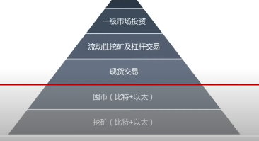

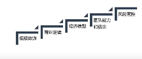

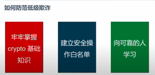

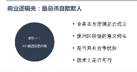
宁可错过，没有都搞不清楚，加了blockchain可以搞清楚么?没有都搞得挺好，为什么还要加

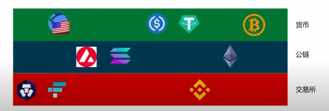

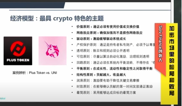

自己的token,激励参与的人。未来的价值

组织
治理
透明
……………… token economy   最重要的新学科，到了微积分的程度，内部估值 paper  token 的内在价值，没有这个专业程度会出错。

guojia的权利给了公司，如何加速自己的发展！
uniswap，只是保留治理权，因为其他权利会导致违反证券法，美国

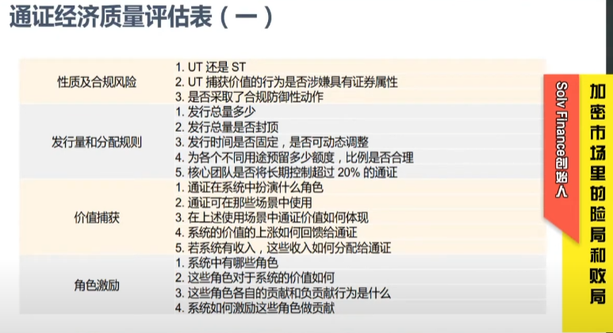
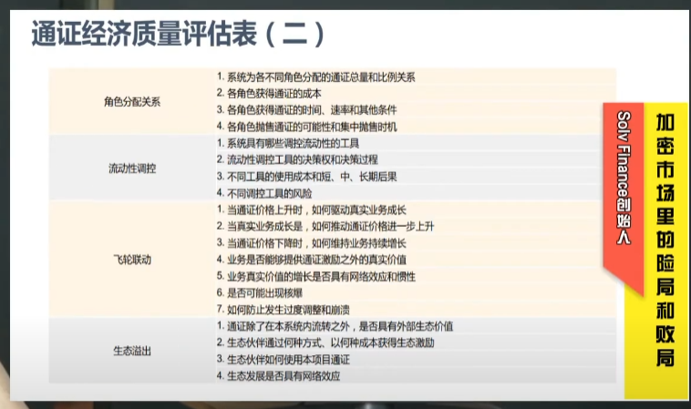
合规，token避风港

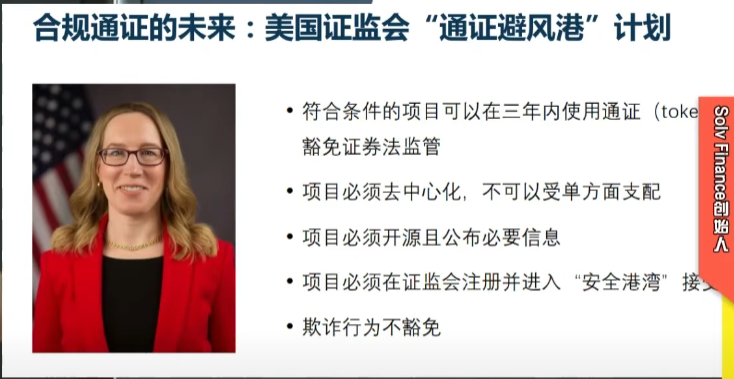

最大的风险：错过加密金融革命的风险

科技革命：人类即将进入机器智能的一个阶段！

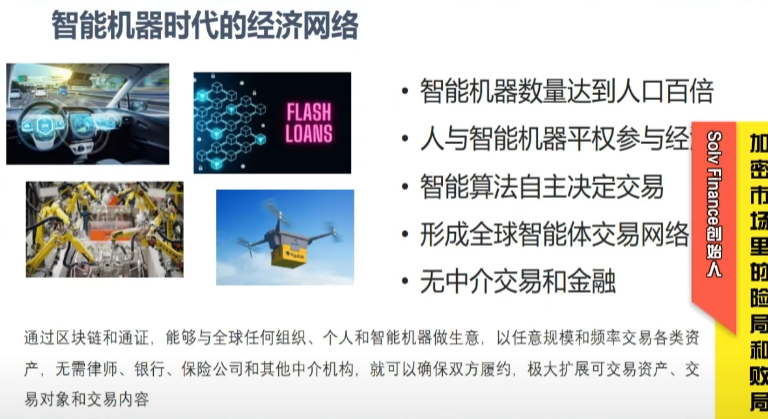

机器的股票就是token,掌握机器的使用权就是token,结盟投资他，

可以移民火星，可以操作机器，和很多机器都是盟友！token是一种做朋友的通行证，有机会比较早升级的资格证。十来之类，在之后可能是后代交代不过去的，不成为会怎么样！给你一个元宇宙，随便去玩，真实时代和你没有关系。财富的机会，人类文明的机会！

其实我们说的是：
认真的写作和编程的机会和时机！

所以区块链确实不适合解决这个世界上大多数问题。这也就是为什么过去十年，区块链在真实世界应用并不成功的根本原因。区块链是个金刚钻，但是这个世界上大部分的工作并不是瓷器活，而是敲各种各样的钉子。如果 Web3 非得要拿区块链这个金刚钻去敲钉子，那就只有碰钉子。

现在大多数政府、学术界和古典互联网的人确实还非常瞧不起 Web3，觉得就是一帮人炒币，用不到实践当中。这是一种遗憾，但也是一件好事。Web3 的最终崛起，如果不能引起一片“看不见、看不起、看不懂、来不及”的哀嚎，那也就太缺少快感了。

正确的选择应该是，就是其中的几种token币，然后再具体看怎么交易合约，而不是usdt，这在牛市不合适！回调之后就eth btc

学习的正确只是，应该是，一专多能！

学习新领域

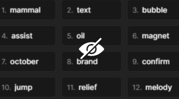

解决一个数学问题需要的能量消耗！
用低得多的能量解决这个问题！

每个密钥对包括一个私钥和一个公钥。私钥（k）是一个数字，通常是随机选出的。有了私钥，我们就可以使用椭圆曲线乘法这个单向加密函数产生一个公钥（K）。有了公钥（K），我们就可以使用一个单向加密哈希函数生成比特币地址

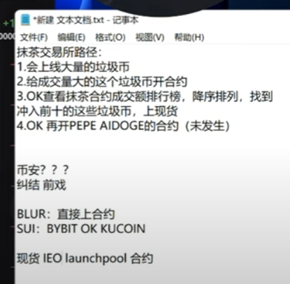

[depin intro](https://twitter.com/BitalkNews/status/1735201978551341213?s=20)

https://www.coinglass.com/zh

