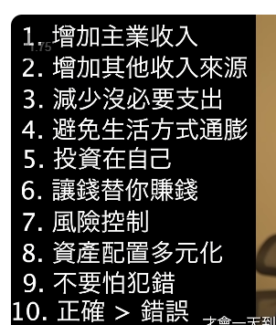

# merlinchain
https://merlinchain.io/

https://mirror.xyz/0x378300746800525CD74964683ec3e496909DB5D7/1RWZvcHl4v3y5GsJ4pwWq0S7RxguublyciU9jgSMCTw

https://launchpad.ally.build/en/details?id=1

https://merlinswap.org/trade/swap

迅速出动，而且，这个就是一种投资方式了，80%

其实本质上，都踏空了，是什么感受，本来是一个数字，结果一回撤，立马开始显得白搭！！

说明对投资得入门知识，仍然是一种入门得东西和状态，难以精进，就像连续创业一样或许！

https://www 3.ntu.edu.sg/home/ehchua/programming/blockchain/bitcoin.html

https://hackernoon.com/exploring-the-feasibility-of-transitioning-btc-from-pow-to-pos

