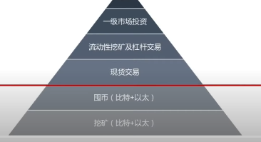
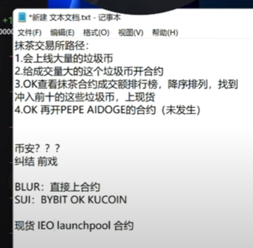

### 八、solidity智能合约工程师

1.前沿Defi协议的原理和源码分析。
2.Defi智能合约的开发、部署和维护。
3.Defi产品后台开发、部署和维护。
4.技术文档编写。

https://mirror.xyz/0x539Bf1d1d8cCbC0A1F04013DB087f03ecd2CC0aA/sfZAZci0JKjNUq6S87DE85UpoUX8cseG8bh_h_KmGg8

### 四、区块链工程师
地点:北京/海口职位需求:1
1.公链和联盟链的底层架构设计和研发:
2.负责去中心化金融(DEFI)产品开发和实现;
3.参与DAPP项目的需求分析，智能合约实现相关功能;
任职要求
本科及以上学历，计算机相关专业，5年及以上开发经验
1、熟悉如下技术:P2P网络，密码学，共识算法(如BFT系列、POX系列、 PAXOS，RAFT)等
2、具备3年区块链底层技术研发经验，主要是HYPERLEDER FABRIC和ETHE- REUM;
3、精通BITCOIN，ETHEREUM，HYPERLEDGER等主流区块链技术以及相关机制原理;
4、熟悉LINUX，熟练堂握GOLANG，JAVA，C/C++SOLIDITY等主流区块链系统开发语言一种或几种;
5、对技术有强烈的兴趣，喜欢钻研，具有良好的学习能力，沟通技能，团队合作能力。

# 挣钱本身学习研究，写作，上升到人生的意义的层面的问题，

当年的加密主义思潮-《True nyms and crypto anarchy》读书会
https://www.notion.so/dapplearning/b37a0a4ab4e646e3af5758bc977c5bc8

# developerreport.org

通过生态去了解生态！all 技术原理，使用等等！

# 工具

 [查看期货的交易价格，某种程度上，可以知道对应的价格市场期望](https://www.aevo.xyz/)

## starknet  生态

layer2  linea  zksync都是相同的扩容方案！

# linea
没有穷韭菜，只有懒韭菜

# btc 生态

[BTC 生态的全景分析：重塑历史或开启下一次牛市](https://www.theblockbeats.info/news/50733)

铭文，就是最小单位的序数，然后上传的内容和对应的区块绑定，也就是mint,
问题是，我mint和其他人 mint的区别是什么，如何挣钱，矿工交易的gas费用是明显增加了！

三、「 How 」: 怎么玩转铭文？

现在主要的玩法有这么几个：

1️⃣ 「 铸造 」 铭刻代币或 NFT，可以尽量选择铸造有价值的，而不是随便一串数字or 小图片；

2️⃣「 打新 」mint别人已经铸造好的代币，比拼的个人的眼光和手速！

3️⃣「 交易 」和其他交易一模一样，高抛低吸！

具体操作手法组长就不介绍了，玩币的应该都知道！

埋伏，屯币就对了，成为币圈和链圈！

铸造：铭刻代币或 NFT
如何判断价值？自己的和别人的! 争先恐后的怕是有些投机
1️⃣“概念雕刻”：比如AIGC只是一个概念，但如果把它刻在无法更改的位上，概念的涨跌肯定会体现在价格上！

2️⃣ "Inscripciones conmemorativas": grabar varias cosas que están sucediendo ahora tendrá un significado diferente cuando se mire la historia en el futuro. ¡Es mejor que cavar tumbas ahora e inferir el año aproximado hasta c14! ¡Conmemorar personas o cosas actuales, como grabar la primera foto de su bebé recién nacido en bits, también es muy significativo según las características de las inscripciones de bits!
2️⃣《纪念碑刻》：记录现在正在发生的各种事情，以后看历史会有不一样的意义。比现在挖坟墓并推断大约公元 14 年要好！纪念现在的人或事，比如用比特雕刻自己刚出生的宝宝的第一张照片，根据比特铭文的特点，也是非常有意义的！

3️⃣ "Los t

## solana   生态

[Web3 工具指南系列：如何使用 DefiLlama 分析加密货币](https://foresightnews.pro/article/detail/29595?u_atoken=094c841ebea264e0807f0b9b1dccbed4&u_asession=01lXlLBlT7s-KFQat9rXXac5zvTlmlT2hz8fhe5JpOjje1KtRY6PTixas1PIuFOHOXdlmHJsN3PcAI060GRB4YZGyPlBJUEqctiaTooWaXr7I&u_asig=05bO93labiIkA_Z2npDAH6zXyZfPvY3q48ibxeMgwqhL_bpMfju6gVjeZczW5DHqcsDKf8z7fa_ev9hpYeGsF5go09Jyb9u-LJFBMIZJLRlATfv2ztq4g2gMStlPj8uE4zANgrCDkyL-tb8PVW1dgAQyXiATP9kWIAG0C6SjbG-GBg2QMxYs6lyXb1lFWKql56gxcy1VNpFr8gXqATSpWXxaBw_Ga_ErXOyP_EsML8kP5RqGDt5VEohKDr2rhehA_5WIXtlamMPdj9XfOSZTW0CLFbNEOakV-Q-GfeMdsS2xSkwjKYptTEc9w4n4W4t0Z69d1hAkWglaU3f27pKKNVuA&u_aref=2ZcSUuR441dV8P%2BknqtmHFs6u6k%3D)

重新认识 DefiLlama——强大的数据工具网站

# 代币系统设计模型：
比如为什么需要锁仓，为什么需要，

https://zhuanlan.zhihu.com/p/59302331

https://www.woshipm.com/blockchain/984856.html
《通证设计》
《token经济设计模式》

[通证经济学和激励机制设计入门](https://www.infoq.cn/article/vtcvavxtppaqy6dgb0ja)

token-economics-and-incentivized-crypto-economics-mechanism-design/

https://www.woshipm.com/blockchain/970142.html

https://learnblockchain.cn/2019/05/30/dev-meeting-45

http://pdjedu.com/upload/course_469/index.html

什么样的项目方，对应的锁仓量什么类型才是我们应该参与的，可以有前途的或者认为是？

# 协议

# 思考
本质上玩合约，终究是一种专业的人做的事情，其二这是一个需要很多时间经历去做的事情。有的是需要屯币
这些都是一种术上的操作，
 本质上要想从道上胜一筹，
 需要的是，研究生态，发现那些有用的东西，研究百倍币加入他，让时间做我们的朋友，通过通证设计，得出一些未发币，就去参与，去项目提交解决问题。本质上解决问题才是一种长久的来源。你拿着你的钱包去玩，拿着你的其他东西去玩！

合约账户买的好处：
可以在eth,或者bnb,或者 btc中就买比如sol,等其他，只不过我们设置为1倍就行
现货账户，只可以先划转为对应的bi,才可以进行买卖，比如 strk,stx等。

对于追求和学习，问题，根本上没有改变，但是在寻求自我感动

币圈和链圈是不同的圈子，
黑客松对于工作也是不够的，唯一够的就是寻找好的项目，然后参与进去，
研究对应的投资机构，研究对应的开发团队，提交issue,pull

从协议和通证系统的设计上拿出自己的见解！

我看待这项投资的目标是百倍的增长，而不是普通的50%等的增长，不然投入这么多的经历是没有用的！
市场瞬息万变，永远不要fomo,不要emo,一种的懦弱，一种是无用。永远向前看，一直有机会，一直有对应的机会！

有一个事实，除了炒作的那些，韭菜和老韭菜之外
我们其实找一个web3类型的工作内容本身，也就是提高了，我们的薪资一点点仅此而已，同时，提高了生存能力！

### 神鱼的理解
时机依然不对
市场已然不同
入场时长区别很大
神鱼不是靠的交易，靠的是屯币

### 通证一哥
入场的尴尬时刻，是崩盘之后的不能取出，所以导致后续涨了几十倍的情况！

# 一个币，上交易所的前后，我们可以做什么，背后会发生什么？
如何买低价币还没上交易所

1. 先是coingecko.com找到，之后uniswap直接购买
2. mexc直接进行购买！可以购买一些还没有上交易所的币,中国用户禁止

3. 

从抹茶交易所，到ok交易所，再到币安交易所中的员工要上币和老板的博弈
交易所之间的博弈
抹茶交易所本身的博弈

# DAO
blockchain go 
dapp sol
[dao topic and design](https://ethereum.org/zh/dao/#further-reading) 
https://aragon.org/education-portal

https://mirror.xyz/gaobenpeng.eth/DSuq1-SPY10teKvI2mAvurahhot5ZsTnnEEE3jE4hPY

https://www.chainside.info/

https://news.marsbit.co/20230926215123279125.html

severn dao and other 得来龙去脉

https://news.marsbit.co/20220828095522864250.html

"Don't wait for being completely ready for the plans and ideas you may have in mind. Take action now and you will learn and become ready.

https://kinjal.mirror.xyz/eD3-Sgv2h50j-kwjHQCOnwqMKqSLTfnrqrtNypU-P5k

https://www.bankless.com/how-to-create-a-bankless-dao

[create dao website openlaw](https://lib.openlaw.io/web/default/search/general) 

dapp learning dao得运行不同是什么？

这将向公众和政府发出一个信号：web3 可以成为一股正义的力量。谁会与一群人聚集在一起购买宪法，然后通过免费展示将其返还给人民呢？这就是代码中的民主。

# 研究对应的投资机构，

dcg:

# 研究对应的开发团队，提交issue,pull

# 行业大佬的额访谈和认识，思维逻辑

### 宝二爷
大家都认为是热点的时候，热点已经过了

刚开始都赔钱

最后熬过来的

13年之后留下来的 10 %的人

帮别人对接矿场!干股都不值钱，同时也没有钱，只有牛市来了的时候，才会有钱！

借地，然后抵押了房子

冷钱包一放

产品化，而不是简单的主播

低买高卖

不是投资，而是一种投机，高风险的投机

亏钱了，就怪自己的认知不够，赚钱了，某种程度上，就是运气好而已！

当你跟大部分的观点都一致就成为了韭菜

小额资金有小额的玩法，就玩高风险的
大额资金才玩对应的4% 这类的稳定性的玩法！

本质上还是能源交易，离不开比特币！

# CoinGecko

https://www.coingecko.com/en/coins/artrade

如何寻找潜在的百倍币：

### 神鱼

不进行交易，找好币，就一直放着就行了！

### 何一

当你有了一些东西之后，你会发现很多资源都会向你倾斜靠拢，这是常识的一些东西！

# 找到项目方
解决他们的问题，贡献自己的能力和业绩！

历史：20年牛市btc从3000到60000美金。那年你还在写论文，同时，老师也给你介绍了，可惜仍然还是错过了！！！
长期主义和一定的思考钱财的能力。

https://www.sc.gov.cn/10462/10778/10876/2024/1/31/77e7162bda924c3b892eead9663e755d.shtml

税收的计算方式：

