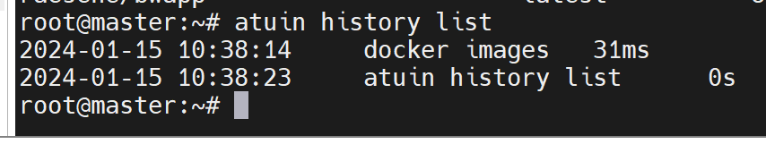
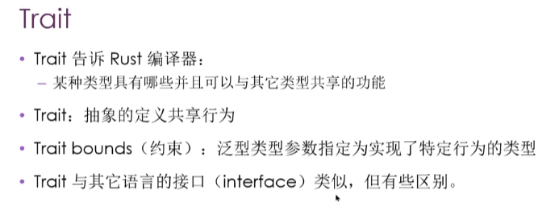
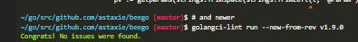

## techlog



### atuin的使用方法，最好的使用就是代码本身，文件都是一种代码不合格的表现

atuin init bash
atuin register   login

atuin history list

```
 Possible values:
          - zsh:  Zsh setup
          - bash: Bash setup
          - fish: Fish setup
          - nu:   Nu setup

```
的区别？
这些值代表不同的命令行壳程序（shell）以及它们的设置方式。下面是它们之间的一些主要区别：

Zsh（Z Shell）：Zsh是一个功能强大的命令行壳，它提供了许多高级功能和配置选项。它具有自动补全、历史命令搜索、模糊匹配、主题和插件支持等特性。Zsh的配置文件是~/.zshrc。

Bash（Bourne Again Shell）：Bash是许多Linux和Unix系统默认使用的命令行壳。它是Zsh的前身，提供了基本的命令行功能，如命令历史记录、变量扩展、管道等。Bash的配置文件是~/.bashrc。

Fish（Friendly Interactive Shell）：Fish是一个用户友好的命令行壳，注重易用性和交互性。它提供了语法高亮、自动补全、智能提示、内置函数等功能。Fish的配置文件是~/.config/fish/config.fish。

Nu：Nu是一个现代化的命令行壳，旨在提供更简洁、可组合、易于使用的命令行体验。它采用了一种基于数据流的操作方式，支持结构化数据处理。Nu的配置文件是~/.nu/config.toml。


### binwalk
binwalk无法直接分解图片里面的图片文件
```apt install binwalk ```

[unblob](https://unblob.org/)


### foremost

[foremost](https://sourceforge.net/projects/foremost/)
分解图片
```
apt install foremost
```
解决binwalk无法直接分解图片里面的图片文件
picture下的file.jpg作为测试实验

### winhex

[winhex](https://en.softonic.com/download/winhex/windows/post-download?ex=CS-1689.4)


### osmedeus

[进攻性安全的工作流引擎](https://github.com/j3ssie/osmedeus)


前沿的动态的区块链安全切入角度

https://github.com/practical-tutorials/project-based-learning.git


[代码夹克和混淆工具](DRMsoft  EncryptEXE)
https://blog.51cto.com/senseshield/4314712


### EXECryptor
适用场景加壳运行的程序，反汇编而已。
有支持代码和资源的压缩


专业的程序加壳脱壳工具，可以有效地保护程序进行逆向工程分析、修改和破解，保护自己的版权。

VMProtect允许对可执行文件（EXE、SCR）、动态链接库（DLL，OCX，BPL）和驱动程序（SYS）进行保护


### awesome-malware-analysis

https://github.com/geeeekegeeeeke/awesome-malware-analysis

[匿名网络](http://anonymouse.org/cgi-bin/anon-www.cgi/http://www.google.com/webhp?hl=en)

基于网络的匿名器和Tor之间的一些区别：

架构和工作原理：基于网络的匿名器和Tor在架构和工作原理上有所不同。基于网络的匿名器通常是代理服务器，通过转发用户的网络请求来隐藏其真实IP地址和身份。基于网络的匿名器可以通过不同的协议（如HTTP、SOCKS等）提供代理服务。


### 什么是grapql，和普通的http的请求有什么不同？
代码层面展示

```
package main

import (
	"encoding/json"
	"fmt"
	"log"
	"net/http"

	"github.com/graphql-go/graphql"
)

type User struct {
	ID   string `json:"id"`
	Name string `json:"name"`
}

var data map[string]User

func init() {
	data = map[string]User{
		"1": User{
			ID:   "1",
			Name: "Alice",
		},
		"2": User{
			ID:   "2",
			Name: "Bob",
		},
	}
}

func main() {
	// 定义 GraphQL 对象类型
	userType := graphql.NewObject(graphql.ObjectConfig{
		Name: "User",
		Fields: graphql.Fields{
			"id": &graphql.Field{
				Type: graphql.String,
			},
			"name": &graphql.Field{
				Type: graphql.String,
			},
		},
	})

	// 定义 GraphQL 根查询类型
	rootQuery := graphql.NewObject(graphql.ObjectConfig{
		Name: "Query",
		Fields: graphql.Fields{
			"user": &graphql.Field{
				Type: userType,
				Args: graphql.FieldConfigArgument{
					"id": &graphql.ArgumentConfig{
						Type: graphql.String,
					},
				},
				Resolve: func(params graphql.ResolveParams) (interface{}, error) {
					id, _ := params.Args["id"].(string)
					return data[id], nil
				},
			},
		},
	})

	// 定义 GraphQL 模式
	schema, err := graphql.NewSchema(graphql.SchemaConfig{
		Query: rootQuery,
	})
	if err != nil {
		log.Fatalf("failed to create schema, error: %v", err)
	}

	// 定义 GraphQL 处理函数
	http.HandleFunc("/graphql", func(w http.ResponseWriter, r *http.Request) {
		result := graphql.Do(graphql.Params{
			Schema:        schema,
			RequestString: r.URL.Query().Get("query"),
		})
		json.NewEncoder(w).Encode(result)
	})

	// 启动 HTTP 服务器
	fmt.Println("Server started at http://localhost:8080/graphql")
	log.Fatal(http.ListenAndServe(":8080", nil))
}

```

``` http://localhost:8080/graphql?query={user(id:"1"){id,name}} ```

### 老老实实解决问题，产品化的需求，前后端分离注定是一种工作需求而不是能力需求！
git config --global url."hub.fastgit.xyz/".insteadOf github.com/


Fix apt-get update “the following signatures couldn’t be verified because the public key is not available”
修复 apt-get update “由于公钥不可用，无法验证以下签名”


https://github.com/99designs/gqlgen

https://github.com/vektah/gqlparser


支持查询语法的数据库

https://github.com/dgraph-io/dgraph 

github.com/graphql-go/graphql


https://github.com/TykTechnologies/tyk


https://github.com/TykTechnologies/tyk?tab=readme-ov-file


## 图数据库了解


## 构建信息秩序
## 选择信息源
## 消费信息

linux 执行文件的几种方式：

chmod +x 给文件可执行命令：

移动到 /usr/local/bin
或者 /usr/bin

命名规范是 snake case
struct camel case


## rust by example  
https://foresightnews.pro/article/detail/10089

https://rust-cli.github.io/book/tutorial/index.html

https://rustmagazine.org/

[包含了使用rust来写一个os的项目的博客](https://zh.practice.rs/elegant-code-base.html)

通过有挑战性的示例、练习题、实践项目来提升 Rust 水平，建立从入门学习到上手实战的直通桥梁
[Rust语言圣经github](https://github.com/sunface/rust-course)
[Rusty Book(锈书)](https://rusty.course.rs/)


# rust
 sudo code --no-sandbox --user-data-dir ~

### trait



 # truffle


# 一个严谨的devSecOps开发者的工具箱！
主要是通用工具在开发中的严谨的构造，从代码到发布产品的代码管理一整套工具。从代码编码检查，单元测试，静态动态分析，漏洞扫描和分析的一整套工具箱！


 sudo code --no-sandbox --user-data-dir ~




# 树莓派的体验和使用购买 


### go k8s  docker build (api function）


### saas

## go micro project 


## go K8s project  

docker run 命令转化为 docker-compose的go lib


写作就是思考的一种形式和完善。
没有写作，或者笔记，你的思考是没用的，或者不逻辑严谨的

更加进一步产品和思维本身就是一种宣传和付费


### Solidity智能合约的开发、测试、部署以及验证


### 参与开源
矿池

AntPool
f2pool
btc.com
没有意识到产品的重要性
没有意识到精通的重要性
没有意识到参与开源博客记录的重要性


https://practice.course.rs/elegant-code-base.html

download https://github.com/pr0v3rbs/FirmAE/releases/download/v1.0/libnvram.so.armel


### 三件事情：

rust demo all ok   https://doc.rust-lang.org/stable/rust-by-example/flow_control/loop.html

blockchain demo  -----
firmae *work ok

[connect to github.com port 443: Connection refused github的解决方法](https://gitcode.csdn.net/65aa3908b8e5f01e1e44e089.html#Failed_to_connect_to_githubcom_port_443_Connection_refused_1)

140.82.114.3  github.com
代替默认的去的地址：20.205.243.166

```  docker images | grep registry.cn-qingdao.aliyuncs.com/metersphere/* | awk '{print $3}' | xargs docker rmi
```
### 删除匹配名字的镜像名


### [rust权威指南，视频](https://www.bilibili.com/video/BV1hp4y1k7SV?p=23&spm_id_from=pageDriver&vd_source=0e660fb7ec22b95b9c2864934e1fe387)


## 软件工艺师的go学习指南：


https://archive.org/details/github.com-0voice-Introduction-to-Golang_-_2021-08-18_08-08-36

https://github.com/yongxinz/gopher

#### 宽度其实就是字符的宽度

在Go语言中，fmt.Printf是用于格式化输出的函数，而$%5.2f\n是格式化字符串。

让我们逐个解析它：

$表示在输出中放置一个美元符号。
%5.2f是一个格式化说明符，用于指定浮点数的输出格式。其中，
5表示最小字段宽度为5个字符。如果输出的值不够宽，将使用空格进行填充。
.2表示将浮点数保留两位小数。
f表示浮点数的格式。

总结：

#[actix_rt::test]用于标记异步测试函数，确保在actix-rt的运行时环境中执行。
#[cfg(test)]用于条件编译，标记测试相关的代码，只在运行测试时编译和执行。


gitea go lib
blockchain go 
rust demo proj 
system long output
计算机科学，最起码是循证科学，其次才是会编写好的代码！所以你会写好的文档四一名合格的开发者和工程师

https://github.com/rust-boom/rust-boom?tab=readme-ov-file

你很难想象程序的运行结果需要等到打印出来才能看到
伪终端（pseudo terminal, PTY）
终端模拟器(terminal emulator) 是运行在内核的模块，我们也可以让终端模拟程序运行在用户区。运行在用户区的终端模拟程序，就被称为伪终端（pseudo terminal, PTY）。

我们经常通过 ssh 连接到一个远程主机，这时候远程主机上的 ssh server 就是一个伪终端 PTY，它同样持有 PTY master，但 ssh server 不再监听键盘事件，以及在屏幕上绘制输出结果，而是通过 TCP 连接，向 ssh client 发送或接收字符。
```
man 2 open //查看linux系统调用接口的manual
```

电传打字机（TTY）是物理设备，最初是为电报设计的，后来被连接到计算机上，发送输入和获取输出。

电传打字机（TTY）现在被运行在内核中的模块所模拟，被称为终端模拟器(terminal emulator)。

伪终端（pseudo terminal, PTY） 是运行在用户区的终端模拟程序。

Shell 由 terminal fork 出来，是 terminal 的子进程。Shell 不处理键盘事件，也不负责字符的显示，这些是由 terminal 处理。Shell 负责解释执行用户输入的字符。

可以使用 stty 命令对 TTY 设备进行配置。

远程终端 ssh 也是一种伪终端 PTY。


```
sqlite3

查询user表字段名字
PRAGMA table_info(user);
修改表字段值
UPDATE user SET is_admin = 1 WHERE id = 1;

```


