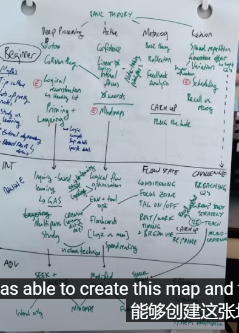

[golang实现连接多数据源](https://www.zytops.com/articles/2023/05/06/1683347460238.html)

Home Infra 家庭基础设施的使用场景和为什么要使用？可以解决什么问题？

### 家庭基础设施是指为家庭提供基本服务和功能的设备、系统和网络。以下是一些家庭基础设施的使用场景以及为什么要使用它们的原因：

1. 家庭网络：家庭网络是连接各种设备和服务的基础，如智能手机、电脑、智能电视、智能家居设备等。通过家庭网络，可以实现设备之间的互联和数据共享，以及访问互联网上的各种资源和娱乐内容。

2. 家庭安全系统：家庭安全系统包括视频监控、入侵检测、烟雾和一氧化碳报警等功能，用于保护家庭免受入侵、火灾和其他安全威胁。这些系统可以提供实时的监控和警报，帮助家庭成员保持安全。

3. 智能家居设备：智能家居设备包括智能灯泡、智能插座、智能门锁、智能温控器等，通过无线连接和智能控制，使家庭环境更加智能和便捷。可以通过手机或语音助手控制这些设备，实现远程操控、定时任务和自动化场景，提高生活品质和能源效率。

4. 家庭娱乐系统：家庭娱乐系统包括电视、音响、游戏机等设备，用于提供高质量的音视频娱乐体验。通过家庭网络和互联网，可以享受在线流媒体、视频游戏、音乐和电影等各种娱乐内容。

使用家庭基础设施可以解决以下问题：

1. 连接和互联：通过家庭网络，可以将各种设备连接到一起，实现设备之间的互联和数据共享，方便家庭成员之间的交流和合作。

2. 安全和保护：家庭安全系统可以提供实时的安全监控和警报功能，帮助保护家庭免受入侵、火灾和其他安全威胁。

3. 舒适和便捷：智能家居设备可以通过智能控制和自动化场景，提供舒适和便捷的家居环境，如智能灯光调节、温度控制和远程操控等。

4. 娱乐和娱乐体验：家庭娱乐系统可以提供高质量的音视频娱乐体验，让家庭成员享受在线流媒体、游戏和娱乐内容。

综上所述，家庭基础设施的使用可以提供连接、安全、舒适和娱乐等多种功能，解决家庭生活中的各种问题，提高生活品质和便利性。如何构造一个家庭安全系统！

### casaos

os

https://gitee.com/unicornx/riscv-operating-system-mooc/tree/v0.9.9


我使用自己手机的网络共享功能创建了一个与我表弟的家庭网络具有相同名称和密码的 WiFi 网络 - 然后我们开始在这个地方走动。我们确保帮助我们搜索的另一个人关闭了自己的 WiFi，以避免误报，并等待找到与热点的新连接。它成功了！当在停放的卡车附近行走时建立了连接，但事实证明手机不在卡车中 - 它躺在停在卡车旁边的一辆全地形车上。





提高思想！崇尚科学，多运动多勤奋！

管理时间精力，在某个领域产生影响可以帮助到更多的人！

并且了解到练习听写练习可以帮助一个人提高他/她的记忆能力

set a goal 
reading
listening
writing
speaking


## diy电脑主机配置


电源 ：转发，供应，适配，模组，稳定性，全部带走


take a feedback 
open-minded


继电器的作用的小电压小电流控制大电压大电流

### 物联网系统的了解：
传感器的使用，


在 Portainer Agent 中，心跳检查是用来确认 Agent 是否能够正常工作的一种机制，它可以检测 Agent 是否在线并能够与 Portainer 通信。具体来说，心跳检查包括以下几个部分：

1. `checkUrl`：检查 Agent 的 URL 是否可以访问。这是通过向 Agent 的 URL 发送 HTTP 请求，并检查响应是否为 200 OK 来实现的。如果检查失败，则说明该 Agent 的 URL 无法访问，可能是由于服务器故障或网络问题等原因导致的。
2. `checkPolling`：检查 Agent 是否可以定期与 Portainer 通信。这是通过向 Portainer 发送心跳请求，并检查响应是否在规定的时间内返回来实现的。如果检查失败，则说明该 Agent 无法与 Portainer 通信，可能是由于网络问题或 Portainer 服务器故障等原因导致的。
3. `checkTunnel`：检查 Agent 是否可以通过隧道与 Portainer 通信。这是通过使用 WebSocket 建立一个隧道连接，并检查连接是否正常工作来实现的。如果检查失败，则说明该 Agent 无法通过隧道与 Portainer 通信，可能是由于防火墙或网络代理等问题导致的。

通过这些心跳检查，Portainer 可以实时监测 Agent 的状态，并及时发现并处理任何可能导致 Agent 工作异常的问题。这有助于提高 Portainer 的可靠性和稳定性，以及保证容器环境的正常运行。


或许你应该仔细做的事情就是，研究这件事情的来龙去脉和风险的分析！
投入这么多钱做这么有风险的事情的意义究竟怎么样！

本质上来说，就是风险和收益以及避险！
研究的深入程度，转入不同的银行卡的意思

绝对理性的一种复杂计算的投资分析的性格的绝对优势和风险分析！

风险是什么？
政治 风险


# 买车


### 混动：
绿牌

故障率：高
三电系统，方便充电么？

理想
### 增城式

### byd dm-i
插电和混电技术，合二为一的一种技术。 ecvt

https://www.bilibili.com/video/BV1k34y197cN/?spm_id_from=333.337.search-card.all.click&vd_source=0e660fb7ec22b95b9c2864934e1fe387


丰田的ths技术

### hev模式  ev  phev  

soc设定为70%时，是让你的电力维持到最高70%，这样下高速后你在城里就可以有更多的电来用，即在城里用纯电ev或混动hev模式来使用（混动状态下低速或不爬坡的情况下优先用电），目的是帮你省钱。因为如果你设置的低了一样在高速上跑，而你是巡航的状态下在跑，发动机多余的能量就浪费了。比如你一样跑300公里，假设你设定为70%，那么等你下高速后你的电量也充满到70%了，但如果你设定为50%，


### 报价单包括：

#### 裸车价

### 购置税
购置税：发票价除以 11.3
       常见错误是，报价除以10

### 上牌费
[新车上牌流程，4S店3千的上牌费，自己会上120就够了，你学会了吗](https://www.bilibili.com/video/BV1RP4y1g7cw/?spm_id_from=333.337.search-card.all.click&vd_source=0e660fb7ec22b95b9c2864934e1fe387)


### 保险费
保险第一年：6、7千元
之后三千元左右


贷款还会有：金融手续费和利息！

登记证书：绿色 和行驶证：蓝色

## [买车到上牌的完整流程](https://www.bilibili.com/video/BV1DH4y1m7H2/?spm_id_from=333.788.recommend_more_video.-1&vd_source=0e660fb7ec22b95b9c2864934e1fe387)

### 试驾
滤震
隔音
提速
舒适性

烂路
快开

多看几家店都列个报价单包括活动，以及赠品等信息！

### 车价差不多了，就疯狂要东西：
含工时的保养
玻璃膜
行车记录仪

回家发帖问问，都没问题了，再去交定金
谈谈：月末或者季度末更好谈一些
是不是库存车
旧车置换，不行就自己卖
#### 验车：

手电筒，发动机是否有漏油的现象
底盘，发动机下沉的现象
天窗
排气管
又黑又脏换下一台。

贷款提前还款是否有违约金，有的话，是多少？
### 完事交接：
两把钥匙
购车发票
购车合同
贷款合同
合格证
一致性证书
三包凭证
保养手册


998-体重最轻：文鼎冠军
速度成反比，优势


2021老秦
120冠军版亏电：2，3毛钱每公里

### 无法快充
纯电测试，优化三电模式
998无天窗，整块钢板，无法快充

即便是亏点跑车:
他的油耗，也就是通常的我们认为的3毛钱左右


[易车横评 秦PLUS新老同场对决！谁说DM-i亏电油耗有优化？](https://www.bilibili.com/video/BV1vL411S7oy/?spm_id_from=333.337.search-card.all.click&vd_source=0e660fb7ec22b95b9c2864934e1fe387)


## suv
宋 dm-i

视频还提到了与宋 PLUS DM-i竞争的银河L7、骁龙max和长安S7等车型的特点和差异。


汉

海豹700车主发现的几个问题
1.比亚迪属于丰田那种扣利润的企业，卖车子只追求稳定，所以用起来奇葩问题少，是因为很多地方不换代，技术成熟（老旧），但是品控不行
2.比亚迪做车的重心在于低能耗，就是中国人掏钱时候关注的点，别指望他能做好底盘，加速这种叫好不叫座的东西
3.比亚迪不是一家有追求的企业，赚钱最重要，不要对他有什么期待
如果今年再买，特斯拉，极氪001可能会买这俩之一

太对了，赚钱就是赚钱，可现在的企业，都在讲故事而不讲赚钱，但目的也是为了赚钱而已

转弯半径大
哪天一看一个汉车型掉头打了好几手方向盘，不要怀疑什么，那就是转弯半径大而已！
隔音：包括远方喇叭的声音和抖动路面的隔音地盘稳定性等等。

只看性能和销量的话：那销量最好的都是跑车了：

支撑性和悬挂性

海豹：

车身： etb

[ev](https://www.marketwatch.com/story/what-is-ev-bev-hev-phev-heres-your-guide-to-types-of-electric-cars-11617986782)

The standard EV, also known as a battery-powered electric vehicle (BEV); the hybrid electric vehicle (HEV); and the plug-in hybrid electric vehicle (PHEV). There are subsets of each type as well.
一般来说，我们在本文中将讨论以下几种主要类型的电动汽车： 标准电动汽车，也称为电池供电的电动汽车（BEV）；混合动力电动汽车（HEV）；以及插电式混合动力电动汽车（PHEV）。每种类型也有子集。


一个最重要的是你只知道表明逻辑，不知道深层次的逻辑，这个是让人很费解的！


汇丰银行和卓越账户

投资深层逻辑
潜规则和明规则

变化回去的动作：
民企的鼓励：巨头党支部取消
科技创新，亚马逊
腾讯前三十只能是

底：深不可测
能打的牌，是越来越少了！


货币基金：风险

换外汇，哈哈哈


托管费：不是基金公司自己保管，而是给某一个银行管理这个费用，
要不然怕跑路了怎么办呢？


既然解决的是普通人，非垄断的金融问题，那么投资也可以做到会中间人的问题啦，只需要找好卖家和买家不就可以了，这类有途径的人，就是机会和能力！


有时候很纳闷，你都可以通过那个进行买，为什么不就只通过那个进行交易呢，对吧！--但是不足以弥补你短时间的风险造成的重大的影响！

可能不足以抵抗通货膨胀率


问题：
法律不健全，无法：
成为受害者被封禁无能为力，
那怎么办呢？转出去，兑换也可以！


买成黄金的盈利对比前后这么多年的比例；--你不懂


本质上是：前沿圈子的认知能力，学习成为他们的能力，学习能够解决他们问题的能力。


FUSE 是指文件系统在用户空间（Filesystem in Userspace）的技术，它允许开发者在操作系统层面创建自定义的文件系统，而无需修改内核代码。获得 FUSE 支持意味着操作系统提供了与 FUSE 技术的集成和兼容性，使开发者能够使用 FUSE 接口来创建、安装和操作自定义的文件系统。

[a16z books link web ](https://a16zcrypto.com/posts/listicles/reading-watching-playing-list-winter-2023/)


## 打造第二大脑：

方法：
让我们的想法具体化。
Revealing new associations between ideas.揭示想法之间的新关联。
Incubating our ideas over time.随着时间的推移孵化我们的想法。
Sharpening our unique perspectives.锐化我们独特的视角。

费曼的方法是保留一份包含十几个悬而未决的问题的清单。当一项新的科学发现出现时，他会针对他的每个问题进行测试，看看它是否为问题提供了新的线索。这种跨学科的方法使他能够在看似不相关的主题之间建立联系，同时继续追随他的好奇心。

不要保存一本书的整个章节，只保存选定的段落。不要保存完整的采访记录——保存一些最好的引言。不要保存整个网站 - 保存最有趣部分的一些屏幕截图。 link

知识块值得保留：
它能激励我吗？
有用吗？
它是个人的吗？
没有人能够获得你个人从一生的谈话、错误、胜利和经验教训中获得的智慧。没有人像您一样重视您一天中的点点滴滴
令人惊讶吗？

让你感到惊讶的信息
是信息

以我当时无法完全解释的方式引起我的共鸣，而它的真正潜力只有在以后才会变得清晰。
压力是一种自动反应，是因为直觉思维意识到出了问题而发生的——早在意识思维意识到有什么不对劲之前。

项目、区域、资源和档案——构成了 PARA 的四个类别。

项目：您现在正在工作或生活中所做的短期努力。
Areas:Long-term responsibilities you want to manage over time.领域：您想要长期管理的职责。
Resources:Topics or interests that may be useful in the future.资源：将来可能有用的主题或兴趣。
档案：其他三个类别的非活动项目。

工作项目： 完整的网页设计；创建会议幻灯片；制定项目进度表；计划招聘活动。
Personal projects:Finish Spanish language course; Plan vacation; Buy new living room furniture; Find local volunteer opportunity.个人项目：完成西班牙语课程；计划假期；购买新的客厅家具；寻找当地志愿者机会。
Side projects:Publish blog post; Launch crowdfunding campaign; Research best podcast microphone; Complete online course.业余项目：发表博客文章；发起众筹活动；研究最好的播客麦克风；完成在线课程。


但您希望在每个领域坚持一个标准。对于财务而言，该标准可能是您始终按时支付账单并满足家人的基本需求。为了健康，可能每周锻炼一定次数，并将胆固醇保持在一定数量以下。对于家人来说，你可能会每天晚上和周末与他们共度美好时光。


https://www.amazon.com/sendtokindle


## 一页命令行指南
https://github.com/jlevy/the-art-of-command-line


https://thedefiant.io/podcasts

 An interplanetary microblogging platform 🚀
🌎 星际微博平台🚀

misskey-hub.net/


# 万字解析：defi的行业！

how to defi 书籍中例举的defi应用都是再以太坊上的么？
关于 DeFi 的书籍可能会提到许多基于不同区块链平台的 DeFi 项目。以下是一些常见的区块链平台及其相关的 DeFi 项目：

以太坊（Ethereum）: 以太坊是 DeFi 领域最为活跃和广泛采用的区块链平台。许多知名的 DeFi 项目都是在以太坊上构建的，包括去中心化交易所（例如Uniswap、SushiSwap）、借贷协议（例如Compound、Aave）、稳定币（例如Dai）等。

Binance 智能链（Binance Smart Chain）: Binance 智能链是由加密货币交易所 Binance 推出的区块链平台。该平台提供了一些与以太坊类似的功能，并成为许多 DeFi 项目的选择，如PancakeSwap、Venus Protocol等。

波卡（Polkadot）: 波卡是一个跨链平台，旨在实现不同区块链网络之间的互操作性。波卡生态系统中的一些项目也涉及 DeFi 领域，例如Acala Network、Polkastarter等。

Solana: Solana 是一个高性能的区块链平台，它支持快速和低成本的交易处理。一些 DeFi 项目选择在 Solana 上构建，如Raydium、Serum等。


##  Uniswap白皮书

我的学习，问题在于没有闭环，问题在于没有深度参与 dapp项目在区块链上。
白皮书
社区
源码代码的实现


https://github.com/Dapp-Learning-DAO/Dapp-Learning


[How to Get Rich Without Being Lucky](https://www.sohu.com/a/483915623_120760722)
你必须有点异乎寻常，才能独自走在前沿
https://github.com/fat-garage/how-to-get-rich-without-getting-lucky


出租时间不会让你变得富有，因为你不能非线性地赚钱

出租时间赚钱意味着你很容易被替代

但这会使你深陷在工资奴隶的陷阱里。我忘了是谁，可能是纳西姆·塔勒布说的，“世界上最危险的东西是海洛因和月薪。”没错，因为它们很容易上瘾。你想要变得富有的方式恰恰是你想要变穷，那时你能做（想做）的事情只有工作，工作，再工作。

想清楚你能提供的产品，然后考虑如何扩大规模

收益来自重复游戏的复利

选择智慧、精力充沛和正直的合作伙伴
动机必须是内在的
诚信反映在一个人的行为，而不是他说了什么

自尊是你对自己的评价
他的境遇是有下限的，但上限却很难说

不要孤注一掷。但理性乐观的押注会带来巨大的好处。

你的特殊技能可能是由那些了解你的人观察到的，而且经常是由那些了解你的人观察到的。

阅读你所热爱的内容 直到你爱上阅读

学习的手段是丰富的，学习的欲望是稀缺的

学习讲故事和编程

冷静的头脑，健康的身体，充满爱的家庭
没有什么快速致富的方法

产品化你自己


[主权个体ppt](https://docs.google.com/presentation/d/1LsLB2r0RMc44Gp7eWnHF9loKUW_tDFDAFp7CyLTT8mw/edit#slide=id.g10c7e67fa93_0_104)


六的人：工业社会的人，和精通技术的人。

人的谦虚，输入，和熵增的本质
可能你是一个觉得自己还不错的人，或者在面对信息的输入总是有点不削。
或者有那么一个时刻，你选择了炫耀，炫耀，或者炫耀心理，自以为了不起的种种，那种心理很神奇，暴露你的认知，慵懒你的神经，阻挡你的学习。
有一刻，想起来那是一种壁垒和无知导致的浪费，时间和思考的浪费。在那一刻的个体来说。在那个时期的个体来说，系统来说，没有输入，没有一种open的接收和思考整理。久而久之，就会在慢慢的熵增中逐渐越走越远。你以为你知道的很多，其实确实多，多的是信息而不是知识，多的是老旧，缺的是新意和批判性的思考和一种基于思考的模式的思维。
这就是某一刻，从系统的复杂性，熵的自增，输入输出。对学习和思维的整理的认知

[ssl证书的学习基本](https://jvns.ca/blog/2017/01/31/whats-tls/)

[gpu](https://journal.hexmos.com/gpu-survival-toolkit/)
1. Executing Parallel Tasks执行并行任务
2. Running AI Models Efficiently高效运行人工智能模型
3. How GPU Driven Development Solves These IssuesGPU 驱动开发如何解决这些问题
4. CPUs are optimized for tasks that require high single-threaded performance, such as
CPU 针对需要高单线程性能的任务进行了优化，例如

General-purpose computing
通用计算
System operations 系统操作
Handling complex algorithms that involve conditional branching
处理涉及条件分支的复杂算法

5. 


##  数据备份与还原

1. [飞致云的手动方法](https://metersphere.io/docs/v2.x/installation/backup_data/)
2. [带Web界面的数据库备份工具,](https://github.com/jeessy2/backup-db)
https://github.com/jeessy2/backup-x


```
# 默认启动rclone的配置会保存到/app/backup-x-files/rclone/rclone.conf：

docker run -d --name backup-x  \
  -p 9977:9977 \
  -v /opt/backup-x-files:/app/backup-x-files \
  jeessy/backup-x
```

[特斯拉灯光秀]()


[浏览器获取所有的信息](https://mattfrisbie.substack.com/p/spy-chrome-extension?subscribe_prompt=free)

[纪录片网站](https://ihavenotv.com/)


[jakoby](https://github.com/I-Am-Jakoby) bad usb


The Four Steps 四个步骤
Understand why you should become a blockchain engineer
了解为什么你应该成为一名区块链工程师
Take a Blockchain Course 参加区块链课程
Join a Hackathon, the Community, & Build
加入黑客马拉松、社区和构建
Start your own protocol, Take a job, Freelance & Contribute
开始你自己的协议，接受一份工作，自由职业并做出贡献
If you make it this far, you’ve done it! Although, I’ll add a bonus step 5 that we will talk about soon.
如果你做到了这一步，你就成功了！不过，我会添加一个额外的步骤 5，我们很快就会讨论。

5. You’ve made it! Keep learning!
5. 你成功了！保持学习！


rust in come book


https://rustycab.github.io/LearnRustEasy/chapter_3/chapter_3_11.html


**需求明确：**
本机
达蒙数据库

备份位置：本机，minio,s3sync


run big model 

https://github.com/ollama/ollama.git


go proj code 
rust code
eth proj source code 
book read for buz


### solana all dev resources:


https://www.theblockbeats.info/news/29170


rust theory and practice
https://course.rs/basic/trait/trait.html


https://www.github-zh.com/top/Rust


唯一的区别在于增加了对变量生命周期的注释。这里，r 变量被赋予了生命周期 'a，x 被赋予了生命周期 'b，从图示上可以明显看出生命周期 'b 比 'a 小很多。


该函数签名表明对于某些生命周期 'a，函数的两个参数都至少跟 'a 活得一样久，同时函数的返回引用也至少跟 'a 活得一样久。实际上，这意味着返回值的生命周期与参数生命周期中的较小值一致：虽然两个参数的生命周期都是标注了 'a，但是实际上这两个参数的真实生命周期可能是不一样的(生命周期 'a 不代表生命周期等于 'a，而是大于等于 'a)。


三条消除规则
编译器使用三条消除规则来确定哪些场景不需要显式地去标注生命周期。其中第一条规则应用在输入生命周期上，第二、三条应用在输出生命周期上。若编译器发现三条规则都不适用时，就会报错，提示你需要手动标注生命周期。

每一个引用参数都会获得独自的生命周期

例如一个引用参数的函数就有一个生命周期标注: fn foo<'a>(x: &'a i32)，两个引用参数的有两个生命周期标注:fn foo<'a, 'b>(x: &'a i32, y: &'b i32), 依此类推。

若只有一个输入生命周期(函数参数中只有一个引用类型)，那么该生命周期会被赋给所有的输出生命周期，也就是所有返回值的生命周期都等于该输入生命周期

例如函数 fn foo(x: &i32) -> &i32，x 参数的生命周期会被自动赋给返回值 &i32，因此该函数等同于 fn foo<'a>(x: &'a i32) -> &'a i32

若存在多个输入生命周期，且其中一个是 &self 或 &mut self，则 &self 的生命周期被赋给所有的输出生命周期

